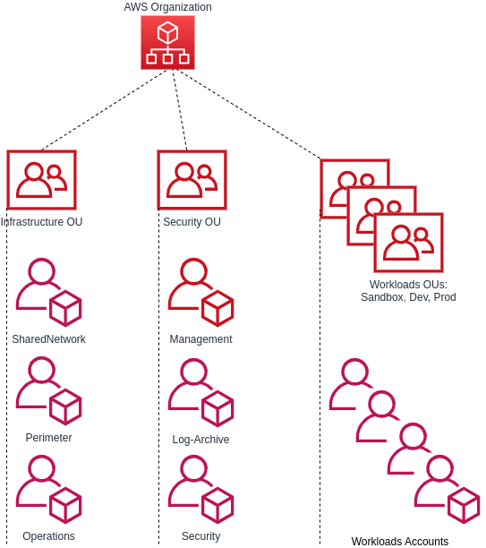
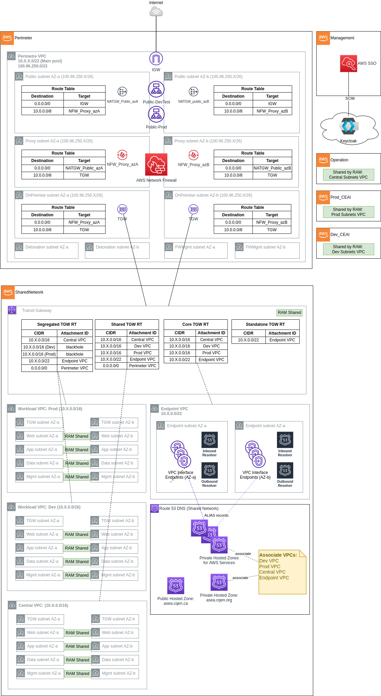

# AWS Secure Environement Accelerator (ASEA)

Le CEAI déploie son infrastructure chez le fournisseur infonuagique AWS. Pour déployer cet infrastructure, le CEAI a utilisé l'outil AWS Secure Environment Accelerator qui permet de déployer rapidement une architecture AWS multi-comptes, multi-régions sécuritaire et automatisé. 

Cette architecture adaptée au contexte d'utilisation gouvernemental garantie une conformité envers les standards de sécurité infonuagique américain [NIST 800-53](https://csrc.nist.gov/publications/detail/sp/800-53/rev-5/final) et canadien [CCCS Medium Cloud Control Profile](https://www.canada.ca/fr/gouvernement/systeme/gouvernement-numerique/innovations-gouvernementales-numeriques/services-informatique-nuage/profil-controle-securite-services-ti-fondes-information-nuage.html).

Pour comprendre ce qui suit il est préférable d'avoir consulté la documentation du dépôt [AWS Secure Environement Accelerator (ASEA)](https://github.com/aws-samples/aws-secure-environment-accelerator)

## Architecture

Le CEAI a choisi de mettre en place une version allégée de l'architecture ASEA.

### Organisation

Trois types de comptes de travail seront utilisés: **Sandbox**, **Dev** et **Prod**.

**Sandbox**: Comptes sans architecture restrictive. Pour mettre en place rapidement des expérimentations. Peut être utilisé pour les phases exploiratoires de conceptions de services ou dans le cadre d'un  laboratoire.

**Dev**: Comptes avec architecture prescriptive et VPC partagé. Pour intégrer le déploiement d'un solution éventuelle dans ASEA. 

**Prod**: Comptes avec architecture prescriptive et VPC partagé. Pour déployer des solutions dans un contexte de production.

### Réseautique

Au niveau réseautique, le CEAI ne déploie que les VPC partagés Dev, Prod et Central dans deux zones de disponibilité. 

Le pare-feu AWS Network Firewall est déployé dans le compte Perimeter pour filtrer le traffic entrant et sortant de l'infrastructure.

Le compte Management est isolé au niveau réseautique et déploie le service AWS SSO qui utilise le service public Keycloak du CEAI comme fournisseur d'identité.

Finalement deux zones hébergées asea.cqen.ca (publique) et asea.cqen.org (privée) assurent la résolution des noms de domaines de l'infrastructure.