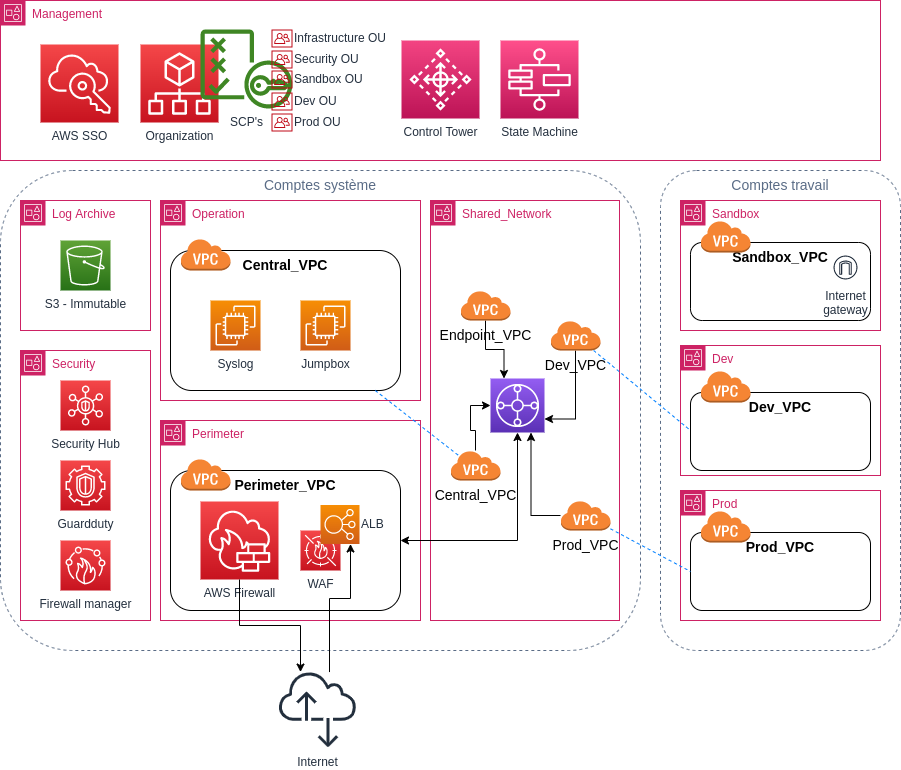

<!-- ENTETE -->

---

    

<!-- FIN ENTETE -->

# Architecture ASEA

L'architecture de référence est disponible dans la [documentation du projet ASEA](https://aws-samples.github.io/aws-secure-environment-accelerator/architectures/).

Le CEAI a choisi de mettre en place une version allégée de l'architecture ASEA.

Le CEAI ne possédant pas d'infrastructure sur site, elle déploie donc un environnement totalement autoportant et indépendant basé sur une configuration légère utilisant les services Control Tower ainsi que le pare-feu AWS Firewall.

## Organisation

ASEA utilise le service AWS Organization pour organiser son architecture multicompte. Celle-ci est composée de 6 comptes systèmes répartis dans deux unités d'organisations puis, d'un nombre variable de comptes de travail assignés dans des unités représentant des niveaux d'environnement. 

Trois types de comptes de travail sont utilisés: **Sandbox**, **Dev** et **Prod**.

Pour en savoir plus sur l'architecture prescriptive des comptes de travail, consultez ce [document](compte_travail.md).

## Réseautique

Au niveau réseautique, le CEAI ne déploie que les VPC partagés Dev, Prod et Central dans deux zones de disponibilité. 

Le pare-feu AWS Network Firewall est déployé dans le compte Perimeter pour filtrer le trafic entrant et sortant de l'infrastructure.

Le compte Management est isolé au niveau réseautique et déploie le service AWS SSO qui utilise le service public Keycloak du CEAI comme fournisseur d'identité.

Finalement deux zones hébergées asea.cqen.ca (publique) et asea.cqen.org (privée) assurent la résolution des noms de domaines de l'infrastructure.