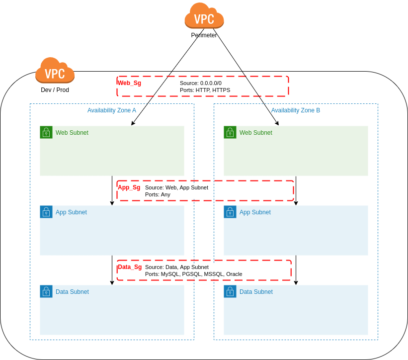
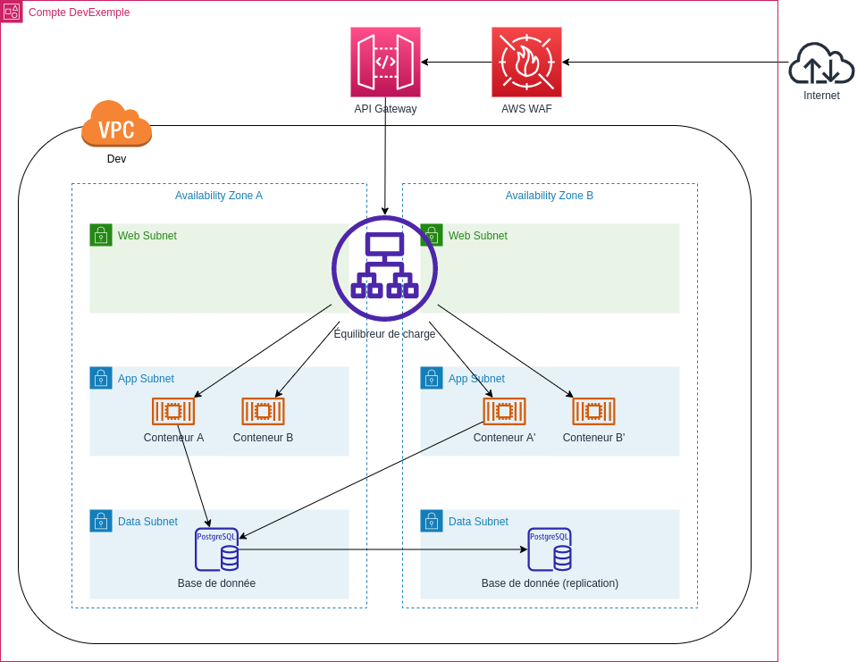

<!-- ENTETE -->

---

    

<!-- FIN ENTETE -->
# Comptes de travail ASEA

L'environnement ASEA du CEAI propose trois types de comptes de travail: Sandbox, Dev et Prod.

### Sandbox 
Comptes sans architecture restrictive. Pour mettre en place rapidement des expérimentations. Peut être utilisé pour les phases exploratoires de conceptions de services ou dans le cadre d'un laboratoire.

## Dev
Comptes avec architecture prescriptive et VPC partagé. Pour intégrer le déploiement d'une solution éventuelle dans ASEA. 

## Prod
Comptes avec architecture prescriptive et VPC partagé. Pour déployer des solutions dans un contexte de production.

## Architecture réseau

Par défaut un compte de travail contient un VPC partagé déployé dans deux zones de disponibilité (trois pour les comptes de type Dev). Ces zones sont divisées en 3 sous-réseaux: Web, App et Data. 

Chaque compte contiendra aussi 3 groupes de sécurité prédéfinis à appliquer aux déploiements dans chaque sous-réseau. Combinés aux NACL (Network Access Control List) appliqués à chaque sous-réseaux, ceux-ci définissent l'architecture réseau préscriptive pour les déploiements dans les comptes de travail ASEA.

### Web
Le sous-réseau Web sert au déploiement des services qui doivent écouter et émettre vers l'extérieur du compte de travail. On y trouvera principalement des équilibreurs de charges, passerelle d'API ou encore des serveurs Web qui n'interviennent pas dans la couche métier de l'application. La communication est permise seulement sur les ports HTTP(80) et HTTPS(443). 

### App
Le sous-réseau App sert à déployer les charges de travail (qui devraient être principalement des conteneurs) des services de vos déploiements. La communication est permise sur tous les ports sur ce sous-réseau.

### Data
Le sous-réseau Data sert à déployer les services de persistance de données, tel que des bases de données. Seul le sous-réseau App peut communiquer avec ce sous-réseau et ce sur les ports des principaux services de base de données. Si vous déployez un service qui communique par un autre port, vous devrez définir un groupe de sécurité sur mesure pour votre service.

## Exemple d'un déploiement simple

L'exemple illustre le déploiement d'une applications composée de deux conteneurs et une base de données.

La base de données est déployée à l'aide du service RDS. Une instance principale est déployée dans le sous-réseau Data de la zone de disponibilité A et une réplication est activée dans la zone B. La base de données est exposé via un point d'accès protégé par le groupe de sécurité Data_Sg qui limite l'accès au sous-réseau App.

Les conteneurs applicatifs sont déployé via le service ECS. Le service est configuré pour déployer 2 tâches pour le conteneur A et B distribués dans les sous-réseaux App des zones A et B. Le groupe de sécurité App_Sg est appliqué aux tâches. Chaque service ECS déploie un équilibreur de charge applicatif dans les sous-réseaux Web. 

API Gateway est le service qui doit être utilisé pour exposer les services conteneurs sur Internet. Il effectue entre autres choses la gestion des accès et la qualité du service. Finalement, l'accès public d'API Gateway doit toujours être protégé par le service de pare-feu applicatif AWS WAF.

## Contenus connexes

* [Patrons d'architecture AWS-SEA](../Patrons)
* [Guide d'utilisation de l'infrastructe AWS du CEAI](../Guides/AWS)
