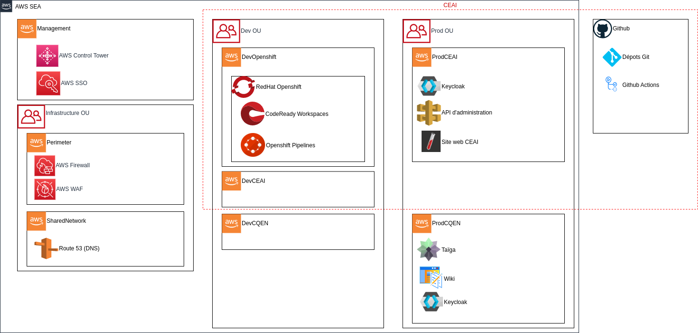

# Architecture

L'infrastructure du CEAI est déployée principalement dans un environnement infonuagique AWS. La zone d'accueil des différents service est gérée par l'outil [AWS Secure Environnement Accelerator](../ASEA).

Le service Github est aussi utilisé pour le stockage du code source des applications et des déploiements ainsi que pour le stockage de la documentation.

