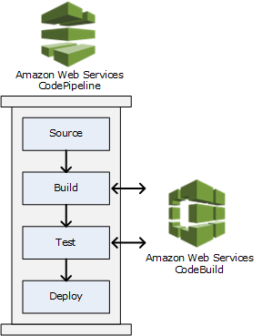

<!-- ENTETE -->
[](https://www.quebec.ca/gouv/politiques-orientations/vitrine-numeriqc/accompagnement-des-organismes-publics/demarche-conception-services-numeriques)
[](LICENSE_FR)

---

<div>
    
</div>
<!-- FIN ENTETE -->

# Pipelines en AWS

## AWS Codebuild

AWS CodeBuild c'est un service de "build" dans le nuage qui permet de compiler le code source, d'exécuter des tests unitaires et de produire les artefacts prêts pour déployer.
Voir [ici](https://docs.aws.amazon.com/codebuild/latest/userguide/welcome.html) pour plus d'information d'AWS.

Entre les avantages que CodeBuild offre, nous pouvons mentionner:
- Flexibilité de configuration du "build" de l'application, avec un fichier de spécification "buildspec.yaml". Ce fichier sert à détailler les tâches à exécuter lors du "build" de l'application et il peut se trouver dans le code source.
- Un project de CodeBuild peut être déclenché par exemple à la création et mis à jour d'un "Pull Request".
- Le project CodeBuild créé pour une application, peut être appelé aussi à partir d'un pipeline dans AWS CodePipeline pour spécifier les tâches d'un "stage" particulier comme un "build" ou test par exemple.

  

Pour les avantages mentionnées précédement, nous avons décidé de travailler et de proposer des différents gabarits d'AWS CodeBuild pour nos workflows d'automatisation.

### AWS Buildspec

AWS offre une [documentation detaillé](https://docs.aws.amazon.com/codebuild/latest/userguide/getting-started-create-build-spec-console.html) de la syntaxe d'un fichier buildspec.yaml.

Vous pouvez voir le fichier au complet [ici](CodeBuild/buildspec_ref.yaml), mais nous allons vous montrer les parties plus importantes à être utilisées dans nos gabarits.

Voici un exemple de fichier buildspec.yaml simple et minimal:

```yaml
version: 0.2
...
phases:
  install:
    commands:
      - echo sequence optionnelle pour installer des paquets dans l'environnement du "build"
  pre_build:
    commands:
      - echo sequence optionnelle pour les commandes à exécuter avant le "build". Par exemple pour se logger au repository Amazon ECR.
  build:
    commands:
      - echo sequence optionnelle pour les commandes à exécuter durant le "build". Par exemple pour installer maven.
  post_build:
    commands:
      - echo sequence optionnelle pour les commandes à exécuter après le "build". Par exemple, pousser l'image docker au repository Amazon ECR.
artifacts:
  files:
    - echo sequence requise pour indiquer la location des artefacts résultat du "build"
```

#### Gabarits des fichiers buildspec pour AWS CodeBuild

| Buildspec | Fichier yaml | Plus d'information  |
|---|---|---|
| syntaxe  | [référence](CodeBuild/buildspec_ref.yaml)  | [doc-aws](https://docs.aws.amazon.com/codebuild/latest/userguide/build-spec-ref.html#build-spec.phases) |
| application java  | [java-app](CodeBuild/buildspec_app_java.yaml)  | [doc-aws](https://docs.aws.amazon.com/codebuild/latest/userguide/getting-started-create-build-spec-console.html), [app-java](#application-java) |
| application nodejs  | [nodejs-app](CodeBuild/buildspec_app_nodejs.yaml) | [app-nodejs](#application-nodejs) |
| application golang  | [go-app](CodeBuild/buildspec_app_go.yaml)  | [app-go](#application-go) |
| scan snyk  | [scan-snyk](CodeBuild/buildspec_scan_snyk.yaml)  | [scan-snyk](#scan-snyk)  |
| docker image  | [docker-img-ecr](CodeBuild/buildspec_docker_img_ecr.yaml)  | [docker-img](#image-docker-dans-aws-ecr) |

**Plus de détails sur les projets CodeBuild**

Dans les gabarits du tableau, pour le cas des applications, la liste des tâches à exécuter lors du "build" du projet sont en général:

- Compiler le code source
- Exécuter les tests unitaires
- Déployer les artefacts résultat dans un conteneur de data en AWS S3

À continuation, nous allons mentionner les parties les plus pertinentes pour chacun des gabarits: 

##### Application Java

- Extrait du [buildspec](CodeBuild/buildspec_app_java.yaml):
  ```yaml
  phases:
    install:
      runtime-versions:
        java: corretto17
    build:
      commands:
        - echo Build started on `date`
        - mvn install
  artifacts:
    files:
      - target/messageUtil-1.0.jar
  ```  
- Extrait du [log](CodeBuild/logs/log-extract-java.log) du build dans AWS CodeBuild:

  ```bash
  ...Selecting 'java' runtime version 'corretto17' based on manual selections...
  ...Running command echo "Installing Java version 17 ..."
  ...
  -------------------------------------------------------
  T E S T S
  -------------------------------------------------------
  Results :

  Tests run: 2, Failures: 0, Errors: 0, Skipped: 0
  ...
  ...Expanding target/messageUtil-1.0.jar
  ...Phase complete: UPLOAD_ARTIFACTS State: SUCCEEDED
  ```

  Vous pouvez observer que le build: 
    - Exécute l'installation du runtime java, 
    - Compile le code source, 
    - Exécute les tests unitaires et finalement, 
    - Télécharge l'artefact résultat avec succès.
  
##### Application Nodejs

- Extrait du [buildspec](CodeBuild/buildspec_app_nodejs.yaml):
  ```yaml
  phases:
    install:
      runtime-versions:
        nodejs: 16
      commands:
        - npm install
  ```    
- Extrait du [log](CodeBuild/logs/log-extract-nodejs.log) du build dans AWS CodeBuild:-  

  ```bash
  ...Running command npm install
  ...
  added 383 packages, and audited 384 packages in 7s
  ...
  found 0 vulnerabilities
  ```
  Vous pouvez observer que le build: 
    - Exécute l'installation de nodejs version 16 et,
    - Compile le code source. 

##### Application Go

- Extrait du [buildspec](CodeBuild/buildspec_app_go.yaml):
  ```yaml
  env:
  variables:
    GO_VERSION: 1.19
  phases:
    install:
      commands:
        #...
        # Install golint
        - go get -u golang.org/x/lint/golint        
        # install govulncheck to scan code
        - go install golang.org/x/vuln/cmd/govulncheck@latest           
    pre_build: 
      commands:
        - go get -t ./...
        # Ensure code passes all lint tests
        - golint -set_exit_status
        # Check the Go code for common problems with 'go vet'
        - go vet .
        # Run all tests included with our application
        - go test .
        # Vulnerability detection using govulncheck
        - govulncheck -json ./... > lambda-go-samples-govulncheck-results.json   
    build:
      commands:
        # Build our go application
        - go build -o main
  artifacts:
    files:
      - lambda-go-samples-govulncheck-results.json           
  ```    
- Extrait du [log](CodeBuild/logs/log-extract-go.log) du build dans AWS CodeBuild:-  

  ```bash
  ...Running command go get -u golang.org/x/lint/golint
  ...Running command go install golang.org/x/vuln/cmd/govulncheck@latest
  ...
  Running command go vet .

  Running command go test .
  ok      github.com/aws-samples/lambda-go-samples    0.003s
  ...
  ...Running command govulncheck -json ./... > lambda-go-samples-govulncheck-results.json
  ...
  ...Expanding lambda-go-samples-govulncheck-results.json
  ...Found 1 file(s)
  ...Phase complete: UPLOAD_ARTIFACTS State: SUCCEEDED  
  ```
  Vous pouvez observer que le build: 
    - Exécute l'installation de golint
    - Exécute l'installation de govulncheck pour le scan de code, 
    - Exécute `go vet` for vérifier les problèmes communs dans le code, 
    - Exécute `go test` pour les tests unitaires, 
    - Exécute `govulncheck` pour vérifier les vulnerabilités et imprime le résultat dans un fichier json, et finalement, 
    - Télécharge tel fichier json dans le conteneur des données, AWS S3.

##### Scan Snyk

Le script suivant sert à exécuter le scan du code afin de trouver possibles vulnerabilités générales.

Snyk offre une intégration avec AWS pour utiliser directement ses services de scan avec un jeton de connection à l'api de Snyk. Comme montré dans l'exemple, le jeton se trouve dans AWS Secrets Manager pour une question de sécurité.

- Extrait du [buildspec](CodeBuild/buildspec_scan_snyk.yaml):
  ```yaml
  env:
    secrets-manager:
      AWS_SNYK_AUTH_TOKEN: "API-token-snyk:SNYK_AUTH_TOKEN_RP"      
  phases:
    install:
      commands:
        - npm install -g snyk
    build:
      commands:
        # Snyk Auth using API token
        - snyk config set api=$AWS_SNYK_AUTH_TOKEN
        - snyk test --json > snyk-results-open-source.json
        - snyk code test --json > snyk-results-code.json
    post_build:
      commands:     
        - |
          jq "{ \"messageType\": \"CodeScanReport\", \"reportType\": \"SNYK\", \
          \"createdAt\": $(date +\"%Y-%m-%dT%H:%M:%S.%3NZ\"), \"source_repository\": env.CODEBUILD_SOURCE_REPO_URL, \
          \"source_branch\": env.CODEBUILD_SOURCE_VERSION, \
          \"build_id\": env.CODEBUILD_BUILD_ID, \
          \"source_commitid\": env.CODEBUILD_RESOLVED_SOURCE_VERSION, \
          \"report\": . }" snyk-results-open-source.json > snyk-scan-results-open-source.json
        - echo ""
        - |    
        #...    
  artifacts:
    files:
      - snyk-scan-results-open-source.json
      - snyk-scan-results-code.json      
  ```    
- Extrait du [log](CodeBuild/logs/log-extract-scan-snyk.log) du build dans AWS CodeBuild:-  

  ```bash
  ...Running command npm install -g snyk
  ...Running command snyk config set api=$AWS_SNYK_AUTH_TOKEN api updated
  ...
  ...Running command snyk test --json > snyk-results-open-source.json
  ...Running command snyk code test --json > snyk-results-code.json
  ...
  ...Running command jq "{ \"messageType\": \"CodeScanReport\", \"reportType\": \"SNYK\", \
  \"createdAt\": $(date +\"%Y-%m-%dT%H:%M:%S.%3NZ\"), \"source_repository\": env.CODEBUILD_SOURCE_REPO_URL, \
  \"source_branch\": env.CODEBUILD_SOURCE_VERSION, \
  \"build_id\": env.CODEBUILD_BUILD_ID, \
  \"source_commitid\": env.CODEBUILD_RESOLVED_SOURCE_VERSION, \
  \"report\": . }" snyk-results-open-source.json > snyk-scan-results-open-source.json  
  ...
  ...Expanding snyk-scan-results-open-source.json
  ...Expanding snyk-scan-results-code.json
  ...Found 3 file(s)
  ...Phase complete: UPLOAD_ARTIFACTS State: SUCCEEDED
  ```
  Vous pouvez observer que le build: 
    - Exécute l'installation de l'outil de scan Snyk,
    - Configure la clé de connection à l'api de l'outil Snyk avec un secret dans AWS Secrets Manager,
    - Exécute les commandes de scan de snyk,
    - Extrait les résultats du scan dans un fichier json
    - Edite le fichier json résultat pour ajouter des informations du CodeBuild, et finalement,
    - Télécharge les fichiers json résultat dans un conteneur des données dans AWS S3.

##### Image docker dans AWS ECR

L'exemple du script suivant sert à obtenir une image conteneurisé de l'application et la pousser dans le service de conteneur AWS ECR.

- Extrait du [buildspec](CodeBuild/buildspec_docker_img_ecr.yaml):
  ```yaml
  env:
    variables:
      ECR_REPO_NAME: "hello-world-nodejs-repo"        
  phases:
    install:
      commands:
        - nohup /usr/local/bin/dockerd --host=unix:///var/run/docker.sock --host=tcp://127.0.0.1:2375 --storage-driver=overlay2 &
        - timeout 15 sh -c "until docker info; do echo .; sleep 1; done"      
    pre_build:
      commands:
        - aws ecr get-login-password --region ca-central-1 | docker login --username AWS --password-stdin 111111111111.dkr.ecr.ca-central-1.amazonaws.com
    build:
      commands:
        - IMAGE_TAG=`echo $CODEBUILD_BUILD_NUMBER`
        - docker build -t $APP_NAME:$IMAGE_TAG .
        - docker run -d --name $APP_NAME -p 5000:5000 $APP_NAME:$IMAGE_TAG
        - curl http://localhost:5000
        - docker tag $APP_NAME:$IMAGE_TAG 111111111111.dkr.ecr.ca-central-1.amazonaws.com/$ECR_REPO_NAME:$IMAGE_TAG
    post_build:
      commands:
        - docker push 111111111111.dkr.ecr.ca-central-1.amazonaws.com/$ECR_REPO_NAME:$IMAGE_TAG
        - docker stop $APP_NAME
        - docker rm $APP_NAME
        - docker rmi 111111111111.dkr.ecr.ca-central-1.amazonaws.com/$ECR_REPO_NAME:$IMAGE_TAG
        - docker rmi $APP_NAME:$IMAGE_TAG          
  ```    
- Extrait du [log](CodeBuild/logs/log-extract-docker.log) du build dans AWS CodeBuild:-  

  ```bash
  ...Running command docker build -t $APP_NAME:$IMAGE_TAG .
  ...
  ...Running command docker run -d --name $APP_NAME -p 5000:5000 $APP_NAME:$IMAGE_TAG 
  1111111111111111111111111111111111111111111111111111111111111111
  ...
  Running command curl http://localhost:5000
    % Total    % Received % Xferd  Average Speed   Time    Time     Time  Current
                                  Dload  Upload   Total   Spent    Left  Speed

    0     0    0     0    0     0      0      0 --:--:-- --:--:-- --:--:--     0
  100    50  100    50    0     0   6271      0 --:--:-- --:--:-- --:--:--  7142
  {"message":"Hello World JavaScript v202202161438"}
  Running command docker tag $APP_NAME:$IMAGE_TAG 111111111111.dkr.ecr.ca-central-1.amazonaws.com/$ECR_REPO_NAME:$IMAGE_TAG  
  ...
  Running command docker push 111111111111.dkr.ecr.ca-central-1.amazonaws.com/$ECR_REPO_NAME:$IMAGE_TAG
  The push refers to repository [111111111111.dkr.ecr.ca-central-1.amazonaws.com/hello-world-nodejs-repo]
  ...
  ...Phase complete: UPLOAD_ARTIFACTS State: SUCCEEDED
  ```
  Vous pouvez observer que le build: 
    - Build le conteneur de l'application
    - Exécute l'instance du conteneur
    - Exécute un appel à l'application exposé dans le port 5000
    - Obtient une réponse de l'application
    - Étiquette l'image avec le nom du dépôt AWS ECR
    - Pousse l'image étiquettée dans le dépôt AWS ECR

## Références

- [AWS CLI Command Reference](https://docs.aws.amazon.com/cli/latest/reference/codepipeline/create-pipeline.html)
- [AWS CLI Create Project](https://docs.aws.amazon.com/cli/latest/reference/codebuild/create-project.html)
- Exemples de AWS CodeBuild pour des applications:
  - java
    - [Getting started with AWS CodeBuild using the console](https://docs.aws.amazon.com/codebuild/latest/userguide/getting-started.html)
  - golang
    - [Codebuild AWS for Golang](https://abrahamlarrazolo.com/articles/codebuild-golang-aws/)
    - [lambda-go-samples](https://github.com/aws-samples/lambda-go-samples)