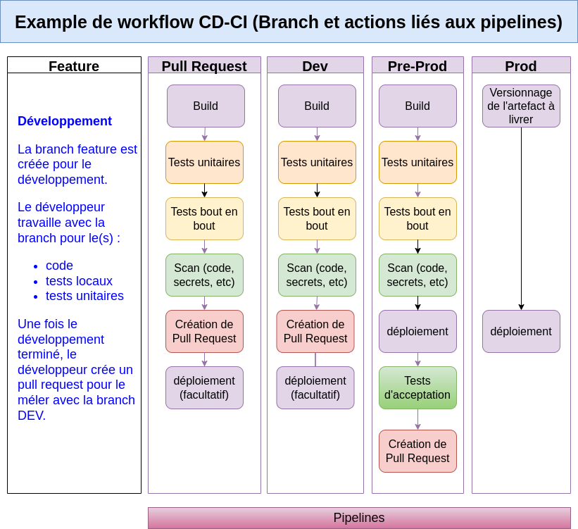

<!-- ENTETE -->

---

    

<!-- FIN ENTETE -->

# Pipelines

## Qu’est-ce que le processus de pipeline CI/CD ?

Le pipeline CI/CD est essentiellement un workflow qui permet aux équipes DevOps d’automatiser le processus de distribution de logiciels. Il permet d'éliminer les erreurs manuelles, de normaliser les boucles de rétroaction des développeurs et d'augmenter la vitesse d’itération des produits.

Pour en savoir plus, vous pouvez consulter notre documentation [CI/CD](../../Guides/CICD/README.md)

## Phases du pipelines

Bien que chaque équipe DevOps devra déterminer les étapes qui comprennent ses pipelines, selon les besoins et l'infrastructure qui possèdent, nous allons mentionner les phases qui sont généralement comprises.

**Exemples de phases des pipelines:**

### Description des principales phases d'un pipeline

- **Phase source (Code)** : les développeurs extraient et travaillent localement sur le code source des applications, stocké dans un dépôt central tel que GitHub. Ils créent ensuite une nouvelle branche pour la fonctionnalité ou le bug qu’ils veulent corriger, et exécutent des tests sur cette branche localement dans leur environnement de développement, avant de la valider dans le dépôt source.

- **Phase de construction (Build)** : le nouveau code validé dans le dépôt source déclenche l’étape de construction, dans laquelle les codes de branche sont rassemblés et compilés pour construire une instance exécutable de la version. Les développeurs peuvent créer et tester leurs versions plusieurs fois par jour afin de détecter les erreurs dans le code. Ils reçoivent des alertes en cas d’échec d’une compilation ou autre problème, afin que l’équipe puisse le corriger dès que possible. Une fois le code exempt d’erreurs, il passe à la phase suivante.

- **Phase de test** : la compilation passe par plusieurs tests pour valider le code et s’assurer qu’il fonctionne comme prévu. Le plus souvent, il s’agit de tests unitaires, au cours desquels l’application est divisée en petites unités de code qui sont testées individuellement, et de tests d’acceptation utilisateur (UAT), dans lesquels les utilisateurs testent l’application pour déterminer si le code nécessite d’autres modifications avant d’être déployé en production. Des tests de charge, de sécurité et autres tests continus peuvent être effectués à ce stade.

- **Phase de déploiement** : Une fois que l’application est prête à déployer, les stratégies de déploiement sont variées. Le meilleur choix dépend du type d’application, du degré de révision qu’elle a subi, de l’environnement cible et d’autres facteurs. Voici des approches de déploiement modernes pour les applications cloud. 

    - **Déploiement roulant** : cette méthode délivre l’application mise à jour par incréments jusqu’à ce que toutes les cibles aient la version à jour. Les déploiements roulants présentent moins de risques d’indisponibilité et sont faciles à annuler, mais nécessitent de prendre en charge à la fois les nouvelles et les anciennes versions de l’application.
    - **Déploiement bleu-vert** : avec cette méthode, les développeurs exécutent deux versions de l’application en parallèle sur des infrastructures distinctes. La dernière version stable de l’application est exécutée dans l’environnement de production (bleu) et la nouvelle version est exécutée dans un environnement de simulation (vert) pour y tester les fonctionnalités et les performances. Lorsque les tests sont réussis, le trafic passe de l’environnement bleu à l’environnement vert, qui devient le nouvel environnement de production. Les déploiements bleu-vert sont rapides et faciles à mettre en œuvre, mais ils peuvent être coûteux si l’environnement de production répliqué est particulièrement complexe.
    - **Déploiement canari** : dans ce modèle de déploiement, les développeurs mettent une application à la disposition d’un petit sous-ensemble d’utilisateurs qui font part de leurs commentaires. Lorsqu’il est certain que l’application fonctionne correctement, elle est déployée auprès du reste des utilisateurs. Cette stratégie permet aux développeurs de tester deux versions parallèles d’une application avec de vrais utilisateurs, et d’effectuer des mises à jour et des annulations sans interruption.

### Diagramme d'un exemple de workflow avec les phases et tâches liées aux branchs et pipelines:

# Modèles de Pipelines

- AWS
- Github Actions
- Azure DevOps
- Tekton

# Références
- [CEAI - Pipelines CI/CD](../../Guides/CICD/README.md)
- [Qu'est-ce que le pipeline CI/CD?]()

