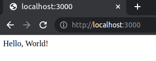
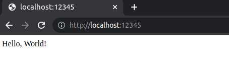

<!-- ENTETE -->
[](https://www.quebec.ca/gouv/politiques-orientations/vitrine-numeriqc/accompagnement-des-organismes-publics/demarche-conception-services-numeriques)
[](LICENSE_FR)

---

<div>
    
</div>
<!-- FIN ENTETE -->

# Construction d'une image docker d'une application web simple

Cette étape est nécessaire si vous n'avez pas déjà une application web simple à déployer dans AWS.

Si vous avez déjà une image *docker* d'une telle application, alors, vous pouvez passer à l'[étape 2](E2-preps-and-init-workspace-tf.md) pour commencer à travailler avec les scripts terraform pour la création de ressources dans AWS.

## Créer une application basique NodeJS

Nous allons créer une application web simple qui peut être exécutée localement dans votre poste de travail (localhost).

Créez un répertoire de travail et allez dans ce répertoire:
```bash
mkdir web-api-nodejs
cd web-api-nodejs
```

Initialisez le fichier package.json pour suivre les dépendances:
```bash
npm init
```
Installez le serveur express comme le serveur web:
```bash
npm install --save express
```

Créez un fichier app.js pour le serveur web avec le contenu suivant:
```js
const app = require('express')();

app.get('/', (req, res) => {
  res.send('Hello, World!\n');
});

app.listen(3000, '0.0.0.0');
```
Ce fichier va démarrer le serveur web localement (localhost) sur le port 3000.

Vérifiez que votre serveur fonctionne:
```bash
node app.js
```
Testez l'application dans votre navigateur avec le lien: http://localhost:3000

Vous devriez voir un résultat similaire:



## Faire une image docker de l'application

Nous allons utiliser les avantages d'un conteneur *docker* pour faciliter le déploiement de l'application dans un service infonuagique.

Entre autres, *docker* nous permet de:
- Lister les dépendances (en excluant un noyau Linux qui est assumé)
- Isoler l'application web par défaut
- Donner des instructions simples pour exécuter l'application

Pour plus d'information sur *Docker*, voir [ici](../../../CEAI/README.md#conteneurs)

### Créez le fichier Dockerfile
Créez un fichier Dockerfile avec le contenu suivant:
```dockerfile
FROM node:10
WORKDIR /usr/src/app
COPY package*.json ./
RUN npm i
COPY . .
EXPOSE 3000
CMD [ "node", "app.js" ]
```

Explication du contenu du fichier Dockerfile:
- **`FROM node:10`** -> Définit l'image de base (dans notre exemple c'est Node) et sa version (10).
- **`WORKDIR /usr/src/app`** -> Indique que pour les autres commandes dans votre fichier Dockerfile, le dossier du travail est `/usr/src/app` dans le système virtuel des fichiers.
- **`COPY package*.json ./`** -> Copie les fichiers locaux`package.json` et `package-lock.json` au dossier du travail `WORKDIR` (dans docker).
- **`RUN npm i`** -> Installe les dépendances listées dans le fichier package.json.
- **`COPY . .`** -> Copie tous les fichiers de votre espace de travail au dossier du travail `WORKDIR` du conteneur.

    * **Note**: Afin d'éviter de copier certains fichiers comme ceux qui ont été génerés au moment de l'installation des dépendances `node_modules`, nous allons utiliser le fichier .dockerignore. 
  
        Créez un fichier `.dockerignore` avec le contenu suivant:

        ```dockerfile
        node_modules
        npm-debug.log                    
        ```

- **`EXPOSE 3000`** -> Permet d'exposer l'application à l'extérieur du conteneur via le port 3000.
- **`CMD [ "node", "app.js" ]`** -> Indique au conteneur d'exécuter la commande `node app.js` (comment exécuté précédemment pour tester localement l'application).

### Exécutez l'image de l'application localement
- Construisez l'image:
  ```bash
  docker build -t some-image-name .
  ```
  :warning: N'oubliez pas le point à la fin de la commande.
- Pour exécuter le conteneur localement, utilisez `docker run`:
  ```bash
  docker run -p 12345:3000 -d some-image-name
  ```
  Cette commande va démarrer le conteneur *docker* de l'image `some-image-name` localement, dans le port `12345` (qui correspond au port 3000 du conteneur).
  
  **:information_source:** Comme bonne pratique, le nom de l'instance de l'image qui roule devrait être spécifié:
  ```
  docker run --name sample-app -p 12345:3000 -d some-image-name
  ```
  Dans le cas de cet exercice, le nom n'a pas été spécifié, donc, un nom par hasard a été assigné à l'instance: `nifty_greider`

- Pour tester l'accès à l'application dans le conteneur, utilisez le lien http://localhost:12345 dans votre navigateur.
  
  Vous devriez voir un résultat similaire:
  
  

### Arrêtez le processus Docker
Vous avez réussi à tester localement l'exécution d'un conteneur à partir de l'image construite.

L'image servira pour les étapes suivantes de déploiement de l'application dans AWS.

Maintenant, nous allons arrêter le conteneur local, car on n'en a plus besoin:
- Pour lister les processus *docker* qui s'exécutent, utilisez la commande `docker ps`:
  ```bash
  docker ps
  ```
  Exemple de résultat:
  ```bash
  CONTAINER ID   IMAGE                           COMMAND                  CREATED          STATUS          PORTS                                         NAMES
  ccb4c473e008   nodejs-example-dev-ecr:latest   "docker-entrypoint.s…"   44 minutes ago   Up 44 minutes   0.0.0.0:12345->3000/tcp, :::12345->3000/tcp   nifty_greider
  ```
- Pour arrêter le processus docker, utilisez la commande `docker stop <nom du processus>`
  ```bash
  docker stop nifty_greider
  ```

[<- Page Principale](README.md)

[-> Page Suivante: Étape 2: Préparation et initialisation de l'espace du travail avec les scripts terraform](E2-preps-and-init-workspace-tf.md)