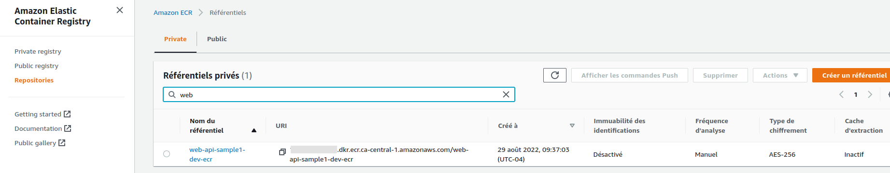
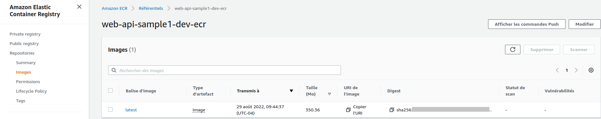

<!-- ENTETE -->
[](https://www.quebec.ca/gouv/politiques-orientations/vitrine-numeriqc/accompagnement-des-organismes-publics/demarche-conception-services-numeriques)
[](LICENSE_FR)

---

<div>
    
</div>
<!-- FIN ENTETE -->

# Déploiement du ressource du registre des conteneurs AWS ECR (Elastic Container Registry)

Le registre contiendra l'image de l'application à être déployée.

Pour commencer à créer les ressources dans AWS, il faut que le profile de connexion au compte AWS [soit créé](../../Outils/AWS-Command-Line-Interface/README.md#configuration-daws-sso-single-sign-on) et ensuite, ouvrir une session de connexion avec ce profile créé ([voir](../../Outils/AWS-Command-Line-Interface/README.md#login-au-compte-aws)).

- Exécutez la commande `init` pour initialiser le répertoire comme un conteneur du code terraform:
  ```bash
  terraform init
  ```
  La commande va télécharger les plugins disponibles pour le fournisseur AWS listé dans le fichier `provider.tf`

- Exécutez la commande `plan` pour visualiser les ressources à créer:
  ```bash
  terraform plan
  ```
  Vous devriez voir un résultat similaire:
  ```bash
  Terraform used the selected providers to generate the following execution plan. Resource actions are indicated with the following symbols:
  + create

    Terraform will perform the following actions:

    # aws_ecr_repository.ecr_repo will be created
    + resource "aws_ecr_repository" "ecr_repo" {
        + arn                  = (known after apply)
        + id                   = (known after apply)
        + image_tag_mutability = "MUTABLE"
        + name                 = "web-api-sample1-dev-ecr"
        + registry_id          = (known after apply)
        + repository_url       = (known after apply)
        + tags_all             = (known after apply)
        }

    Plan: 1 to add, 0 to change, 0 to destroy.
  ```
  Vous pouvez constater que la ressource ecr_repo sera créée.

- Exécutez la commande `apply` pour appliquer les modifications.
  ```bash
  terraform apply -var-file terraform.tfvars
  ```
  Vous confirmez l'action et la ressource sera créée dans AWS.
  Dans votre navigateur, vous pouvez aller au compte AWS et confirmer que le registre a été bien créé.

  

  Si vous cliquez sur le registre créé, vous allez voir qu'il est vide. À continuation, vous allez ajouter l'image de l'application.
## Déposer l'image docker de l'application dans la ressource ECR

Toujours, dans votre navigateur, cliquez sur le registre créé dans AWS, si vous n'êtes pas déjà à l'intérieur.

Vous allez voir en haut à droit, le bouton "Afficher les commandes Push". Cliquez sur lui pour voir les instructions à suivre pour le téléchargement de l'image docker de l'application.

Dans votre terminal:
1. Ouvrez une session de connexion au registre créé en exécutant la première instruction. Par exemple:
    ```bash
    aws ecr get-login-password --region ca-central-1 | docker login --username AWS --password-stdin 123456789012.dkr.ecr.ca-central-1.amazonaws.com
    ```
2. Comme vous avez déjà l'image de votre application en local, vous n'avez pas besoin de la construire, donc pas besoin de la deuxième instruction.
   Vous pouvez voir vos images locales avec la commande `docker images`
   ```bash
   docker images
   ```
3. Étiquettez l'image locale avant de la transférer au registre:
   ```bash
   docker tag web-api-sample1-dev-ecr:latest 123456789012.dkr.ecr.ca-central-1.amazonaws.com/web-api-sample1-dev-ecr:latest
   ```
   * `web-api-sample1-dev-ecr:latest` correspondent au nom de l'image (web-api-sample1-dev-ecr), et la version de l'image (latest).
  
4. Poussez l'image dans le registre créé dans AWS:
   ```bash
   docker push 123456789012.dkr.ecr.ca-central-1.amazonaws.com/web-api-sample1-dev-ecr:latest
   ```
5. Vérifiez que l'image a été bien poussez dans le registre. Dans votre navigateur, dans la console web de votre compte AWS (vue ECR), vous allez voir que l'image a été transférée:

    

[<-- Page Principale](README.md)

[-> Page Précedente: Étape 2: Préparation et initialisation de l'espace du travail avec les scripts terraform](E2-preps-and-init-workspace-tf.md)

[-> Page Suivante: Étape 4: Déployer les ressources du cluster ECS](E4-deploy-aws-ecs.md)
