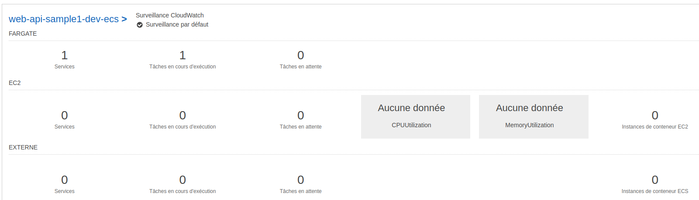
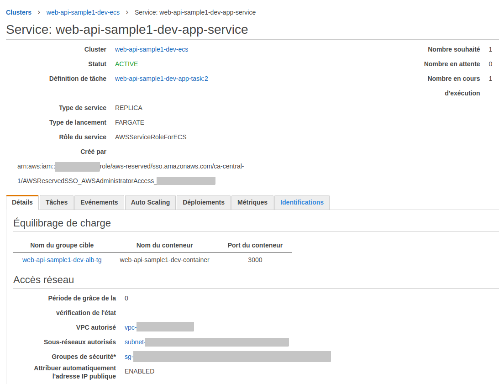
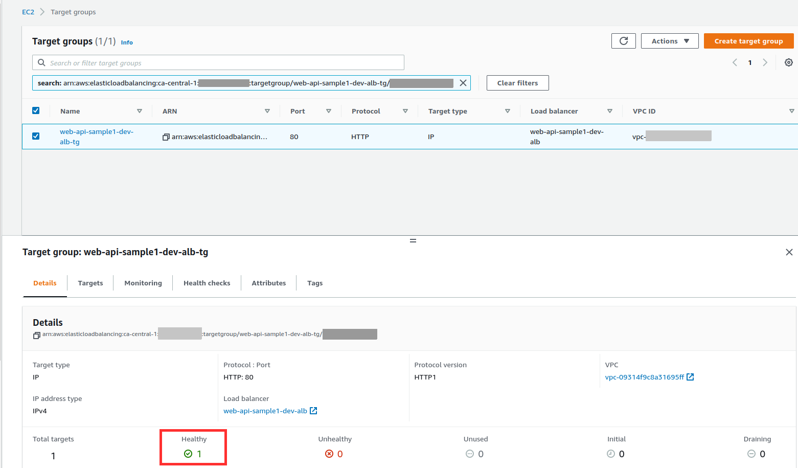

<!-- ENTETE -->
[](https://www.quebec.ca/gouv/politiques-orientations/vitrine-numeriqc/accompagnement-des-organismes-publics/demarche-conception-services-numeriques)
[](LICENSE_FR)

---

<div>
    
</div>
<!-- FIN ENTETE -->

# Déploiement des ressources du cluster AWS ECS (Elastic Container Service)

Dans l'étape précedente, vous avez créé le registre pour stocker l'image de l'application. 
Maintenant, nous allons déployer cette image dans un cluster AWS (ECS).

## Role IAM (Identity and Access Management)
Il faut créer le role qui permettra d'exécuter la tâche liée au cluster ECS qui gère l'exécution de l'instance de l'application.

Dans votre répertoire deploiement, copiez le ficher [iam.tf](scripts/iam.tf)

## Réseau Virtuel Privé (VPN - Virtual Private Cloud)
Un des prérequis de cet exercice, était celui d'avoir un réseau privé virtuel dans le compte AWS auquel vous avez accès.

Les informations des ressources créées se trouvent dans le fichier [data.tf](scripts/data.tf).

Nous allons ajouter la ressource de `groupe de sécurité`.
Copiez le fichier [sg.tf](scripts/sg.tf) dans votre répertoire de travail.


## Fargate (ECS)
Cette section contient la partie des ressources du cluster ECS de AWS où l'application sera déployée.

Fargate c'est un type de service de conteneur (ECS - Elastic Container Service), qui a trois concepts:
- Clusters: Un regroupement logique de tâches ou de services.
- Services: Où on regroupe les tâches et on spécifie combien de ces tâches on veut qui s'exécutent au même temps.
- Tâches: Définit l'image Docker à utiliser ainsi que le role IAM dont on a besoin pour l'utiliser.

Copiez les fichiers [alb.tf](scripts/alb.tf), [ecs.tf](scripts/ecs.tf).

Créez un folder `tasks` où vous pouvez copier le fichier [web_api_sample1_task_definition.json](scrip/../scripts/tasks/web_api_sample1_task_definition.json)
Ce fichier json est un gabarit de fichier de définition de conteneur pour la tâche du cluster ECS, qui recevra de manière dynamique. les valeurs des variables comme:
- Le nom du registre de l'image Docker
- Le nom de l'image Docker
- Les ports du conteneur et du hôte.

## Déploiement
Dans le terminal, dans votre répertoire `deploiement`, exécutez les commandes terraform:
- Pour valider les scripts, utilisez la commande `validate`:
    ```bash
    terraform validate
    ```
- Pour lister les ressources à créer, utilisez la commande `plan`:
    ```bash
    terraform plan
    ```
- Pour appliquer les modifications, utilisez la commande `apply`:
  ```bash
  terraform apply -var-file terraform.tfvars
  ```

## Vérification dans AWS (console web)

Après la création des ressources AWS, allez dans le navigateur, dans la console web de votre compte AWS, pour vérifier que les ressources ont été bien créées. Vous devriez trouver que:
- Dans la vue ECS: Un cluster a été crée pour l'application web
  - Ce cluster a un service et une tâche en cours d'exécution

    

  - Cliquez sur le cluster crée pour voir plus des détails. Dans l'onglet `Services` du détails du service, cliquez sur le service pour vérifier ses détails. Vous devriez voir que le service est lié au équilibreur de charge.

    

- Dans la vue EC2:
  - Target Groups: vous devriez voir dans l'onglet des détails, le statut: `Healthy`

    


Voilà!, vous avez réussi à déployer avec succès, une application web dans un cluster AWS ECS.


[<-- Page Principale](README.md)

[-> Page Précedente: Étape 3: Déployer les ressources du registre de conteneurs ECR](E3-deploy-aws-ecr.md)

[-> Page Suivante: Étape 5: Déployer les ressources de l'Api Gateway pour tester l'application](E5-deploy-api-gateway-aws.md)