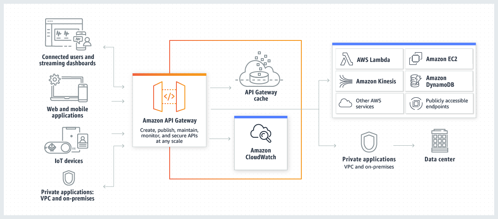

<!-- ENTETE -->

---

    

<!-- FIN ENTETE -->

# Déploiement des ressources de l'Api Gateway pour tester l'application

Dans l'étape précédente, l'application web a été déployée dans le service ECS sur une unité de calculs Fargate. Maintenant, nous allons créer les ressources nécessaires pour exposer notre application sur le web.

## Équilibreur de charge de réseau (Network Load Balancer)
Copiez le fichier [nlb.tf](scripts/nlb.tf)

Ce fichier-ci va créer des ressources comme:
- Le groupe cible de réseau (network target group)
- L'équilibreur de charge réseau (network load balancer)
- L'auditeur de l'équilibreur de charge réseau (listener)
- Le lien entre l'équilibreur de charge réseau et l'équilibreur de charge d'application.

## Passerelle API (API Gateway)

La passerelle API d'AWS est un service qui permet de créer, de publier, de gérer, de surveiller, et de sécuriser APIs REST, HTTP et WebSocket à n'importe quelle échelle.

Voici un diagramme de l'architecture de la passerelle API pour mieux comprendre:

Copiez le fichier [api-gateway.tf](scripts/api-gateway.tf)

Ce fichier a les scripts de création de:
- Une entité `Resource` qui peut exposer une ou plusieurs méthodes HTTP d'API.
- Chaque entité `Resource` peut disposer d'une ou de plusieurs ressources `Method`. Cette ressource définit l'interface de programmation d'application afin que le client puisse accéder à la `Resource` exposée et représente une demande entrante envoyée par le client.
- Une ressource `Integration` pour intégrer la `Method` à un point de terminaison de backend, aussi appelé point de terminaison d'intégration, en transmettant la demande entrante à un URI de point de terminaison d'intégration spécifiée.
- Le lien VPC qui permet de créer des intégrations privées qui connectent vos itinéraires d'API HTTP à des ressources privées dans une VPC, comme des équilibreurs de charge (load balancer). Dans ce cas-ci à l'équilibreur de charge de réseau (nlb).

## Déploiement
Appliquez les commandes terraform `validate`, `plan` et `apply` comme dans l'[étape précédente](E4-deploy-aws-ecs.md#déploiement).

## Vérification dans AWS (console web)

Après la création des ressources AWS, allez dans le navigateur, dans la console web de votre compte AWS, pour vérifier que les ressources ont été bien créées. Vous devriez trouver que:
- Dans la vue API Gateway: l'API a été créée.

    

  
- Si vous cliquez sur l'API créée, vous allez voir le `Resource` "web-api-sample1-dev" qu'a été créée avec sa méthode `GET`. Cliquez sur `GET` pour voir plus de détails:
  

## Test de l'appel à l'application
- Pour exécuter un appel HTTP `GET` à l'application, cliquez sur la barre à gauche de la `Demande de méthode` (Client - Tester) et vous allez voir un résultat similaire:
  
- Pour le cas de cet exemple, l'application est simple; elle n'a pas besoin des paramètres pour faire la requête. 
  Cliquez sur le bouton `Tester`:

  

  Vous pouvez constater que la réponse est le message "Hello, World!" et que l'appel a été exécuté avec succès. 

Et voilà! Vous avez réussi à faire une requête `GET` à l'application déployée.

[<-- Page Principale](README.md)

[<- Page Précedente: Étape 4: Déployer les ressources du cluster ECS](E4-deploy-aws-ecs.md)

[-> Page Suivante: Étape 6: (optionnel) Déployer les ressources pour avoir un lien public de l'application (DNS)](E6-opt-deploy-domain-name-aws.md)