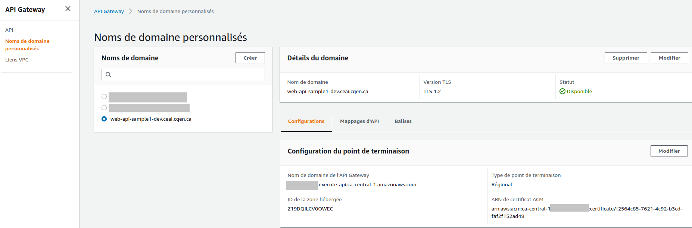
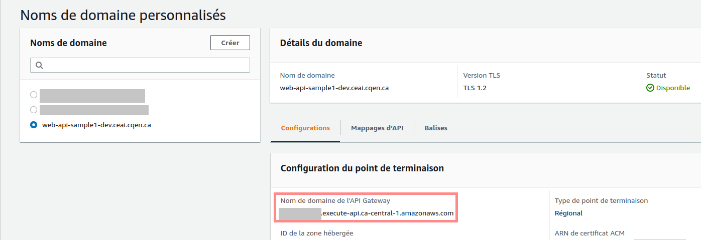
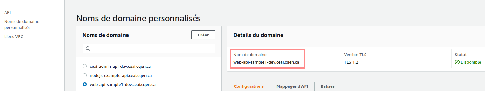
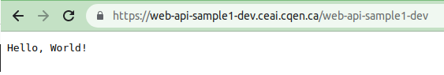
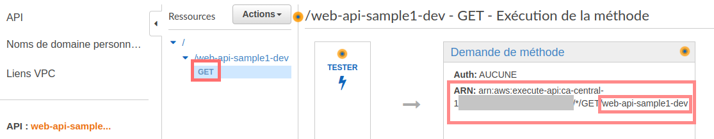

<!-- ENTETE -->

---

    

<!-- FIN ENTETE -->

# (Optionnel) Configuration des noms de domaine personnalisés pour les API REST

Les `noms de domaine personnalisés` sont des URL plus simples et plus intuitives que vous pouvez fournir à vos utilisateurs d'API.

:warning: Cette partie de l'exercice est optionnelle parce qu'elle a besoin d'autorisations spéciales dans le compte AWS, pour gérer les ressources de Route53 et du Gestionnaire de Certificats.

Voici quelques définitions pour mieux comprendre:
- ***Route53***: Service web de système de noms de domaine (DNS) dans le cloud hautement disponible et évolutif.
- ***DNS***: Un système de noms de domaine (DNS) traduit les noms de domaine lisibles par l'homme (par exemple: www.monexemple.com) en adresses IP lisibles par une machine (par exemple: 192.0.2.44).
- ***Gestionnaire de Certificat***: Service qui permet de mettre en service, de gérer et de déployer facilement des certificats Secure Socket Layer/Transport Layer Security (SSL/TLS) afin de les utiliser avec les services AWS et vos ressources internes connectées. Les certificats SSL/TLS sont utilisés pour sécuriser les communications réseau et pour établir l'identité de sites web par internet ainsi que  celle des ressources présentes sur des réseaux privés.

    
Comment un DNS achemine-t-il le trafic vers l'application web?

Nous allons, de toute façon, montrer la création des ressources nécessaires dans AWS pour rendre l'application publique sur internet (avec un lien public).

Dans les étapes précédentes, vous avez réussi à:
- Déployer une application web dans AWS et,
- Tester un appel à l'application avec une requête HTTP GET avez l'API Gateway.

Maintenant, nous allons voir la partie d'exposer un lien public de l'application pour qu'elle soit accessible sur internet.

## Nom de domaine dans Route53
Cette partie de l'exercice se fait manuellement dans le compte AWS.

Dans AWS -> Route53 -> zone hébergée, créez un enregistrement de type `CNAME` avec le nom de domaine que vous allez utiliser.

Exemple du nom de domaine: ***api-example***

Donc, l'URL finale serait par exemple: https://api-exemple.com

Pour l'instant, vous pouvez indiquer comme valeur, une URL temporaire qui sera ajustée lors de la création du nom de domaine personnalisé.

## Certificat ACM et enregistrement DNS dans la Route53

Copiez le fichier [custom_domain_preps.tf](scripts/custom_domain_preps.tf).

Ce fichier va permettre de créer:
- Un certificat ACM lié au DNS et,
- Un enregistrement DNS dans la Route53.

Appliquez les commandes terraform `validate`, `plan` et `apply` comme dans  l'[étape 4](E4-deploy-aws-ecs.md#déploiement).

Le certificat sera validé et son statut final devrait être `Émis`.

## Nom de domaine

Copiez le fichier [custom_domain.tf](scripts/custom_domain.tf).

Appliquez les commandes terraform `validate`, `plan` et `apply` comme dans  l'[étape 4](E4-deploy-aws-ecs.md#déploiement).

Avec ce fichier, le nom du domaine personnalisé sera créé dans AWS.

:warning: Dans Aws -> Route53 -> zone hébergée, éditez l'enregistrement de type CNAME de votre nom de domaine avec la valeur du "Nom de domaine de l'API Gateway" dans l'onglet `Configurations` du nom de domaine personnalisé.

## Test du nom de domaine personnalisé
Pour tester l'accès public à l'application, vous n'avez qu'à copier le lien du nom de domaine personnalisé dans votre navigateur et vous devez voir le "Hello World!" de l'api.

AWS - Api Gateway - Nom de Domain Personnalisé

Internet:

Dans le cas de cet exemple, l'URL pour accéder à l'application est accompagnée du path `web-api-sample1-dev`, ça veut dire:

https://web-api-sample1-dev.ceai.cqen.ca/web-api-sample1-dev

Vous pouvez vérifier ceci dans la vue AWS -> Api Gateway -> Resources -> Demande de méthode (valeur ARN):

Voilà! Finalement l'application est accessible dans l'internet avec une adresse publique!

Fin de l'exercice!

[<-- Page Principale](README.md)

[-> Page Précedente: Étape 5: Déployer les ressources de l'Api Gateway pour tester l'application](E5-deploy-api-gateway-aws.md)