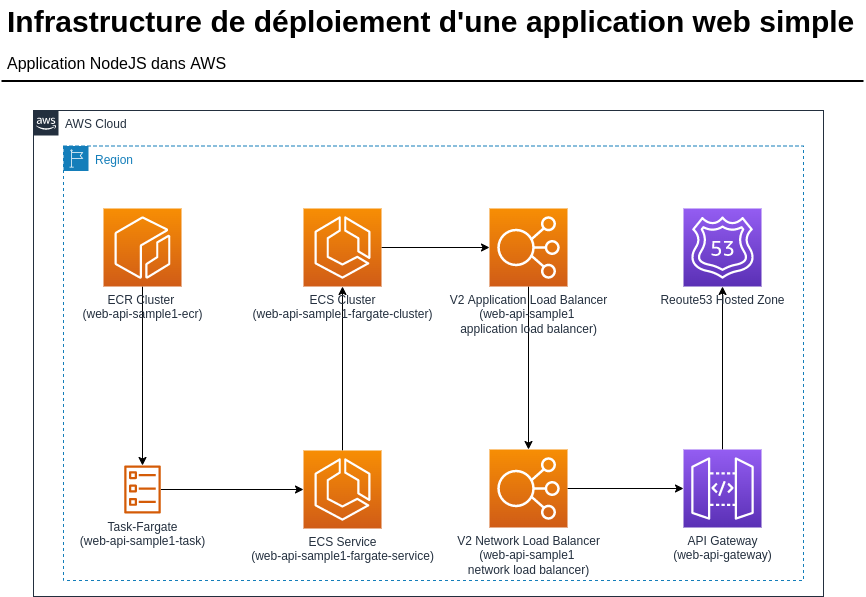

<!-- ENTETE -->

---

    

<!-- FIN ENTETE -->

# Déploiement d'une application web dans AWS avec terraform

## Description
Cet exercice vous montre comment déployer une application web simple dans AWS d'une manière fiable.

Il s'agit d'une application nodejs que, dans une première étape, sera déployé dans un cluster ECS (Elastic Container Service), à partir d'un service de registre d'images de conteneur ECR (Elastic Container Registry).

Ensuite, dans une deuxième étape, l'application sera exposé à l'extérieur via l'API gateway d'AWS.

L'infrastructure nécessaire pour cet exercice sera monté en utilisant l'outil d'infrastructure en tant que code (IaC): terraform.
Terraform aide à la mise en place des ressources nécessaires dans AWS pour le déploiement de l'application. À travers des scripts il offre la flexibilité et le montage/démontage de toute l'architecture utilisé dans l'exercice.

Plus sur terraform: [ici](../../Outils/Terraform/README.md#quest-ce-que-cest-terraform)

## Instructions

### Prérequis
- Un compte AWS avec
  - Un réseau virtuel (Virtual Private Cloud - VPC)
  - Des sous-réseaux d'application et de web
  - Des groupes de sécurité d'application et de web
  - Une service web de système de noms de domaine (DNS) - Route 53
- Accès au compte AWS
- Terraform installé dans le poste de travail ([voir](../../Outils/Terraform/README.md#installation))
- AWS cli installé dans le poste de travail ([voir](../../Outils/AWS-Command-Line-Interface/README.md#installation))

### Exécution

- [Étape 1: Construire une image docker d'une application web simple](E1-image-docker-web-app.md)
- [Étape 2: Déployer les ressources du cluster ECS](E2-deploy-aws-ecs.md)
- [Étape 3: Déployer les ressources de l'Api Gateway pour tester l'application](E3-deploy-api-gateway-aws.md)
- [Étape 4: (oprtionnel) Déployer les ressources pour avoir un lien public de l'application](E4-opt-deploy-domain-name-aws.md)

### Nettoyage

## Références
- [Deploy NodeJs App on AWS Using Terraform and Docker](https://codelabs.transcend.io/codelabs/node-terraform/index.html?index=../..index#6)