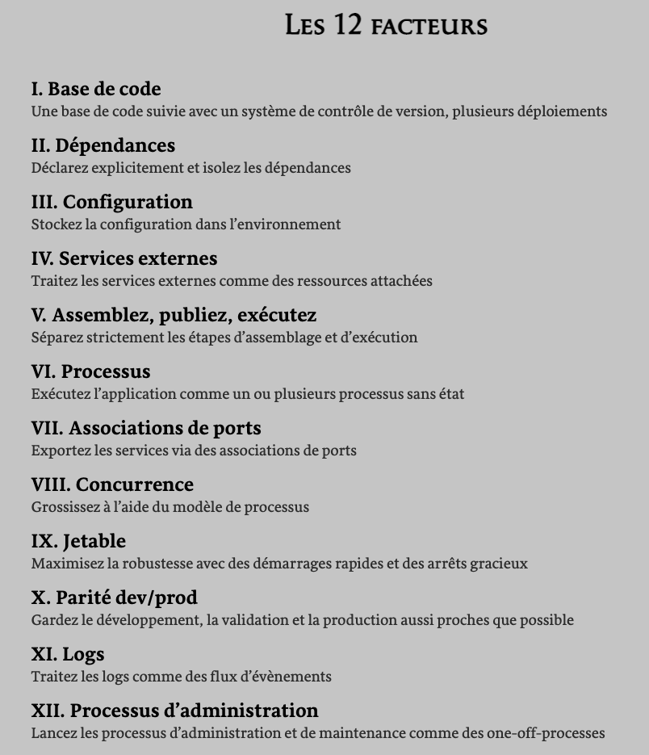

# Processus d'accueil au Centre d'expertise appliquée en innovation du CQEN

## Table de matières:

  - [Le laboratoire du CEAI](#le-laboratoire-du-ceai)
    - [L'environnement d'expérimentation du CEAI](#lenvironnement-dexpérimentation-du-ceai)
    - [Le fonctionnement du laboratoire](#le-fonctionnement-du-laboratoire)
    - [Les bonnes pratiques pour l'utilisation de l'environnement d'expérimentation](#les-bonnes-pratiques-pour-lutilisation-de-lenvironnement-dexpérimentation)
  - [Prérequis pour l'intégration au laboratoire du CEAI](#pré-requis-pour-lintégration-au-laboratoire-du-ceai)
    - [Twelve-factor App](#twelve-factor-app)
    - [Linux](#linux)
  - [Application cloud-native](#application-cloud-native)
    - [Concepts de base](#concepts-de-base)
      - [DevOps](#devops)
      - [Conteneurs](#conteneurs)
      - [API](#api)
      - [CI/CD](#cicd)
      - [Open Source](#open-source)
    - [Comment concevoir une application cloud-native](#comment-concevoir-une-application-cloud-native)
    - [Patrons de comception d'applications cloud-native](#patrons-de-comception-dapplications-cloud-native)

## Le laboratoire du CEAI

Le laboratoire sert à faciliter l'expérimentation de nouvelles technologies et de les appliquer au contexte gouvernemental de manière innovante. Il fournit des services infonuagiques et l'accompagnement tout au long des expérimentations. Vous devez utiliser les approches "Cloud Native" et "DevSecOps" pour expérimenter des solutions dans le laboratoire ([Bonnes pratiques](#les-bonnes-pratiques-pour-lutilisation-de-lenvironnement-dexpérimentation)).

Actuellement, les services infonuagiques offerts par le laboratoire du CEAI sont: [Openshift (PaaS)](../Openshift/README.md) et [AWS/ASEA (IaaS)](../ASEA/README.md). On vous accompagne dans la montée en compétence et la mise en oeuvre de votre application cloud-native.

### Expérimentation dans l'environnement du CEAI

1. Problème/Hypothèse
   
C'est le début de l'accompagnement pour l'expérimentation. L'étape d'identification du problème et les hypothèses à valider.

2. Rechercher solution existante

La recherche des solutions existantes qui respectent les critères du laboratoire: application cloud-native ou déployable en conteneur.

3. Expérimentation locale

La première phase de l'expérimentation est la réalisation d'un environnement local pour comprendre comment la solution fonctionne et si elle répond bien à vos besoins.

4. Création du prototype
   
On doit utiliser des [Conteneurs](#conteneurs) pour générer un prototype déployable dans l'infrastructure du laboratoire.

5. Déploiement PaaS ou Déploiement AWS
   
Le déploiement du prototype dans un de nos environnements:

[Openshift](../Openshift/README.md)

La plateforme OpenShift fournit des outils de développement et de déploiement intégrés qui facilite le déploiement d'une solution. Son utilisation est souvent plus simple pour faire les premiers pas dans la méthodologie DevSecOps. 

[AWS/ASEA](../ASEA/README.md)

AWS est actuellement le fournisseur infonuagique de la zone d'accueil du MCN. Si le prototype d'une expérimentation est destiné a être déployé dans un environnement de production infonuagique, le laboratoire peut fournir un équivalent dans sa zone d'accueil pour prendre en main les services natifs d'AWS dans l'architecture sécurisée ASEA.

6. Mise en disponibilité/test du prototype

Le prototype peut être exposé sur le web, ou bien à l'interne, pour être testé pour compléter cette étape de validation. Plusieurs acteurs peuvent être impliqués pour cette étape.

7. Packaging du prototype

À la fin des tests, écrire les procédure de provisionnement et déploiement du prototype avec un outil comme Terraform. De cette façon il sera déployable en dehors du lab.

8. Rapport d'expérimentation

Écrire votre rapport d'expérimentation directement dans le repo [Github](https://github.com/CQEN-QDCE) utilisé pour être inclus dans le site du CEAI.

### Les bonnes pratiques pour l'utilisation de l'environnement d'expérimentation
- S'assurer que le type de ressource utilisé est disponible dans le catalogue du courtier en infonuagique;
- Les utilisateurs s'engagent à ne pas utiliser des données sensibles et à ne pas en produire;
- Utiliser une voûte de secrets pour le stockage des mots de passe et toutes les informations sensibles nécessaires au fonctionnement des composantes logicielles;
- Nommer de manière consistante les composantes logicielles nécessaires aux expérimentations;
- Documenter les expérimentations de manière à faciliter la réutilisation et la répétabilité;
- Automatiser les tâches répétitives;
- Mettre en place des mécanismes d'alertage et de suivi de coûts;
- Mettre en place des mécanismes permettant de limiter l'utilisation des ressources lorsque non utilisés (scripts de démarrage-arrêt);
- N'utiliser que des solutions libres pour les expérimentations;
- Ne pas donner des accès à des usagers autres que ceux de l'équipe d'expérimentations;
    - Ne pas créer des utilisateurs qu'à des fins d'expérimentation;
- Pour AWS: Privilégier l'API SSO à l'API IAM autant que possible.

## Pré-requis pour l'intégration au laboratoire du CEAI
1. 12-factor Apps
2. Containers (allez à la section [Conteneurs](#conteneurs))
3. Linux
4. Protocole Git (guide disponible [ici](https://github.com/CQEN-QDCE/ceai-cqen-documentation/tree/GithubBonnesPratiques))
5. Orchestrateur (guide Openshift disponible [ici](https://github.com/CQEN-QDCE/ceai-cqen-documentation/tree/121-guide-openshift-kompose/Guides/Openshift))
6. Atout: capable de faire du bash script

Nous avons disponibilisé un [guide de formations](formations.md) en ligne pour vous aider à intégrer le laboratoire du CEAI.

### Twelve-factor App
> L'application à 12 facteurs est une méthodologie définie par les développeurs d'Heroku pour créer et déployer des applications cloud natives:  
> - Utilisent des formats **déclaratifs** pour mettre en oeuvre l'automatisation, pour minimiser le temps et les coûts pour que des nouveaux développeurs rejoignent le projet;
> - Ont un **contrat propre** avec le système d'exploitation sous-jacent, offrant une **portabilité maximum** entre les environnements d'exécution;
> - Sont adaptés à des **déploiements** sur des **plateformes cloud** modernes, rendant inutile le besoin de serveurs et de l'administration de systèmes;
> - **Minimisant la divergence** entre le développement et la production, ce qui permet le **déploiement continu** pour une agilité maximum;
> - et peuvent **grossir verticalement** sans changement significatif dans les outils, l'architecture ou les pratiques de développement.
>
> La méthodologie 12 facteurs peut être appliquée à des applications écrites dans tout langage de programmation, et qui utilisent tout type de services externes (base de données, mémoire cache, etc.)

Le schéma qui suit liste les 12 facteurs qui doivent être respectés pour l'application de cette méthodologie. Pour plus de détails sur la méthodologie 12 facteurs, consultez:
- [Documentation officielle](https://12factor.net/)
- [Beyond the 12 factors: 15-factor cloud-native Java applications](https://developer.ibm.com/articles/15-factor-applications/)

### Linux
> Linux est le système d'exploitation Open Source le plus connu et utilisé au monde. Des compagnies et des individus choisissent de l'utiliser parce qu'il est sécuritaire, flexible et qu'il est possible d'avoir beaucoup de support d'une grande communauté d'utilisateurs. 

Dans le laboratoire, les conteneurs déployés doivent utiliser un OS Linux.

Pour plus d'informations, consultez [cet article](https://opensource.com/resources/linux).

---
:point_right: **NOTE:**

Nous proposons [cet atelier sur OpenClassrooms](https://openclassrooms.com/fr/courses/7170491-initiez-vous-a-linux?archived-source=43538) si vous voulez approfondir vos connaissances sur Linux.

---

## Application cloud-native
> Une application cloud-native se compose de services plus petits, indépendants et faiblement couplés. Le développement d'applications cloud-native permet d'accélérer la création des nouvelles applications, d'optimiser les anciennes et de les connecter les unes aux autres. L'objectif est double: fournir aux utilisateurs les applications dont ils ont besoin tout en suivant le rythme imposé par leur activité.
Lorsque l'ont dit une application qu'elle est cloud-native, cela signifie qu'elle a été conçue spécialement pour offrir une expérience cohérente de développement et de gestion automatisée dans les clouds privés, publics et hybrides.

Pour plus d'informations sur les applications cloud-native, consultez [cet article](https://www.redhat.com/fr/topics/cloud-native-apps).

Pour plus d'information sur les patrons de conception d'architecture cloud-native, consultez [cet article](https://medium.com/walmartglobaltech/cloud-native-application-architecture-a84ddf378f82) et [cet article](https://cloud.google.com/blog/products/application-development/5-principles-for-cloud-native-architecture-what-it-is-and-how-to-master-it).

### Concepts de base
#### DevSecOps
> DevSecOps signifie développement, sécurité et opérations. Il s'agit d'une approche de la culture, de l'automatisation et de la conception de plate-forme qui intègre la sécurité en tant que responsabilité partagée tout au long du cycle de vie informatique.
>
> DevSecOps signifie penser à la sécurité des applications et de l'infrastructure dès le départ. Cela signifie également automatiser certaines portes de sécurité pour empêcher le flux de travail DevOps de ralentir. La sélection des bons outils pour intégrer en permanence la sécurité, comme convenir d'un environnement de développement intégré (IDE) avec des fonctionnalités de sécurité, peut aider à atteindre ces objectifs. Cependant, une sécurité DevOps efficace nécessite plus que de nouveaux outils : elle s'appuie sur les changements culturels de DevOps pour intégrer le travail des équipes de sécurité le plus tôt possible.

Pour plus d'informations sur le modèle DevSecOps, consultez [cet article](https://www.redhat.com/en/topics/devops/what-is-devsecops).

#### Conteneurs
> Un conteneur est une unité de logiciel qui permet d'assembler et d'isoler des applications avec leur environnement d'exécution complet, c'est-à-dire tous les fichiers nécessaires à leur exécution. Les applications conteneurisées sont plus faciles à déplacer d'un environnement à un autre (développement, test, production, etc.), tout en conservant l'intégralité de leurs fonctions.

---
:point_right: **NOTE:**

Nous proposons [cet atelier sur DockerHub](https://dockerlabs.collabnix.com/workshop/docker/) pour approfondir vos connaissances sur les conteneurs Docker.

---

Pour plus d'informations sur les conteneurs, consultez [cet article](https://www.docker.com/resources/what-container/).

#### API
> Une API désigne une interface de programmation d'application. Les API sont des mécanismes qui permettent à deux composants logiciels de communiquer entre eux à l'aide d'un ensemble de définitions et de protocoles.
> 
> Dans le contexte des API, le terme "application" désigne tout logiciel ayant une fonction distincte. L'interface peut être considérée comme un contrat de service entre deux applications. Ce contrat définit la manière dont les deux parties communiquent entre elles à l'aide de demandes et de réponses. La documentation de l'API contient des informations sur la manière dont les développeurs doivent structurer ces demandes et ces réponses.

Pour plus d'informations sur les API, consultez [cet article](https://aws.amazon.com/fr/what-is/api/?nc1=h_ls).

#### CI/CD
> L'automatisation est au coeur de la réussite du DevOps et le CI/CD est une composante critique. CI/CD signifie l'intégration continue et le déploiement continu (Continuous Integration and Continuous Deployment). Un pipeline CI/CD est une série de workflows automatisés qui a pour objectif aider les équipes DevOps à réduire les tâches manuelles.
> 
> La partie intégration continue compile, teste et intègre des modifications dans le code de façon automatique, pour qu'ensuite la partie déploiement continue déploie les modifications dans le code aux environnements de production.

Pour plus d'information, consultez [cet article](https://resources.github.com/ci-cd/).

#### Open Source
> Le terme Open Source fait référence à quelque chose que n'importe qui  peut modifier et distribuer, car sa conception est accessible au public. 
> 
> Il est né dans le contexte du développement logiciel pour désigner une manière de créer des logiciels. Aujourd'hui l'Open Source désigne un ensemble de valeurs basé sur les principes de l'échange ouvert, de la participation collaborative, du prototypage rapide, de la méritocratie et du développement orienté par la communauté.

Pour plus d'information sur l'Open Source, consultez [cet article](https://opensource.com/resources/what-open-source).

### Comment concevoir une application cloud-native

> Le développement d'applications cloud-native s'articule autour d'une architecture modulaire qui utilise des services indépendants et faiblement couplés. Chaque microservice assure une fonctionnalité métier précise, s'exécute dans le cadre d'un processus propre et communique via des interfaces de programmation d'application (API) ou un système de messagerie.

Pour plus d'information sur comment concevoir une application cloud-native, consultez [cet article](https://www.redhat.com/fr/topics/cloud-native-apps).
