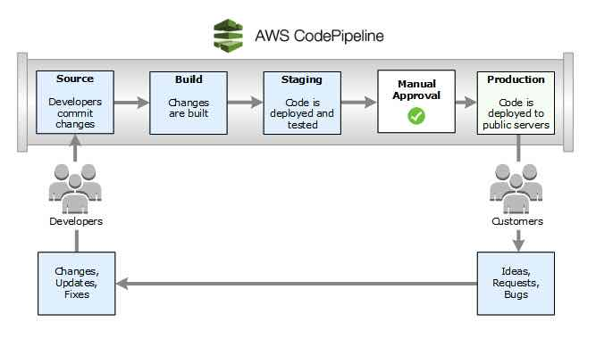

<!-- ENTETE -->

---

    

<!-- FIN ENTETE -->

La plateforme amazon cloud offre AWS CodePipeline qui automatise les phases de construction, de test et de déploiement de votre processus de publication chaque fois qu'un changement de code est effectué. Cela permet la livraison rapide et fiable de nouvelles fonctionnalités et de mises à jour. En outre, il est simple d'intégrer AWS CodePipeline à des services tiers tels que GitHub ou tout autre plugin personnalisé.

Lorsque les développeurs apportent des changements à un référentiel de sources, CodePipeline détecte automatiquement ces changements. Ces changements sont construits, et si des tests sont configurés, ils sont exécutés. Une fois les tests terminés, le code construit est déployé sur des serveurs de test pour être testé. À partir du serveur de préparation, CodePipeline exécute d'autres tests (par exemple, des tests d'intégration ou de charge). Une fois ces tests terminés avec succès et l'action d'approbation manuelle ajoutée au pipeline, CodePipeline déploie le code testé et approuvé dans les instances de production à l'aide de AWS CodeDeploy, AWS Elastic Beanstalk, Amazon ECS, AWS Fargate, Amazon S3, AWS Service Catalog, AWS CloudFormation.

Lorsque vous utilisez la console pour créer ou modifier un pipeline qui a une source GitHub, CodePipeline crée un webhook. Un webhook est une notification HTTP qui détecte des événements dans un autre outil, tel qu'un dépôt GitHub, et connecte ces événements externes à un pipeline. 

## Concepts

### Pipeline
Un pipeline définit le flux de travail de votre processus de publication et décrit comment une nouvelle modification de code progresse dans votre processus de publication.
Les pipelines doivent comporter au moins deux étapes. La première étape d'un pipeline doit être une étape source, et le pipeline doit également avoir au moins une autre étape qui est une étape de construction ou de déploiement.
Définissez la structure de votre pipeline à l'aide d'un document déclaratif JSON 

### Revision
Une révision est une modification apportée à l'emplacement de la source définie pour votre pipeline. Il peut s'agir de code source, de résultats de compilation, de configuration ou de données. Un pipeline peut avoir plusieurs révisions qui le traversent en même temps.

### Stage
Une étape (Stage) est un groupe d'une ou plusieurs actions. Un pipeline peut avoir deux ou plusieurs étapes.

### Action
Une action est une tâche effectuée sur une révision. Les actions du pipeline se déroulent dans un ordre précis, en série ou en parallèle, selon la configuration de l'étape (Stage).
Vous pouvez ajouter à votre pipeline des actions qui se trouvent dans une région AWS différente de votre pipeline.
Il existe six types d'actions:
- Source
- Construire (Build)
- Test 
- Déploiement (Deploy)
- Approbation (Approval)
- Appeler (Invoke)

### Artifacts
Lorsqu'une action est exécutée, elle agit sur un fichier ou un ensemble de fichiers appelés artefacts. Ces artefacts peuvent être traités par des actions ultérieures dans le pipeline. 
Vous avez accès au artifact store qui est un Bucket S3 dans la même région AWS que le pipeline pour stocker les éléments de tous les pipelines de cette région associés à votre compte.

### Transitions
Les étapes (Stages) d'un pipeline sont reliées par des transitions. Les transitions peuvent être désactivées ou activées entre les étapes. Si toutes les transitions sont activées, le pipeline fonctionne en continu.

### Approval action
Une action d'approbation empêche un pipeline de passer à l'action suivante tant que l'autorisation n'est pas accordée. 
Ceci est utile lorsque vous effectuez des revues de code avant que le code ne soit déployé vers l'étape suivante. 

Pour plus d'informations sur la conception du `CodePipeline AWS`, veuillez suivre ce [lien](https://docs.aws.amazon.com/fr_fr/codepipeline/latest/userguide/concepts.html#concepts-stages)
