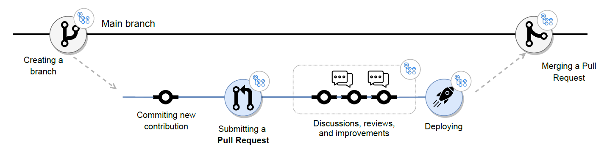

<!-- ENTETE -->
[](https://www.quebec.ca/gouv/politiques-orientations/vitrine-numeriqc/accompagnement-des-organismes-publics/demarche-conception-services-numeriques)
[](LICENSE_FR)

---

<div>
    
</div>
<!-- FIN ENTETE -->

Il y a deux façons principales de structurer vos pipelines, chacune ayant ses propres avantages. Ces méthodes peuvent être mélangées et assorties selon les besoins :

1. Expérimentation : Idéal pour les projets simples où toute la configuration se trouve à un seul endroit facile à trouver.
Production : Idéal pour les projets complexes et de grande envergure qui nécessitent une exécution efficace.
2. Production : Idéal pour les projets en cours de production ou dont vous pensez qu'ils peuvent passer à la phase de production.

## Expérimentation:

### WorkFlow

Le flux Github Flow fonctionne avec différentes branches pour gérer facilement chaque phase du développement du logiciel, il est suggéré de l'utiliser lorsque votre logiciel a le concept de "Expérimentation" car, comme vous pouvez le voir dans le schéma ci-dessus

Les branches principales de ce flux sont :

- Prod (master)
- fonctionnalités(features)



Lorsque vous clonez un dépôt GIT dans votre dossier local, vous devez immédiatement créer une branche à partir du `master` appelée au nom de votre fonctionnalité, par exemple (`features/nom`). Cette branche sera la branche utilisée pour votre développement, où vous pourriez implémenter votre  fonctionnalité ou corriger des bogues avant le déploiement. Chaque fois qu'un développeur a besoin d'ajouter une nouvelle fonctionnalité, il crée une nouvelle branche à partir du `master` qui lui permet de travailler correctement sur cette fonctionnalité sans compromettre le code des autres membres de l'équipe dans la branche `develop`.
Lorsque la fonctionnalité est prête et testée, et vous êtes prêt à déployer votre projet, vous pourriez ouvrir une demande `Pull-request`. Une fois le réviseur a approuvé la fonctionnalité, vous pouvez la fusionner avec `master` afin de faire le déploiement final. 
Notre objectif est d'avoir toujours une version stable de la branche de production car nous ne fusionnons le code que lorsque la nouvelle fonctionnalité est terminée et qu'elle fonctionne.

### CI/CD
L'intégration continue et le déploiement continu feront référence au transfert automatique des modifications apportées par les développeurs du référentiel de la branche prod (maître) vers l'environnement de production sur AWS SEA en utilisant AWS pipeline. Ce processus permet d'apporter régulièrement des modifications au code de leurs applications, de les tester par les développeurs et de soulager les équipes d'exploitation surchargées par des tâches manuelles qui ralentissent la distribution des applications.


## Production
Le flux Git fonctionne avec différentes branches pour gérer facilement chaque phase du développement du logiciel, il est suggéré de l'utiliser lorsque votre logiciel a le concept de "Prduction" car, comme vous pouvez le voir dans le schéma ci-dessus, ce n'est pas la meilleure décision lorsque vous travaillez dans un environnement de livraison continue ou de déploiement continu où ce concept est absent.
Un autre point positif de ce flux est qu'il convient parfaitement lorsque vous travaillez en équipe et qu'un ou plusieurs développeurs doivent collaborer à la même fonctionnalité.
Mais regardons de plus près ce modèle.

Les branches principales de ce flux sont :

- Prod (master)
- pre-prod(release)
- développer(develop)
- fonctionnalités(features)

Lorsque vous clonez un dépôt GIT dans votre dossier local, vous devez immédiatement créer une branche du master appelée develop (Si s'applique), cette branche sera la branche principale pour le développement et où tous les développeurs d'une équipe travailleront pour implémenter de nouvelles fonctionnalités ou corriger des bogues avant la publication.
Chaque fois qu'un développeur a besoin d'ajouter une nouvelle fonctionnalité, il crée une nouvelle branche à partir de develop qui lui permet de travailler correctement sur cette fonctionnalité sans compromettre le code des autres membres de l'équipe dans la branche develop.
Lorsque la fonctionnalité est prête et testée, elle peut être réintégrée dans la branche de développement. Notre objectif est d'avoir toujours une version stable de la branche de développement car nous ne fusionnons le code que lorsque la nouvelle fonctionnalité est terminée et qu'elle fonctionne.
Lorsque toutes les fonctionnalités liées à une nouvelle version sont implémentées dans la branche de développement, il est temps de brancher le code sur la branche de pre-prod où vous commencerez à tester correctement avant le déploiement final et où votre client pourra également tester l'application et voir si tout répond à ses besoins.
Lorsque vous faites passer votre code de la branche de développement à la branche de pre-prod, vous devez éviter d'ajouter de nouvelles fonctionnalités, mais vous devez uniquement corriger les bogues dans le code de la branche de pre-prod jusqu'à ce que vous créiez une branche de pre-prod stable.
À la fin, lorsque vous êtes prêt à déployer votre projet en direct, vous marquerez la version (Mettre un tag) dans la branche principale afin d'avoir toutes les différentes versions que vous publiez semaine après semaine.
Apparemment, cela peut sembler beaucoup d'étapes, mais il est certain que c'est assez sûr et vous aide à éviter les erreurs ou les problèmes lors de la publication.

### CI/CD
Ici nous aurons deux parties selon nos branches :

1. Develop
Pour la branche develop nous aurons juste l'intégration continue qui aidera à faire travailler plusieurs développeurs simultanément sur différentes fonctions d'une même application et qui permettra aux développeurs de fusionner plus fréquemment leurs modifications de code dans la branche de développement. Une fois que les modifications apportées par un développeur sont fusionnées, elles sont validées par la création automatique de l'application et l'exécution de différents niveaux de tests automatisés (généralement des tests unitaires et d'intégration) qui permettent de vérifier que les modifications n'entraînent aucun dysfonctionnement au sein de l'application.

2. pre-prod, Prod
Le déploiement dans la branche de pre-prod doit être le même que dans la branche de prod, afin que nous puissions tester le déploiement de manière plus efficace avant qu'il ne soit mis en production.
Et pour cela, le CEAI a decidé que le CICD doit être construit dans AWS SEA avec AWS pipeline.
Donc l'integration continue et le déploiement continu vont étre dans le AWS pipline afin de réduiser les risques liés au déploiement des applications, puisqu'il est plus simple de publier des modifications par petites touches qu'en un seul bloc. Cette approche nécessite néanmoins un investissement de départ considérable, car les tests automatisés devront être rédigés de manière à s'adapter à un large éventail d'étapes de test et de lancement dans le pipeline CI/CD.

## Sécuriser le CI/CD

[GitHub Action Snyk](https://github.com/marketplace/actions/snyk) a été choisi dans le but de permetre les utilisateurs du laboratoire du Centre d'expertise appliquée en innovation du CQEN (CEAI) de sécurisé pour vos projets GitHub. Et en intégrant Snyk à votre GitHub CI/CD, vous pouvez automatiser l'analyse de sécurité dans le cadre de votre cycle de construction avant la production. Avec les GitHub Action de Snyk, vous pouvez ajouter automatiquement l'analyse à votre flux de travail des actions GitHub et combiner les actions pour qu'elles s'adaptent au mieux à votre projet, garantissant ainsi la sécurité du code maintenant et à l'avenir. 

Snyk est un éditeur spécialisé dans l'analyse des vulnérabilités dans le code des fichiers de configuration d'infrastructure, notamment celles présentes dans les conteneurs et les packages applicatifs.

Snyk Container dans Github consiste à créer une nouvelle image. Pour utiliser Snyk, vous devez créer un nouveau secret appelé SNYK_TOKEN, et pour obtenir le token, vous devez créer un compte chez Snyk. Avec le jeton, vous pouvez créer le secret sur Github et l'utiliser dans l'action.

Voici un exemple d'utilisation, dans ce cas pour tester un projet Node.js :

```yml
# Meta-information about this step of GitHub Action Snyk
    # ↓ ↓ ↓ ↓ ↓ ↓ ↓ ↓ ↓ ↓ ↓ ↓ ↓ 
opensource-security:
   runs-on: ubuntu-latest
   steps:
     - uses: actions/checkout@master
     - name: Run Snyk to check for vulnerabilities
       uses: snyk/actions/node@master
       env:
         SNYK_TOKEN: ${{ secrets.SNYK_TOKEN }}
```
