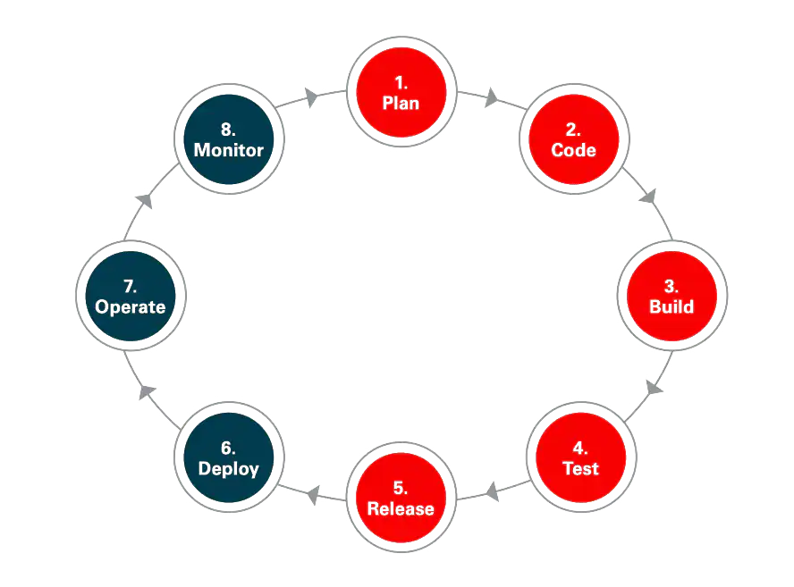
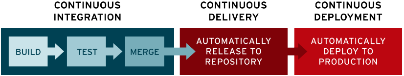

<!-- ENTETE -->

---

    

<!-- FIN ENTETE -->

# Introduction

Avant d'aborder le fonctionnement du pipeline CI/CD, il faut comprendre le concept DevOps.

## DevOps
DevOps est une méthodologie de développement standardisée, une communication claire et des processus documentés, soutenus par une plate-forme middleware standardisée, améliorent les cycles de développement et de gestion des applications, apportent de l’agilité et fournissent une disponibilité et une sécurité accrues à votre infrastructure informatique. Pour être concis, le DevOps consiste à connecter des personnes, des produits et des processus.

Donc c'Est une approche du développement logiciel qui implique un développement continu, des tests continus, une intégration continue, un déploiement continu et une surveillance continue du logiciel tout au long de son cycle de vie.

### Développement :
L'infrastructure nécessaire pour unifier le développement, du partage des ressources à l'écriture de code et d'algorithmes pour les applications d'entreprise qui peuvent tirer parti de fonctionnalités avancées telles que l'intelligence artificielle/le machine learning, les conteneurs et les fonctions sans serveur. En outre, les tests, l’archivage, le suivi des bogues et d’autres tâches critiques sont gérés lors de la phase de développement, le tout prêt à être lancé. Certains outils courants utilisés pour le développement : Git pour l'enregistrement du code, Github ou Bitbucket évolutif pour la gestion des référentiels de code.

### Opérations :
Une fois qu'une application est déployée, le côté opérations prend le relais en veillant à ce que les défis opérationnels des plates-formes cloud soient relevés. Les problèmes tels que la sécurité des utilisateurs, la gestion de la base de données, l'évolutivité des workloads de production et l'application de correctifs sont tous traités dans cette fonction. Quelques outils courants utilisés pour les opérations : Terraform, Ansible, Puppet et Chef pour la gestion de l'infrastructure et des configurations.

Que l'approche soit nommée « DevOps » ou « DevSecOps », il a toujours été préférable de faire de la sécurité une partie intégrante du cycle de vie des applications. L'approche DevSecOps repose sur une sécurité intégrée et non sur un périmètre de sécurité qui protège les applications et les données. Lorsque la sécurité est reléguée à la fin du processus de développement, les entreprises qui adoptent l'approche DevOps peuvent se retrouver confrontées à de longs cycles de développement, ce qu'elles essayaient justement d'éviter.

## DevOps & DevSecOps

Le modèle DevOps ne s'adresse pas uniquement aux équipes de développement et d'exploitation. Si vous souhaitez tirer pleinement parti de l'agilité et de la réactivité d'une approche DevOps, vous devez également intégrer la sécurité informatique au cycle de vie complet de vos applications.

Par le passé, les processus liés à la sécurité étaient isolés et confiés à une équipe spécifique, à l'étape finale du développement. Cela ne posait pas de problème à une époque où les cycles de développement duraient des mois, voire des années. Mais cette époque est révolue. Si une approche DevOps efficace garantit des cycles de développement rapides et fréquents (parfois quelques semaines ou jours), des pratiques de sécurité dépassées peuvent réduire à néant les bénéfices des projets DevOps les plus efficaces.
À présent, dans le cadre de travail collaboratif du modèle DevOps, la sécurité est une responsabilité partagée, intégrée du début à la fin. Cette notion est si importante qu'elle a donné naissance à l'expression « DevSecOps » pour souligner la nécessité d'intégrer la sécurité aux projets DevOps.

Donc, le DevOps et le DevSecOps fournissent un moyen de répondre aux besoins du cycle de développement logiciel (SDLC) pour assurer une intégration continue et une livraison continue (CI/CD). L'intégration du développement, des opérations et de la sécurité offre des avantages pratiques aux ressources tout en permettant une communication et une collaboration plus rapides tout au long du cycle de vie. La capacité de construire un pont entre ces groupes, tout en réduisant le cycle de vie global du développement logiciel, donne une signification et une valeur DevOps, quel que soit le secteur.

## Piepline CICD
Les pipelines sont les blocs de construction fondamentaux pour le CI/CD dans notre lab. Cette page documente certains des concepts importants qui leur sont liés.

Le modèle DevSecOps implique d'intégrer la sécurité au processus de développement des applications, du début à la fin. Ceci nécessite d'une part de nouveaux outils et, d'autre part, l'adoption d'une nouvelle culture d'entreprise. Les équipes DevOps doivent automatiser la sécurité pour protéger l'environnement global et les données, ainsi que le processus d'intégration et de distribution continue. 

L'automatisation est un principe fondamental pour la réussite de DevOps et le CI/CD en est une composante essentielle. Le CI/CD comprend l'intégration continue et la livraison continue ou le déploiement continu. Ensemble, ils forment un "pipeline CI/CD" - une série de flux de travail automatisés qui aident les équipes DevOps à réduire les tâches manuelles :

### L'intégration continue (CI) 
construit, teste et intègre automatiquement les changements de code dans un référentiel partagé. Le fait de valider le code plus souvent permet de détecter les erreurs plus rapidement et de réduire la quantité de code qu'un développeur doit déboguer pour trouver la source d'une erreur. Les mises à jour fréquentes du code facilitent également la fusion des modifications apportées par les différents membres d'une équipe de développement logiciel. C'est une excellente chose pour les développeurs, qui peuvent passer plus de temps à écrire du code et moins de temps à déboguer les erreurs ou à résoudre les conflits de fusion.

### La livraison continue (CD) 
permet de livrer automatiquement les modifications du code dans des environnements prêts à la production pour approbation ; ou
### Le déploiement continu (CD) 
déploie automatiquement les changements de code aux clients directement afin de publier et déployer des mises à jour logicielles. Dans le cadre du processus typique de CD, le code est automatiquement construit et testé avant le déploiement. Le déploiement continu est souvent associé à l'intégration continue.

### Sécurité des processus CI/CD
Il serait préférable de suivre les étapes suivantes pour sécuriser votre application et votre environnement:

- Intégrer des analyseurs de sécurité pour les conteneurs;
- Automatiser les tests de sécurité dans le processus CI;
- Ajouter des tests automatisés de la sécurité au processus de test d'acceptation;
- Automatiser les mises à jour de sécurité, comme les correctifs pour les failles connues à réaliser dans le pipeline DevOp;
- Automatiser les capacités de gestion de configuration des systèmes et des services.

Pour plus d'informations sur DevSecOps et le CICD, voici les liens suivants :

https://www.redhat.com/fr/topics/devops/what-is-devsecops

https://www.redhat.com/fr/topics/devops/what-is-ci-cd

