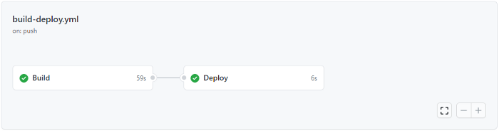

<!-- ENTETE -->
[](https://www.quebec.ca/gouv/politiques-orientations/vitrine-numeriqc/accompagnement-des-organismes-publics/demarche-conception-services-numeriques)
[](LICENSE_FR)

---

<div>
    
</div>
<!-- FIN ENTETE -->

## Composants de Github Actions

### Workflows (Flux de travail)
Un flux de travail est un processus automatisé personnalisé que nous pouvons inclure dans notre référentiel pour construire, tester et déployer nos codes sources. Nous pouvons avoir plus d'un flux de travail et il doit être stocké dans le dossier .github/workflows dans le répertoire racine du code source et peut être programmé ou déclenché par un événement.

### Events (Événements)
Un événement est une activité spécifique qui déclenche un flux de travail. Par exemple, l'activité peut provenir de GitHub lorsque quelqu'un pousse un commit vers un dépôt ou lorsqu'une issue ou une pull request est créée. Vous pouvez également utiliser le webhook de répartition du dépôt pour déclencher un flux de travail lorsqu'un événement externe se produit.
Une liste complète des événements qui peuvent déclencher un flux de travail se trouve [ici](https://docs.github.com/en/actions/using-workflows/events-that-trigger-workflows).
Vous pouvez également spécifier les branches auxquelles ces règles s'appliquent. Par exemple, dans l'extrait de code ci-dessous, nous déclenchons ce flux de travail lorsqu'un push est effectué sur la branche principale et lorsqu'une demande de pull est créée pour fusionner les changements sur la branche principale.

```yml
on:
  push:
    branches:
      - main
  pull_request:
    branches:
      - main
```

### Jobs
Un job est un ensemble d'étapes qui s'exécutent sur le même runner. Par défaut, un flux de travail comportant plusieurs tâches s'exécute en parallèle. Vous pouvez également configurer un workflow pour qu'il exécute les tâches de manière séquentielle. Par exemple, un flux de travail peut avoir deux tâches séquentielles qui construisent et testent le code, où la tâche de test dépend de l'état de la tâche de construction. Si le travail de construction échoue, le travail de test ne sera pas exécuté.

```yml
jobs:
  # General structure of a job
  # ↓ ↓ ↓ ↓ ↓ ↓ ↓ ↓ ↓ ↓ ↓ ↓ ↓ 
  
  this_job_key:
  
    # Meta-information about this job
    # ↓ ↓ ↓ ↓ ↓ ↓ ↓ ↓ ↓ ↓ ↓ ↓ ↓ 
    
    name: This job 
    runs-on: ubuntu-latest  
    needs: previous_job_key 
    if: github.ref == 'refs/heads/main' 
    
    # Other properties of the job can go here
    # ...
    
    steps:
    # Properties and values defining various steps in this job goes here
    # ...
```   

#### Meta-information:

- name : Le nom d'affichage de cette tâche. Ce nom d'affichage apparaît dans l'interface utilisateur des actions GitHub, comme indiqué ci-dessous. Bien que cette propriété soit facultative, nous vous recommandons vivement de l'utiliser pour une meilleure lisibilité.

- runs-on : Un mot-clé obligatoire définissant le type de machine (Windows/Ubuntu/Mac) sur laquelle cette tâche s'exécute. Si vous vous en tenez aux options par défaut, vous choisissez un exécuteur hébergé par GitHub. Il s'agit de machines virtuelles hébergées par GitHub dans Azure et fournies avec des logiciels préinstallés pour pouvoir exécuter votre flux de travail. Si vous souhaitez utiliser votre propre programme d'exécution (runner), vous pouvez sélectionner ["self-hosted runner"](https://docs.github.com/en/actions/hosting-your-own-runners/using-self-hosted-runners-in-a-workflow).

- needs: Les Jobs sont exécutés en parallèle par défaut. Si vous souhaitez les exécuter en série, vous pouvez fournir une clé de Jobs précédents à ce mot-clé. Une fois que vous aurez exécuté l'ensemble du flux de travail, GitHub Actions créera un diagramme de dépendances similaire à la capture d'écran ci-dessous.



- if: Vous pouvez exécuter ce Job de manière conditionnelle en fournissant une condition ici. Si cette condition est évaluée à true, le Job sera exécuté, sinon il ne le sera pas.

### Steps (Étapes)
Une étape est une tâche individuelle qui peut exécuter des commandes dans un travail. Une étape peut être soit une action, soit une commande shell. Chaque étape d'un job s'exécute sur le même runner, ce qui permet aux actions de ce job de partager des données entre elles.

```yml
steps:
  # General structure of steps
  # ↓ ↓ ↓ ↓ ↓ ↓ ↓ ↓ ↓ ↓ ↓ ↓ ↓  
  
  - name: Your step name
    uses: third-party-action@version
    if: always()  
    with:
      other-properties: property-value
      # Other properties of this property can go here
      # ...
      
  - name: Your step name
    run: npm run build
  - name: Upload deployable package
    uses: actions/upload-artifact@v2
    with:
      name: my-artifact
      path: path/to/artifact
    # Other properties of this step can go here
    # ...
```

#### Meta-information:

- name : Tout comme le nom de Job, ce mot-clé est facultatif mais nous recommandons vivement de l'utiliser car il offre une meilleure lisibilité. Sans spécifier un nom d'étape, GitHub Actions attribuera automatiquement un nom basé sur votre tâche.

- if: Exécution conditionnelle d'une étape, similaire au mot-clé if dans la section sur les travaux ci-dessus.

#### Runners
Un runner est un serveur sur lequel l'application GitHub Actions runner est installée. Vous pouvez utiliser un runner hébergé par GitHub ou héberger le vôtre. Un runner est à l'écoute des tâches disponibles, exécute une tâche à la fois et transmet la progression, les journaux et les résultats à GitHub. Les exécuteurs hébergés par GitHub sont basés sur Ubuntu Linux, Windows et macOS, et chaque tâche d'un flux de travail s'exécute dans un environnement virtuel.

```yml
# Meta-information about this step
    # ↓ ↓ ↓ ↓ ↓ ↓ ↓ ↓ ↓ ↓ ↓ ↓ ↓
 - name: Build project
   run: npm run build
```
- run : Si vous souhaitez exécuter un programme en ligne de commande, vous pouvez fournir la commande ici.

- working-directory : Vous pouvez spécifier le répertoire dans lequel exécuter cette commande.

- [shell](https://docs.github.com/en/actions/using-workflows/workflow-syntax-for-github-actions#using-a-specific-shell) : Par défaut, bash est utilisé dans un runner non-Windows et pwsh (PowerShell Core) est utilisé dans un runner Windows. Si vous souhaitez changer cela, vous pouvez sélectionner l'une des nombreuses options de shell prédéfinies.

#### Actions
Les actions sont des commandes autonomes qui sont combinées en étapes pour créer un travail. Les actions sont la plus petite composante portable d'un flux de travail. Vous pouvez créer vos propres actions ou utiliser des actions créées par [la communauté GitHub](https://github.com/marketplace?type=actions). Ces actions sont développées par la communauté et résolvent des problèmes spécifiques. Pour utiliser une action dans un flux de travail, vous devez l'inclure dans une étape.

```yml
# Meta-information about this step
    # ↓ ↓ ↓ ↓ ↓ ↓ ↓ ↓ ↓ ↓ ↓ ↓ ↓ 
- name: Install Node.js
      uses: actions/setup-node@v1
      with:
        node-version: 13.x
```
- use: Cette valeur est du format action-name/version. Le nom de l'action est généralement fourni par le créateur de l'action. Sinon, le nom de l'action est généralement du format github-repo-owner/repo-name. Pour la version, vous pouvez utiliser soit @latest, soit une version spécifique comme @v2. Si vous utilisez @latest, vous devez vous méfier de tout changement de rupture introduit dans un avenir proche, ce qui pourrait faire échouer votre flux de travail.

- with: Si l'action a besoin de certaines entrées, vous pouvez les fournir en utilisant ce mot-clé.

#### Artifacts
Les artefacts sont utilisés pour partager des données d'une tâche à l'autre et également pour stocker des données une fois le flux de travail terminé. Dans GitHub Actions, nous aurons besoin d'un moyen de télécharger des artefacts et un moyen de les télécharger. Voyons cela.

```yml
# Meta-information about this step
    # ↓ ↓ ↓ ↓ ↓ ↓ ↓ ↓ ↓ ↓ ↓ ↓ ↓ 
- name: Upload deployable package
  uses: actions/upload-artifact@v2
  with:
    name: my-artifact
    path: path/to/artifact
```
#### Meta-information:
- uses: nous indique que nous utilisons l'action actions/checkout version 2.

- name: Nous permet de nommer l'artefact.

- path: Indique le répertoire qui contient les données qui doivent être téléchargées.

Après une construction réussie, vous devriez voir l'artefact généré dans l'interface utilisateur GitHub Actions.

Remarque : Une étape peut avoir soit run, soit uses, mais pas les deux.

## Fichier de flux de travail complet
Voici le dépôt GitHub qui héberge un site web de démonstration et un fichier de flux de travail qui le construit et le déploie. Voici à quoi ressemble le fichier de flux de travail complet :

```yml
name: Build & deploy

on:
  push:
    branches:
      - main
  pull_request:
    branches:
      - main

jobs:
  build:
    name: Build
    runs-on: ubuntu-latest
    
    steps:
    - name: Checkout code
      uses: actions/checkout@v2
    
    - name: Install Node.js
      uses: actions/setup-node@v1
      with:
        node-version: 13.x
    
    - name: Install NPM packages
      run: npm ci
    
    - name: Build project
      run: npm run build
    
    - name: Run tests and produce reports
      run: npm run test:ci
    
    - name: Publish test results
      uses: IgnusG/jest-report-action@v2.3.3
      if: always()  
      with:
        access-token: ${{ secrets.GITHUB_TOKEN }}   

    - name: Publish code coverage results
      uses: romeovs/lcov-reporter-action@v0.2.19
      with:
        github-token: ${{ secrets.GITHUB_TOKEN }}
        lcov-file: ./coverage/lcov.info

    - name: Upload production-ready build files
      uses: actions/upload-artifact@v2
      with:
        name: production-files
        path: ./build
  
  deploy:
    name: Deploy
    needs: build
    runs-on: ubuntu-latest
    if: github.ref == 'refs/heads/main'
    
    steps:
    - name: Download artifact
      uses: actions/download-artifact@v2
      with:
        name: production-files
        path: ./build

    - name: Deploy to gh-pages
      uses: peaceiris/actions-gh-pages@v3
      with:
        github_token: ${{ secrets.GITHUB_TOKEN }}
        publish_dir: ./build
```


