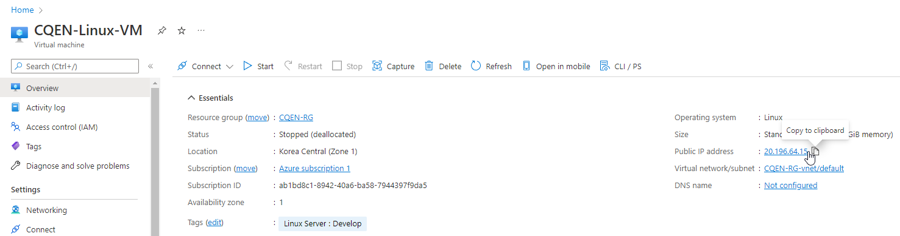
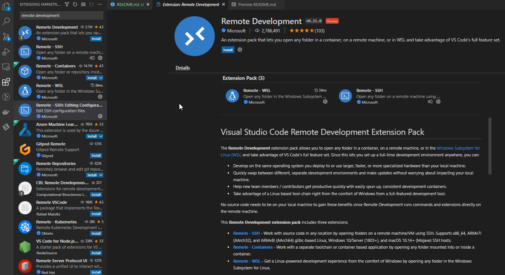
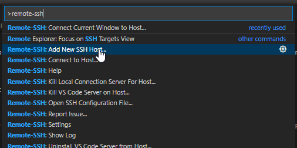
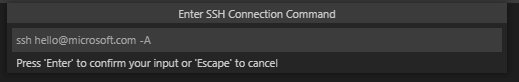
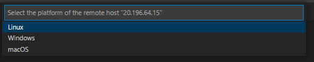
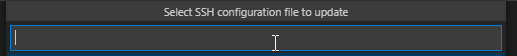
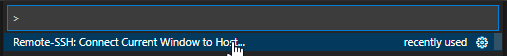
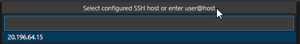
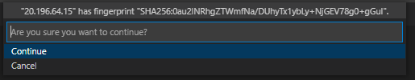

# .Net sur Linux 

Étapes pour la création d'une machine virtuelle Linux sur Azure ainsi que la connexion à cette dernière pour le développement en .Net

   - Se connecter au portail Azure [https://portal.azure.com](https://portal.azure.com) 

  - Dans Azure services, créer une nouvelle ressource "Virtual Machine", puis cliquer sur l'option `+ Create`; choisissez l'option `Azure virtual machine`.

Une fois sur la page `Create a virtual machine`, elle est composée de plusieurs onglets qui présentent  la collection des informations qui sont utilisées pour la création de la VM. 

## Onglet `Basics`

Dans le premier onglet, `Basics`, il faut remplir les champs suivants: 

Project details
- Subscription: choisissez votre suscription;
- Resource group: cliquez sur `Create new` puis donnez un nom de votre préférence. Dans cet exemple on le nomme `CQEN-RG`; 

Instance détails 
- Virtual machine name: dans l'exemple, CQEN-Linux-VM; 
- Region: choisissez la région de votre convenance; 
- Availability options: `Availability zone`; 
- Availability zone: `Zone 1`; 
- Security type: `Standard`; 
- Image: selon votre préférence. Dans cet exemple, on utilisera `Ubuntu Server 20.04 LTS - Gen2`;
- Run with Azure Spot discount: à votre discrétion; 
- Size: à votre discrétion;

Administrator account 
- Authentication type: `SSH public key`
- Username: changez pour votre nom d'utilisateur préféré. Dans cet exemple, nous allons utiliser `cqen`; 
- SSH public key source: `Generate new key pair`
- Key pair name: prenez la suggestion ou donnez un nom de votre préférence. 

Inbound port rules 
- Public inbound ports: `Allow selected ports` 
- Selected inbound ports: choisissez `SSH(22)`, `HTTPS(443)`. 

Cliquez sur le bouton `"Next: Disks"`

## Onglet `Disks`

Disk options 
- OS disk size: `Default size (30 GiB)`
- OS disk type: `Standard HDD (locally-redundant storage)` ou selon votre préférence. Cependant, l'option du disk SSD est beaucoup plus chère que celle du disk HDD. Dans cet exemple on a choisi HDD étant donné que cette machine n'aura pas une application critique qui doit avoir de la haute disponibilité. 
- Delete with VM: sélectionner
- Encryption type: `(Default) Encryption at-rest with a platform-managed key`

Data disks for CQEN-Linux-VM

- Create and attach a new disk: 
    - Name: prenez la suggestion, ou nommez-le selon votre préférence
    - Source type: `None (empty disk)
    - Size: cliquez sur `change size`, choisissez `Standard HDD (locally-redundant storage) et choisissez la taille qui vous convient. 
    - Encryption type: `(Default) Encryption at-rest with a platform-managed key`
    - Delete disk with VM: sélectionnez la boîte

Cliquez sur le bouton `"Next: Networking"`

## Onglet `Networking`

Network interface
- Virtual network: `(new) CQEN-RG-vnet`
- Subnet: `(new) default (10.1.0.0/24)`
- Public IP: `(new) CQEN-Linux-VM-ip
- NIC network security group: `Basic`
- Public inbound ports: `Allow selected ports`
- Select inbound ports: choisissez `SSH(22)`, `HTTPS(443)`. 
- Delete public IP and NIC when VM os deleted: sélectionnez la boîte

Load balancing 
- Load balancing options: `None`

Cliquez sur le bouton `"Next: Management"`

## Onglet `Management` 

Monitoring
- Boot diagnostics: `Enable with managed storage account (recommended)`

Auto shutdown
- Enable auto-shutdown: sélectionnez la boîte

Guest OS updates 
- Patch orchestration options: `Image default`

Cliquez sur le bouton `"Next: Advanced"`

## Onglet `Advanced`

Il n'est pas nécessaire de configurer les options de cet onglet. 

Cliquez sur le bouton `"Next: Tags"`

## Onglet `Tags`

- Name: `Serveur Linux`
- Value: `Develop`

Cliquez sur le bouton `"Next: Review + Create"`

## Onglet  `Review + Create`

À cet onglet, Azure va procéder à la validation des options choisies dans les onglets précédents, si le tout est correct, il va afficher le message `Validation passed` ainsi que toutes les configurations faites, les détails du produit que vous déployez, et aussi le coût et les termes de service. 

Si vous êtes d'accord avec ces termes, cliquez le bouton `Create` en bas à gauche de l'écran. 

Vous verez un écran appellé `Generate new key pair`, qui vous demande de faire le téléchargement de la clé privée SSH de votre utilisateur, pour la connection remote. Cliquez sur le bouton `Download private key and create resource`. Prenez note du répertoire où vous enregistrez ce fichier. Après le telechargement, Azure continue la création et le déploiement de votre machine virtuelle. Cela peut prendre quelques minutes, merci de patienter pendant le traitement de la demande. 

Après quelques minutes, vous recevez le message `Your deployment is complete`, ce que nous confirme que la création est réussie. Cliquez sur le bouton `Go to resource` pour voir les ressources créés. 

## Connecter à la machine

Dans la page de votre VM, prenez note de l'adresse IP publique de votre machine (Public IP address). Assurez-vous aussi que votre machine soit démarrée. 



Vous allez vous connecter à cette machine via une connection SSH. Dans votre machine locale, ouvrez votre VSCode. 

### Installation de l'extension 

Dans la barre d'outils à gauche du VSCode, cliquez sur l'icône des Extensions; ensuite, dans la boîte de recherche, cherchez le terme `Remote Development`, l'extension se présentera dans la liste à gauche. Cliquez sur installer et attendez la fin de l'installation. 



Une fois finie, on va se connecter à la machine virtuelle accessible via l'adresse IP publique que vous avez pris note, avec la clé qui a été générée dans l'étape `Onglet Review+Create` ci-dessus. 

D'abord, vérifiez si vous possedez le répertoire de configuration du SSH dans votre profil d'usager. Il est important parce que c'est l'endroit à enregistrer vos clés d'accès à la machine virutelle.  

```bash 
$ ls ~/.ssh 
```

Si cette commande répond que le répertoire n'est pas trouvable, il faut le créer avec la commande ci-dessous: 

```bash 
$ mkdir ~/.ssh
```

Ensuite, faites la copie du fichier que vous avez téléchargé dans ce répertoire nouvellement créé. Dans mon cas, le fichier s'appele `CQEN-Linux-VM_key.pem` et il a été téléchargé originalement dans le repertoire `~/Downloads`: 

```bash
$ mv ~/Downloads/CQEN-Linux-VM_key.pem ~/.ssh/.
$ chmod 400 ~/.ssh/CQEN-Linux-VM_key.pem
```

Maintenant, dans VSCode, faites `Ctrl+Shift+P` pour ouvrir le menu de selection d'options, puis saisissez `Remote-SSH:` ; vous allez voir l'option `Add a New SSH Host`. Cliquez sur l'option. 



Ensuite, dans le dialog qui suit `Enter SSH connection command`, saississez la commande qui suit, en substituant le nom d'usager, l'IP publique et le path vers la cl'publique avec les valeurs que vous avez configurés: 



```bash 
$ ssh cqen@22.196.64.15 -A -i ~/.ssh/CQEN-Linux-VM_key.pem
```

Dans le dialogue de plateforme, choississez `Linux`: 



Dans le dialog `Select SSH configuration file to update`, saississez l'adresse suivante: 



```bash
~/.ssh/config
```

Et c'est fait, votre configuration de connection est créé. 

Pour vous connecter, faites `Ctrl+Shift+P`, saisissez `Remote-SSH`, et choississez l'option `Connect current window to host`; 



Choisissez votre serveur par l'adresse IP: 



À la première connexion, on vous demandera de confirmer l'empreinte de la clé publique; confirmez en cliquant sur `Oui`. 



Attendez quelques secondes avant que la connexion soit établie. Toute action que vous ferez dorénavant dans cette session du VSCode se passera dans le host remote. 
