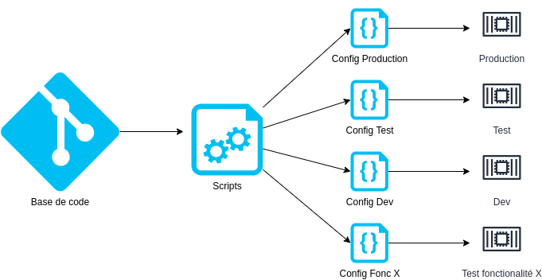

## 1. Base de code

> Base de code unique pour chaque système, stockée dans son propre dépôt de code source avec suivi et contrôle des versions.

Un application doit être suivie dans un dépôt de source dédié avec suivi et contrôle des versions. Ces versions peuvent être déployées sur divers niveaux d'environnement (Dev, Test, Prod, etc).

Idéalement ce dépôt est accessible publiquement (avec ou sans authentification), ainsi vos développeurs et vos outils de compilations, publication et déploiement peuvent y accéder peu importe où ils sont localisés. 

Plusieurs systèmes de contrôle de version existent tel que Subversion, Mercurial ou Git. Git est maintenant le sytème le plus répandu dans l'industrie et est devenu pratiquement un standard. 

Le stockage du code dans un système de contrôle des versions permet aux membres de votre équipe de travailler ensemble. En effet, ce système fournit une trace d'audit des modifications apportées au code, et offre un moyen systématique de résoudre les conflits de fusion et d'effectuer un rollback du code vers une version précédente.

Bien que les développeurs puissent travailler sur différentes versions du code au sein de leurs environnements de développement, la véritable source est le code situé dans le système de contrôle des versions. Le code qui se trouve dans le dépôt correspond à ce qui est conçu, testé et déployé sur les divers niveau d'environnements. Le code du dépôt sert à générer une version unique, qui une fois associée à une configuration spécifique à un environnement, permet de produire une version immuable ne pouvant faire l'objet d'aucune modification, y compris de sa configuration. Cette version peut alors être déployée vers un environnement. (Toute modification requise pour la version doit créer une nouvelle version.)

Dans une architecture de microservices, chaque service doit avoir sa propre base de code. Le fait d'avoir une base de code indépendante vous aide à faciliter le processus CI/CD pour vos applications.

### Nous recommandons les bonnes pratiques suivantes :

- Utilisez une base de code unique pour tous les environnements.
- Toutes les modifications du code de votre application peuvent être suivies dans une base de code unique.
- Attachez vos dépendances à une version afin d'éviter que les choses ne changent sous vos pieds entre deux constructions.

### Exemples de cas d’utilisation

Nous recommandons fortement l'utilisation de Git comme référentiel, en raison de la richesse de ses fonctionnalités et de son énorme écosystème. [Github](https://github.com/CQEN-QDCE/ceai-cqen-documentation/tree/main/Guides/Github#github) est devenu la plateforme d'hébergement Git par défaut dans la communauté *Open Source* mais, il existe de nombreuses autres excellentes options d'hébergement Git, en fonction des besoins de votre organisation.

[Le facteur suivant](./2_dependances.md)

[Le tableau de la méthodologie de 12 Facteurs](../README.md)