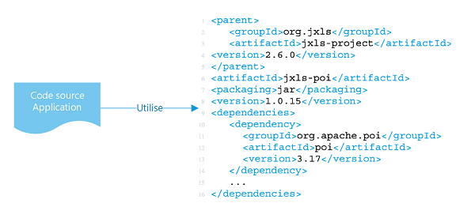

## 2. Dépendances

> Chaque système isole et inclus ses propres dépendances.

Deux éléments sont à prendre en compte pour ce qui est des dépendances: la déclaration et l'isolation des dépendances.

Les dépendances (librairies, outils, …) doivent être décrites explicitement, de manière exhaustive, et doivent être installées lors de l’étape de “build” de l’application. Cela vous permet de faire rapidement vos premiers pas avec le code de manière reproductible et de suivre facilement les modifications apportées aux dépendances.

Les conteneurs vous permettent d'isoler une application et ses dépendances de son environnement, et de garantir le fonctionnement uniforme de l'application malgré les différences entre les environnements de développement et de préproduction.

### Nous recommandons les bonnes pratiques spécifiques suivantes :

- Toutes les dépendances compilés sont déclarées explicitement à l'aide d'un manifeste de déclaration des dépendances, tel qu'un Dockerfile.
- Les dépendances qui doivent être compilées avec votre code doivent être gérées avec un gestionnaire de dépendance. La plupart des langages moderne en ont au moins un: NPM pour Node.js, NuGet pour .NET, etc.
- Les dépendances sont déclarées et isolées de la même manière pour vos divers niveaux d'environnements (développement, test, production).

### Exemples de cas d’utilisation

- Tous les paquets de l'application seront gérés par des gestionnaires de paquets comme `sbt`, `maven`.
- La déclaration des dépendances dans un environnement conteneurisé, faites-le dans le `Dockerfile`.
- `Bundler` pour `Ruby` fournit le format de manifeste `Gemfile` pour la déclaration des dépendances, ainsi que la commande bundle exec pour l’isolation des dépendances.

[Le facteur suivant](./3_configurations.md)

[Le tableau de la méthodologie de 12 Facteurs](../README.md)