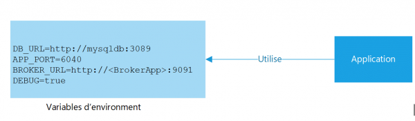

## 3. Configuration (Config)

> Les informations de configuration sont externalisées en dehors du code par le biais d’un outil de gestion de la configuration.

Toutes les informations nécessaires au fonctionnement de votre application qui sont dépendante de l'environnement d'éxecution doivent être transmise via une configuration. Cette configuration doit être séparé du code pour ne pas avoir à créer des versions différentes par chaque environnement. 



L'utilisation de variables d'environnement est le moyen généralement utilisé pour transmettre les configration vers un application exécuté dans l'environnement. Ces variables sont alors initialisées par l'environnement d'éxéction du conteneur ou enncore lues dans un fichier de configuration généré au moment du déploiement. L'application peut ensuite lire les variables d'environnement via des librairies d'accès au système d'exploitation.

### Nous recommandons les pratiques spécifiques suivantes :

- Utilisez des fichiers `.env` non contrôlés par version pour le développement local. `Docker` prend en charge le chargement de ces fichiers au moment de l'exécution.
- Conservez tous les fichiers `.env` dans un système de stockage sécurisé, tel que `Vault`, afin que les fichiers soient disponibles pour les équipes de développement, mais non commités dans `Git`.
- Utilisez une variable d'environnement pour tout ce qui peut changer au moment de l'exécution, et pour tout secret qui ne doit pas être publié avec le code.
- Une fois que vous avez déployé votre application sur une plateforme, utilisez le mécanisme de gestion des variables d'environnement de cette plateforme.
- N'utilisez pas la configuration interne de l’application, tel que `config/routes.rb` avec `Rails`
- N'utilisez pas des fichiers de configuration qui ne sont pas inclus dans le système de contrôle de version, par exemple `config/database.yml` de `Rails`.

L'avantage de séparer les paramètres de configuration de la logique applicative est que vous pouvez appliquer les paramètres de configuration en fonction du chemin de déploiement. Par exemple, vous pouvez avoir un ensemble de paramètres de configuration pour un déploiement destiné à un environnement de test et un ensemble différent pour un déploiement destiné à un environnement de production.

- Externaliser la configuration avec des variables d'environnement.
- Tous les paramètres de configuration sont transmis via des variables d'environnement et ne sont pas codés en dur.
- Les secrets sont transmis à l'aide de méthodes sécurisées telles que `Docker Secrets`, `AWS secret Manager`, `Terraform secret` ou `Kubernetes Secrets` et aucun secret n'est stocké dans le contrôle de version.

Le changement d’environnement est aussi simple que de modifier le fichier env lui-même. Vous pouvez stocker plusieurs fichiers sous les noms `.env.dev`, `.env.prod`, etc., et configurer votre code source pour qu’il accède à ces fichiers en fonction de l’environnement dans lequel il est exécuté.

### Exemples de cas d’utilisation

- Type d’environnement : Les variables d’environnement sont souvent utilisées pour stocker le nom de l’environnement dans lequel l’application est en cours d’exécution. La logique de l’application peut utiliser cette valeur pour accéder au bon ensemble de ressources ou activer/désactiver certaines fonctionnalités ou sections de l’application.
- Nom de domaine : Le nom de domaine d’une application peut varier en fonction de son environnement. L’isoler vous permet également de modifier facilement le nom de domaine de votre application sans avoir à rechercher ses occurrences dans l’ensemble de la base de code.
- URL d’API : Chaque environnement de votre application peut avoir des API déployées dans différents environnements également.
- Clés privées : Les clés des services et ressources externes doivent être isolées du code source de l’application afin qu’elles ne tombent pas accidentellement dans de mauvaises mains.
- Numéros de compte de service, etc : Vous pouvez varier d’autres informations spécifiques au système, telles que les numéros de compte de service, les keytabs, etc., en fonction de l’environnement de l’application pour la gestion et la surveillance des ressources.

Les fichiers `.env` stockent les secrets de votre application sous la forme de paires clé-valeur. Le format habituel pour stocker les variables d’environnement dans un fichier `.env` est le suivant :

```
Clé1=Valeur1
```

[Le facteur suivant](./4_service_externe.md)

[Le tableau de la méthodologie de 12 Facteurs](../README.md)
