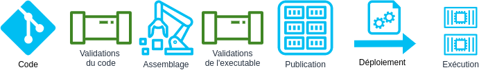

## 5. Assemblez, publiez, exécutez

> Trois étapes distinctes sépare le processus qui transforme du code en tâche exécutée. Chaque publication doit être versionnée avec un identifiant unique. Des validations et des tests assure que chaque étapes soit exempte d'erreur.

Le processus de déploiement doit être séparé en trois phases: 

- La phase d'assemblage ou de compilation (Build) transforme le code en un paquet exécutable/un paquet de construction et installe les dépendances;
- La phase de publication envoie le résultat de l'assemblage dans un régistre de binaire ou d'images de conteneur.
- L'environnement d'exécution déploie ensuite la dernière version de l'application et exécute le nombre d'instances necéssaires.



Entre chaque étape des validations des tests sont menées pour assurer la conformité de l'applications deployée. Des outils de type  d'intégration continue/de livraison continue (CI/CD) permettent d'orchestrer le porcessus de déploiement.

Chaque étape doit donner lieu à un artefact à identifiant unique. Chaque déploiement doit être associé à une version spécifique. Cela permet de réduire le temps d’indisponibilité de l’applicatif car la phase 'assemblage est souvent une longue opération et peut se faire en parallèle de l’exécution de l’ancienne version sur l’environnement cible.

### Nous recommandons les bonnes pratiques suivantes :

- Construire et publier des images de conteneurs.
- Les assemblage doivent être déclenchés par un changement de code. Avec les microservices, cela doit être automatisé et cette automatisation vit dans le contrôle de source avec l'application.
- Les assemblages aboutissent à une version avec un identifiant de version unique qui peut être facilement référencé dans l'étape d'exécution.
- Vous pouvez mettre à l'échelle une version existante ou revenir à une version précédente sans avoir besoin d'un nouvel assemblage ou d'une nouvelle version. Ceci peut être facilement géré avec un outil comme Kubernetes.

### Exemples de cas d’utilisation

Par exemple, une application Cloud Native peut être une application web déployée via des conteneurs Docker et utiliser AWS Container Registry et par la suite, se déployer sur les services `AWS EKS` de `Kubernetes` ou utiliser les services `AWS EC2`, `AWS Lambda` ou `AWS S3`.

Le code ci-dessous est utilisé comme base de d'un [démo de `workflow` CI/CD](https://github.com/CQEN-QDCE/ceai-cqen-github-actions-demo#aws-pipeline) en utilisant AWS pipeline pour une application nodejs:

```yml
version: 0.2
phases:
  install:
    runtime-versions:
      nodejs: 16  
    commands:
      - echo Installing mocha JavaScript test framework for Node.js
      - npm install -g mocha
  pre_build:
    commands:
      - echo Installing source NPM dependencies...
      - npm install
      - npm install unit.js
      - npm ci
  build:
    commands:
      - npm run build
      - echo Build started on `date`
      - echo Testing your app ...
      - mocha test.js
  post_build:
    commands:
      - echo Build completed on `date`
artifacts:
  files:
    - index.html
```

- `package.json` permet de configurer des `scripts` afin de codifier diverses tâches. 
- `npm run build` est utilisé pour construire cette application et produit des fichiers javascript et css minifiés à servir comme actifs statiques.
- `npm start` est utilisé pour démarrer l'application.


[Le facteur suivant](./6_processus.md)

[Le tableau de la méthodologie de 12 Facteurs](../README.md)