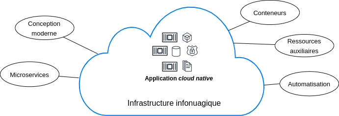

<!-- ENTETE -->

---

    

<!-- FIN ENTETE -->

## Introduction 

Ce document décrit la méthodologie «12 facteurs». Cette méthodologie, appliquée à un projet de développement, permet de créer des applications *cloud native* (conçues pour l'infonuagique).

Avant d'aborder le sujet des «applications 12 facteurs», il faut d'abord comprendre ce que signifie *cloud native*.

Commençons par une définition simple fournit par [Microsoft](https://docs.microsoft.com/en-us/dotnet/architecture/cloud-native/definition):

> L’architecture et les technologies *cloud native* sont une approche de la conception, de la construction et de l’exploitation des charges de travail intégrées au *cloud* et tirent pleinement parti du modèle de *cloud computing*.

La [Cloud Native Computing Foundation](https://www.cncf.io/) fournit la [définition officielle](https://github.com/cncf/foundation/blob/main/charter.md):

> Les technologies *cloud native* permettent aux organisations de créer et d’exécuter des applications évolutives dans des environnements modernes, dynamiques tels que des *clouds* publics, privés et hybrides. Les conteneurs, les maillages de service, les microservices, l’infrastructure immuable et les API déclaratives illustrent cette approche.
>
> Ces techniques permettent des systèmes faiblement couplés qui sont résilients, gérables et observables. Combinés à une automatisation robuste, ils permettent aux développeurs d’apporter des modifications à fort impact fréquemment et prévisibles avec un minimum de peine.

Les cinq piliers d'une application *cloud native*:

 

Un de ces piliers est intitulé «Conception moderne». Mais qu'est-ce au juste une conception moderne? À quoi ressemble une architecture moderne? À quels principes, modèles et bonnes pratiques peut-on adérer pour réaliser une conception moderne? Quelles sont les préoccupations liées à l’infrastructure, aux opérations, etc. ?

La méthodologie «12 facteurs» tente de répondre à ces questions. La mise en pratique de ses quinze facteurs (trois facteurs ce sont ajoutés au cours du temps...) permet de concevoir des applications *cloud native* déployables sur n'importe quel cloud et sur n'importe quelle PaaS et ce, peu importe le langage ou les technologies utilisées.

D'abord écrit comme un manifeste par [Adam Wiggins](https://adamwiggins.com/) (co-fondateur d’Heroku) en 2011 aux débuts des premiers services infonuagiques, les douzes facteurs ont été actualisés et bonifiées avec le temps par des acteurs de l'écosystème infonuagique.

## Les 12 facteurs

| Facteur   |      Explication  |
|----------|:-------------:|
| [1 - Base de code](./facteurs/1_base_code.md) | Base de code unique pour chaque système, stockée dans son propre dépôt de code source avec suivi et contrôle des versions.  |
| [2 - Dépendances](./facteurs/2_dependances.md) |  Chaque système isole et inclus ses propres dépendances. Idéalement un gestionnaire de dépendance est utilisé pour faire cela.   |
| [3 - Configuration](./facteurs/3_configurations.md)	 | Les informations de configuration sont externalisées en dehors du code par le biais d’un outil de gestion de la configuration. Le même déploiement peut se déployer dans des environnements différents avec la configuration appropriée à celui-ci. |
| [4 - Services externes](./facteurs/4_service_externe.md) | Les services externes (magasins de données, caches, répartiteurs de messages) utilisent des protocoles standards et sont exposées via une URL. Cela dissocie le service de l’application, ce qui lui permet d’être interchangeable. |
| [5 - Assemblez, publiez, exécutez](./facteurs/5_cicd.md) | Trois étapes distinctes sépare le processus qui transforme du code en tâche exécutée. Chaque publication doit être versionnée avec un identifiant unique. Les systèmes CI/CD modernes permettent de répondre à ce principe. |
| [6 - Processus](./facteurs/6_processus.md) | L'application s'exécute comme un ou plusieurs processus sans état. Les états sont persistés dans des services externes de persistance. |
| [7 - Associations de ports](./facteurs/7_port.md) | Chaque microservice doit être autonome avec ses interfaces et ses fonctionnalités exposées par lui-même sur son propre port. |
| [8 - Concurrence](./facteurs/8_concurrence.md) | L'application supporte l'exécution simultanée de plusieurs instances d'elle-même. Ainsi, on peut démarrer plus de processus pour gérer une augmentation de la charge. |
| [9 - Instances jetables](./facteurs/9_jetable.md) | Les instances de service doivent être jetables. Favorisez le démarrage rapide pour augmenter les opportunités d’extensibilité et les arrêts gracieux pour laisser le système dans un état correct. |
| [10 - Parité des environnements](./facteurs/10_parite_environnements.md) | Gardez vos environnements d'exécution aussi semblables possibles les uns des autres. Les tests faits sur l'environnement de développement doivent être valides pour l'environnement de production. |
| [11 - Journalisation](./facteurs/11_journaux.md)  | Traitez les journaux générés par les microservices en tant que flux d’événements. Traitez-les avec un agrégateur d’événements. |
| [12 - Processus d’administration](./facteurs/12_processus_administration.md) | Exécutez des tâches d’administration/gestion, telles que le nettoyage ou l'analyse de données, en tant que processus unique. Utilisez des outils indépendants pour appeler ces tâches à partir de l’environnement de production, mais séparément de l’application. |

## Les trois nouveaux facteurs

| Nouveau facteur   |      Explication  |
|----------|:-------------:|
| [13 - API First](./facteurs/13_api_first.md) | Concevez tout comme un API. Vos systèmes pourront être consommée par n'importe quel autre type d'applications. |
| [14 - Télémétrie](./facteurs/14_telemetrie.md) | Collectez le plus de données possibles sur le comportement et l'utilisation de votre application. |
| [15 - Authentification/autorisation](./facteurs/15_authentification.md) | Implémentez l’identité à partir du début. Envisagez les fonctionnalités RBAC (contrôle d’accès en fonction du rôle) disponibles dans les clouds publics. |

## Références

[Les 12 facteurs](https://12factor.net/fr/)

[12-factor applications par IBM](https://developer.ibm.com/articles/creating-a-12-factor-application-with-open-liberty/) IBM - Par Grace Jansen, Mis à jour le 20 mai 2022 | Publié le 12 novembre 2021

[Applications Java cloud natives à 15 facteurs par IBM](https://developer.ibm.com/articles/15-factor-applications) IBM - Par Grace Jansen, Mis à jour le 20 mai 2022 | Publié le 29 novembre 2021

[Les 12 facteurs par CQEN](https://gitlab.forge.gouv.qc.ca/cqen/12facteurs)

[Qu’est-ce que Cloud Native ?](https://docs.microsoft.com/fr-fr/dotnet/architecture/cloud-native/definition) Microsoft, Publié le 23 juin 2022

[Un guide illustré des applications à 12 facteurs](https://www.redhat.com/architect/12-factor-app) RedHat - Par Bob Reselman, le 2 février 2021

[Adapter l'application des douze facteurs aux microservices](https://www.nginx.com/blog/microservices-reference-architecture-nginx-twelve-factor-app/) Par Ben Horowitz de NGINX, Inc., le 28 juillet 2016

[12-factor App : une excellente base de développement applicatif](https://scient.fr/12-factor-app-une-excellente-base-de-developpement-applicatif/) Le 14 février 2022

[The 12-factor app : sont-ils toujours d’actualité ?](https://www.softfluent.fr/blog/the-12-factor-app-sont-ils-toujours-dactualite/) Par Christine Moronval

