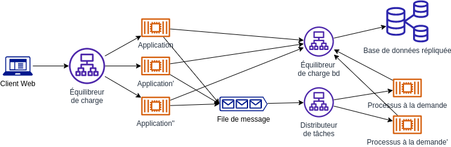

Ce document décrit la méthodologie de l'application douze facteurs et sa mise en œuvre lors du développement d'applications exécutées sur l'infrastruture au CEAI. Cette méthodologie permet de créer des applications évolutives et robustes qui peuvent être déployées en continu avec une agilité optimale.

Avant d'aborder le sujet des « 12 Factor app », il faut comprendre le Cloud Native.

Commençons par une définition simple fournit par AZURE:
"L’architecture et les technologies natives cloud sont une approche de la conception, de la construction et de l’exploitation des charges de travail intégrées au cloud et tirent pleinement parti du modèle de cloud computing."

Cloud Native Computing Foundation fournit la définition officielle :

"Les technologies natives cloud permettent aux organisations de créer et d’exécuter des applications évolutives dans des environnements modernes, dynamiques tels que des clouds publics, privés et hybrides. Les conteneurs, les maillages de service, les microservices, l’infrastructure immuable et les API déclaratives illustrent cette approche."

Ces techniques permettent des systèmes faiblement couplés qui sont résilients, gérables et observables. Combinés à une automatisation robuste, ils permettent aux ingénieurs d’apporter des modifications à fort impact fréquemment et prévisibles avec un minimum de peine.

La vitesse et l’agilité du cloud natif dérivent de nombreux facteurs. Avant tout, l’infrastructure cloud. Mais il y en a plus : cinq autres piliers fondamentaux présentés dans la figure 1-3 fournissent également le fondement des systèmes natifs cloud.

Une de ces pelier comme vous avez vu dans la figure au-desous est Conception moderne pour cela nous pourrons avoir plusieur question:
Comment concevez-vous une application native cloud ? À quoi ressemble votre architecture ? À quels principes, modèles et bonnes pratiques adhéreriez-vous ? Quelles sont les préoccupations liées à l’infrastructure et aux opérations ?

Et pour répondre à ces questions, nous allons vous montrer La méthodologie 15 facteurs peut être appliquée à des applications écrites dans tout langage de programmation et toutes les plateformes, et qui utilisent tout type de services externes (base de données, file, cache mémoire, etc.)

Le « 15 Factor app » est un manifeste qui propose 15 bonnes pratiques concernant le développement d’applications web. Ce manifeste, écrit par Adam Wiggins (co-fondateur d’Heroku), est né de ses observations et de son expérience dans le développement et le déploiement d’applications web.

Cependant, la conception d'applications cloud natives modernes exige que vous changiez de vision en termes d'ingénierie, de configuration et de déploiement logiciel, par rapport à la conception d'applications sur site. Ce document vous explique comment appliquer les quanze facteurs à votre conception d'applications.

1. Codebase
"Une base de code suivie avec un système de contrôle de version, plusieurs déploiements"

Le premier principe de la méthodologie est lié à la base de code de votre application. Une base de code suivie avec un système de contrôle de version, elle est utilisée pour plusieurs déploiements de l’application : prod, pre-prod, dev.
Le point le plus important ici est de s'assurer que votre application est suivie et qu'elle se trouve dans un dépot central accessible à vos développeurs grâce à des outils tels que Git, Mercurial ou SVN.

Vous devez gérer le code de votre application dans un système de contrôle des versions tel que Git ou Mercurial. Pour travailler sur l'application, vous extrayez le code vers votre environnement de développement local. Le stockage du code dans un système de contrôle des versions permet aux membres de votre équipe de travailler ensemble. En effet, ce système fournit une trace d'audit des modifications apportées au code, et offre un moyen systématique de résoudre les conflits de fusion et d'effectuer un rollback du code vers une version précédente. Ce type de stockage fournit également un emplacement à partir duquel effectuer l'intégration continue (CI) et le déploiement continu (CD).

Bien que les développeurs puissent travailler sur différentes versions du code au sein de leurs environnements de développement, la véritable source est le code situé dans le système de contrôle des versions. Le code qui se trouve dans le dépôt correspond à ce qui est conçu, testé et déployé, et le nombre de dépôts est indépendant du nombre d'environnements. Le code du dépôt sert à générer une version unique, qui une fois associée à une configuration spécifique à un environnement, permet de produire une version immuable ne pouvant faire l'objet d'aucune modification, y compris de sa configuration. Cette version peut alors être déployée vers un environnement. (Toute modification requise pour la version doit entraîner la création d'une nouvelle version.)

Cloud Source Repositories vous permet de collaborer et de gérer votre code dans un dépôt Git privé, complet et évolutif. Cet outil est doté d'une fonctionnalité de recherche de code parmi tous les dépôts. Vous pouvez également connecter d'autres produits AWS Cloud, tels que Cloud Build, App Engine, Cloud Logging et Pub/Sub.

Dans une architecture de microservices, l'approche correcte est chaque service doit avoir sa propre base de code. Le fait d'avoir une base de code indépendante vous aide à faciliter le processus CI/CD pour vos applications.
De plus, nous recommandons fortement l'utilisation de Git comme référentiel, en raison de la richesse de ses fonctionnalités et de son énorme écosystème. GitHub est devenu la plateforme d'hébergement Git par défaut dans la communauté open source, mais il existe de nombreuses autres excellentes options d'hébergement Git, en fonction des besoins de votre organisation.

- Utilisez une base de code unique pour tous les environnements.
- Toutes les modifications du code de votre application peuvent être suivies dans une base de code unique.
- Utilisez une gestion des dépendances appropriée à votre langue pour les bibliothèques partagées entre les projets. Pour Java, Gradle ou Maven sont populaires : pom.xml
- Attachez vos dépendances à une version afin d'éviter que les choses ne changent sous vos pieds entre deux constructions.
avec les accès dont vous avez besoin. 
Exemple:

Github, Mercurial, SVN

2. Dépendances

"Déclarer et isoler explicitement les dépendances"

Deux éléments sont à prendre en compte pour ce qui est des dépendances des applications douze facteurs : la déclaration et l'isolation des dépendances.

Les dépendances (librairies, outils, …) doivent être décrites explicitement, de manière exhaustive, et doivent être installées lors de l’étape de “build” de l’application. Cela vous permet de faire rapidement vos premiers pas avec le code de manière reproductible et de suivre facilement les modifications apportées aux dépendances.

Vous devez également isoler une application et ses dépendances en les rassemblant dans un conteneur. Les conteneurs vous permettent d'isoler une application et ses dépendances de son environnement, et de garantir le fonctionnement uniforme de l'application malgré les différences entre les environnements de développement et de préproduction.

Tous les paquets de l'application seront gérés par des gestionnaires de paquets comme sbt, maven.

- Dans les environnements non conteneurisés, utilisez un outil de gestion de la configuration (Chef, Puppet, Ansible) pour installer les dépendances du système.
- Dans un environnement conteneurisé, faites-le dans le Dockerfile.

en coclusion:

- Déclarez toutes les dépendances dans pom.xml ou build.gradle.
- Toutes les dépendances sont déclarées explicitement à l'aide d'un manifeste de déclaration des dépendances, tel qu'un Dockerfile.
- Votre application s'exécute de manière isolée afin d'éviter que les dépendances du système ne soient utilisées accidentellement, comme dans un conteneur Docker.
- Les dépendances sont déclarées et isolées de la même manière pour les environnements de développement et de production.

3. Configuration (Config)

Séparation stricte entre la configuration et le code et Stocker la config dans l'environnement"

Toute application moderne requiert une configuration, d'une forme ou d'une autre. Les données de configuration vont plus porter sur des données sensibles telles que les mots de passe de la base de données ou les identifiants d’authentifications. Il est donc nécessaire de les protéger en les séparant du reste du code de l’application pour cela il existe généralement des configurations différentes en fonction des environnements cibles (développement, pre-prod et production, par exemple). Ces configurations incluent généralement des identifiants de compte de service et des descripteurs de ressources dans des services externes tels que des bases de données.

Dans un environnement de service microservice, vous pouvez gérer les configurations de vos applications à partir d'un contrôle de source comme git (spring-cloud-config) et utiliser les variables d'environnement pour ne pas maintenir les informations sensibles dans le contrôle de source.
Nous recommandons les pratiques spécifiques suivantes :

- Utilisez des fichiers .env non contrôlés par version pour le développement local. Docker prend en charge le chargement de ces fichiers au moment de l'exécution.
- Conservez tous les fichiers .env dans un système de stockage sécurisé, tel que Vault, afin que les fichiers soient disponibles pour les équipes de développement, mais non commités dans Git.
- Utilisez une variable d'environnement pour tout ce qui peut changer au moment de l'exécution, et pour tout secret qui ne doit pas être commité dans le référentiel partagé.
- Une fois que vous avez déployé votre application sur une plate-forme de livraison, utilisez le mécanisme de gestion des variables d'environnement de cette plate-forme.

L'avantage de séparer les paramètres de configuration de la logique applicative est que vous pouvez appliquer les paramètres de configuration en fonction du chemin de déploiement. Par exemple, vous pouvez avoir un ensemble de paramètres de configuration pour un déploiement destiné à un environnement de test et un ensemble différent pour un déploiement destiné à un environnement de production.

- Externaliser la configuration avec des variables d'environnement.
- Tous les paramètres de configuration sont transmis via des variables d'environnement et ne sont pas codés en dur.
- Vous ne construisez qu'une seule fois pour les déploiements dans tous vos environnements.
- Les services peuvent être reconfigurés dynamiquement sans recompilation (par exemple en changeant les paramètres)
- Les secrets sont transmis à l'aide de méthodes sécurisées telles que Docker Secrets, AWS secret Manager, Terraform secret ou Kubernetes Secrets et aucun secret n'est stocké dans le contrôle de version.

4. Services de stockage externes (Backing Services)

"Traitez les services externes comme des ressources attachées"

Chaque service utilisé par l'application dans le cadre de son fonctionnement normal, tel que les systèmes de fichiers, les bases de données, les systèmes de mise en cache, les files d'attente de messages et les serveurs de messagerie doit être accessible en tant que service et externalisé dans la configuration et qui peuvent être approvisionnés et maintenus par le personnel des systèmes comme des ressources attachées. Ce sont des abstractions pour la ressource sous-jacente. 

Par exemple, lorsque l'application écrit des données dans l'espace de stockage, traiter celui-ci comme un service externe vous permet de modifier facilement le type de stockage sous-jacent, car il est dissocié de l'application. Vous pouvez ensuite effectuer des changements, par exemple passer d'une base de données PostgreSQL locale à Cloud SQL pour PostgreSQL sans modifier le code de l'application.

Dans un écosystème de microservices, tout ce qui est externe au service est traité comme une ressource attachée. La ressource peut être échangée à tout moment sans que cela ait un impact sur le service.

- Créez des services pluggable en utilisant des abstractions comme JPA.
- Connexion aux ressources de sauvegarde via URL + secrets. 
- Externaliser les informations de connexion dans la configuration externe. Comme dans helm values.yaml
- Utiliser le stockage objet lorsque des fichiers sont nécessaires (pas de stockage local).
- Utiliser des bases de données externes (par exemple Postgres, MySQL, Redis, etc.) pour conserver l'état.
- Utiliser des variables d'environnement pour la configuration (par exemple, les délais d'attente, les points de terminaison, etc.)
- Utiliser des délais d'attente configurables pour les connexions et les réponses des backends.

5. Build, release, run (CI/CD)

"Étapes de construction et d'exécution strictement séparées".

Il est important de séparer le processus de déploiement logiciel en trois phases: 
la phase de la compilation qui transforme le code en un paquet exécutable/un paquet de construction et installe les dépendances
la phase du release qui envoie le résultat de cette build sur l’environnement cible, et qui récupère le paquet de construction de l'étape de construction et le combine avec les configurations de l'environnement de déploiement et rend votre application prête à fonctionner.
la phase de l'exécution qui lance le ou les processus de l’application, ou plutot c'est comme si vous exécutiez votre application dans l'environnement d'exécution.

Chaque étape doit donner lieu à un artefact à identifiant unique. Chaque déploiement doit être associé à une release spécifique qui est le produit de la combinaison d'une configuration d'environnement et d'une version. Cela permet de réduire le temps d’indisponibilité de l’applicatif car la phase de build, est souvent une longue opération et peut se faire en parallèle de l’exécution de l’ancienne application sur l’environnement cible.

Nous recommandons l'utilisation d'un outil d'intégration continue/de livraison continue (CI/CD) pour automatiser les processus de constructions et de déploiement. Les images Docker permettent de séparer facilement et plus efficacement les étapes de construction et d'exécution. Idéalement, les images sont créées à chaque livraison et traitées comme des artefacts de déploiement.

- Build and publish a Docker image.
- Les builds sont déclenchés par un changement de code. Avec les microservices, cela doit être automatisé et cette automatisation vit dans le contrôle de source avec l'application.
- Les builds aboutissent à une version avec un identifiant de version unique qui peut être facilement référencé dans l'étape "Run".
- Vous pouvez mettre à l'échelle une version existante ou revenir à une version précédente sans avoir besoin d'une nouvelle construction ou d'une nouvelle version. Ceci peut être facilement géré avec un outil comme Kubernetes.

6. Processus

"Les processus sont sans état et ne partagent rien"

Les applications douze/quize facteurs sont exécutées dans l'environnement sous la forme d'un ou de plusieurs processus. Ces processus doivent être doivent être indépendants. Les applications peuvent ainsi évoluer grâce à la réplication de leurs processus. Ces processus qui peut être plus précisément appelé processus sans état. Cela signifie qu'aucun processus ne garde trace de l'état d'un autre processus et qu'aucun processus ne garde trace d'informations telles que l'état de la session ou du flux de travail. Un processus sans état facilite la mise à l'échelle. Lorsqu'un processus est sans état, des instances peuvent être ajoutées et supprimées pour gérer une charge particulière à un moment donné. Comme chaque processus fonctionne indépendamment, l'absence d'état empêche les effets secondaires involontaires.

Pour les microservices, le point important du facteur Processus est que votre application doit être sans état. Ainsi, il est facile de faire évoluer un service horizontalement sans aucun impact en ajoutant simplement plus d'instances de ce service. Si votre système nécessite toujours de maintenir l'état, utilisez les ressources attachées comme redis pour stocker l'état au lieu de le faire en mémoire.

- Créez des services sans état et stockez toutes les informations d'état en dehors de l'application, par exemple dans une base de données.
- Tous les processus doivent exposer des health check endpoint (/healthz)
- Ne doit pas dépendre d'un gestionnaire de processus (par exemple pm2)
- Doit sortir non nul en cas d'erreur fatale
- Les contrôles de santé ne doivent pas dépendre de la santé des services de soutien.
- Ne nécessite pas d'exécution privilégiée (par exemple, root).

7. Association de ports

"Exportez les services via des associations de ports"

Dans les environnements non basés sur le cloud, les applications Web sont souvent conçues pour s'exécuter dans des conteneurs d'applications tels que Apache Tomcat et le serveur HTTP Apache. En revanche, les applications douze facteurs ne reposent pas sur des conteneurs d'applications externes. Au lieu de cela, elles intègrent la bibliothèque du serveur Web directement dans l'application.

Le principe du Port Binding affirme qu'un service ou une application est identifiable sur le réseau par un numéro de port, et non par un nom de domaine. 
Les noms de domaine et les adresses IP associées peuvent être attribués à la volée par des manipulations manuelles et des mécanismes automatisés de découverte de services. Leur utilisation comme point de référence n'est donc pas fiable. En revanche, l'exposition d'un service ou d'une application au réseau en fonction du numéro de port est plus fiable et plus facile à gérer. Au minimum, les problèmes potentiels dus à une collision entre l'attribution d'un numéro de port privé au réseau et l'utilisation publique de ce même numéro de port par un autre processus public peuvent être évités en utilisant la redirection de port.

Sur le plan architectural, il est recommandé que les services exposent un numéro de port, spécifié par la variable d'environnement PORT.

Les applications qui exportent l'association de ports peuvent consommer les informations relatives à cette association en externe (en tant que variables d'environnement) lors de l'utilisation du modèle Platform as a Service. Dans Google Cloud, vous pouvez déployer des applications sur des services de plate-forme tels que Compute Engine, GKE, App Engine ou Cloud Run.

- Configurer le port avec la variable d'environnement server.port.
- Vous ne devez pas coder en dur les numéros de port dans votre code. Indiquez plutôt les numéros de port dans l'environnement, par exemple dans une variable d'environnement.

8. Concurrence
"Evolutivité horizontale (Grossissez) à l’aide du modèle de processus"

Vous devez décomposer votre application en processus indépendants en fonction des types de processus (processus d'exécution en arrière-plan, processus de nœud de calcul et processus Web, par exemple). Votre application peut ainsi évoluer en fonction des besoins de chaque charge de travail. La plupart des applications cloud natives vous permettent d'évoluer à la demande. Vous devez concevoir l'application sous forme de processus répartis multiples et indépendants, capables d'exécuter des blocs de travail et d'effectuer un scaling horizontal par l'ajout d'autres processus.

Dans une architecture microservices, vous pouvez faire évoluer horizontalement chaque service indépendamment, dans la mesure où l'infrastructure sous-jacente le permet. Avec les services conteneurisés, vous bénéficiez en outre de la concurrence recommandée dans l'application à douze facteurs.

Les sections suivantes décrivent certaines structures permettant l'évolutivité des applications. Les applications conçues avec des processus jetables et sans état sont bien placées pour bénéficier de ces conceptions de scaling horizontal.

- Construire de plus petites applications sans état (microservices).
- L'application peut être exécutée un nombre illimité de fois en parallèle (par exemple, pas d'attente de verrouillage).
- L'application ne maintient pas un grand pool de connexions persistantes à la base de données (par exemple, la taille du pool est configurable).
- L'application utilise les transactions de la base de données, le cas échéant, et évite les blocages.
- L'application ne dépend pas de sessions collantes ; les demandes peuvent atteindre n'importe quel processus.

9. Ressources jetables (Démarrages rapides et arrêts gracieux)
"Maximisez la robustesse avec des démarrages rapides et des arrêts gracieux"

Sur une instance Cloud, a vie d'une application est aussi éphémère que l'infrastructure qui la prend en charge. Il faut savoir qu’une application 12 facteurs est jetables : cela signifie qu’elle peut démarrer ou s’arrêter très rapidement. Les processus doivent donc être prêts à l’emploi rapidement : s’ils sont lancés pour des besoins de montée en charge, il est important d’être opérationnel rapidement pour éviter la saturation des instances en cours. En complément, les développeurs doivent prévoir des arrêts gracieux, c’est-à-dire prévoir les cas où l’application est en train d’être déconnectée ou est en train de crasher : il est préférable d’intercepter ces signaux pour que le travail en cours soit renvoyé dans une file de travaux, afin de ne pas corrompre des données.

Pour les microservices, En adoptant la conteneurisation dans le processus de déploiement des microservices, votre application suit implicitement ce principe dans une mesure maximale. Les conteneurs Docker peuvent être démarrés ou arrêtés instantanément. Le stockage des données de demande, d'état ou de session dans des files d'attente ou d'autres services de sauvegarde garantit qu'une demande est traitée de manière transparente en cas de panne du conteneur.

En outre, selon la plate-forme sur laquelle votre application est déployée, un démarrage aussi lent peut déclencher des alertes ou des avertissements lorsque l'application échoue à son contrôle de santé. Des temps de démarrage extrêmement lents peuvent même empêcher votre application de démarrer du tout dans l'infonuagique. Si votre application est soumise à une charge croissante et que vous devez rapidement mettre en place plus d'instances pour gérer cette charge, tout retard au démarrage peut entraver sa capacité à gérer cette charge. Et Si l'application ne s'arrête pas rapidement et gracieusement, cela peut également entraver la capacité à la relancer après un échec. L'incapacité à s'arrêter assez rapidement peut également entraîner le risque de ne pas disposer des ressources, ce qui pourrait corrompre les données.

- Empaquetez l'application dans une image de conteneur.
- Réduire les temps de démarrage. Les temps de démarrage peuvent être réduits en utilisant Docker et en tirant parti de son système de superposition intégré. Envisagez également le lazy-loading ou d'autres pratiques pour réduire les temps.
- Les processus peuvent être facilement créés ou détruits sans processus d'arrêt orchestré.
- Mettez en place un arrêt progressif. Marquez le service comme hors ligne (plus de nouvelles demandes), terminez les demandes existantes, puis supprimez les services. Dans Kubernetes, cela se produit automatiquement pour vous.
- Votre application est robuste contre la mort subite. Il n'y a pas de perte de données si votre application cesse soudainement de fonctionner.

10. Parité des environnements developpemment/production

"Gardez le développement, la pre-prod et la production aussi proches que possible"

À notre époque, de nombreuses organisations cherchent à faire évoluer et à renforcer l'innovation de leurs systèmes d'information de manière rapide et efficace. 

Les applications d'entreprise évoluent dans différents environnements au cours de leur cycle de développement. En règle générale, ces environnements sont les suivants : développement, test, préproduction et production. Il est recommandé de faire en sorte que ces environnements restent aussi semblables que possible.
Pour soutenir ce principe, nous recommandons, une fois encore, l'utilisation de conteneurs - un outil très puissant ici, car ils vous permettent d'exécuter exactement le même environnement d'exécution tout au long du développement local jusqu'à la production. N'oubliez pas, cependant, que des différences dans les données sous-jacentes peuvent toujours entraîner des différences au moment de l'exécution.

Pour les microservices, il s'agit d'une caractéristique inhérente aux microservices qui sont exécutés à l'aide des techniques de conteneurisation.

La parité des environnements (ou parité dev/prod) est une fonctionnalité que la plupart des développeurs considèrent comme acquise. Néanmoins, à mesure que les entreprises se développent et que leurs écosystèmes informatiques évoluent, la parité des environnements devient difficile à maintenir.
Ceci est important pour s'assurer que tous les bogues potentiels peuvent être identifiés lors du développement et des tests plutôt que lorsque l'application est mise en production. Cela permet d'éliminer la déclaration de développement stéréotypée : "Cela fonctionne sur mon ordinateur portable". De nombreuses applications s'exécutant désormais dans le nuage, interagissant avec de nombreux autres services dans un vaste écosystème de services, il est important que nous reproduisions cet environnement lorsque nous développons et testons nos applications.

- Créez des images de conteneurs et expédiez-les dans plusieurs environnements.
- Tous les environnements fonctionnent de la même manière lorsqu'ils sont configurés avec les mêmes paramètres.
- Les flags doivent permettre d'activer/désactiver des fonctionnalités sans connaître l'étape ou l'environnement (par exemple, ne pas utiliser if ($environment == 'dev') { ... })
- N'utilisez pas les noms d'hôtes pour la logique conditionnelle/de routage (c'est le travail d'Ingress).
-  Éliminez le "décalage horaire". Publiez le code qui a été écrit quelques heures plus tard au lieu de plusieurs jours ou semaines.

11. Journaux
"Traiter les journaux comme des flux d'événements, ne pas gérer les fichiers journaux"

La journalisation applicative ou les journaux  d’évènements, permettant de stocker un historique des évènements attachés à un processus ou à un service externe qui tourne. Ces évènements sont horodatés et ordonnés en fonction du temps pour retracer le comportement d’une application. Dans une situation idéale, ces fichiers sont visibles par les développeurs dans leurs consoles locales et, en production, ils sont automatiquement capturés comme un flux d'événements et poussés dans un système consolidé en temps réel pour l'archivage à long terme et l'exploration de données. La meilleure solution serait de capter les erreurs puis de les envoyer à un service comme une notification d’erreur.

Traditionnellement, la responsabilité de collecter les logs, de les filtrer selon le niveau souhaité (ERROR , WARN, DEBUG, etc.), de les contextualiser et enfin de les sauvegarder dans des fichiers est souvent déléguée à l’application. Cette approcher rend l’exploitation des logs pour des fins opérationnelles ou de monitoring, compliquée et fastidieuse.

Dans les microservices, l'observabilité est le citoyen de première classe, c’est pourquoi les applications 12 facteurs privilégient une vision plus dynamique où les logs seront considérés comme un flux d’évènements décrivant le comportement de l’application, sans pour autant se soucier du stockage du flux de sortie.

- Publier les journaux vers un agrégateur central de journaux.
- Ecrire les logs en sortie standard
- Ne supprimez pas ou ne faites pas tourner les logs. Conservez les données des logs pour des analyses futures
- Les événements sont des flux d'événements structurés (par exemple, JSON).

L'observabilité peut être obtenue en utilisant des outils APM (ELK, Newrelic, et d'autres outils) ou des outils d'agrégation de logs comme Splunk, logs, etc.

12. Processus d'administration

"Exécuter les tâches d'administration et de maintenance en tant que processus ponctuels"

Les processus d'administration sont généralement constitués de tâches ponctuelles ou récurrentes, telles que la création de rapports, l'exécution de scripts batch, le démarrage de sauvegardes de bases de données et la migration de schémas. Le facteur relatif aux processus d'administration du manifeste des douze facteurs a été rédigé en prenant en compte les tâches ponctuelles. Pour les applications cloud natives, ce facteur devient plus pertinent lors de la création de tâches récurrentes. Par ailleurs, les instructions de cette section sont orientées vers ce type de tâche.

Les conteneurs rendent cela très facile, car vous pouvez faire tourner un conteneur juste pour exécuter une tâche, puis l'arrêter.

Les processus d'administration doivent respecter les règles suivantes:

- Ces scripts doivent partager le même chemin de déploiement et d’exécution de l’application de base et ne doivent pas être séparés du cycle de vie du développement. Cela signifie que pour une même base de code, on associe une même séquence de Build, Release et Run.
- Afin d’éviter tout risque d’interférence avec les processus de production en cas de problème (fail ou potentiel impact de performances), les processus d’administration doivent être exécutés d’une manière séparée et isolés des autres processus de production. Il est préférable de démarrer de nouvelles instances d’exécution.
- Une parfaite parité entre les environnements de dev, tests et production permet de valider le bon fonctionnement de ces scripts avant de les appliquer en production.

De cette façon, vos microservices peuvent se concentrer sur la logique métier. Cela permet également de déboguer et d'administrer en toute sécurité les applications de production et qui permet également d'exécuter les processus ponctuels comme une tâche et de les arrêter automatiquement une fois la mise en œuvre terminée.

- Créez des processus ponctuels en tant que points de terminaison d'API.
- Exécuter des scripts ponctuels (comme la sauvegarde d'une base de données) dans le même environnement et la même configuration que l'application. Cela peut être fait avec Docker en utilisant les commandes docker exec ou kubectl exec.
-  Stockez les scripts d'administration dans le même contrôle de version que l'application pour éviter les problèmes de synchronisation.
- Le traitement doit être exécuté dans un conteneur séparé

