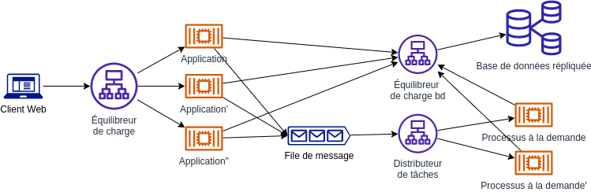

## 8. Concurrence

> L'application supporte l'exécution simultanée de plusieurs instances d'elle-même. Ainsi, on peut démarrer plus de processus pour gérer une augmentation de la charge

Vous devez décomposer votre application en processus indépendants en fonction du type d'exécution (exécution en arrière-plan, execution à la demande, execution planifiée, etc). Chacun de ces processus doit pouvoir supporter l'exécution simulté d'un nombre variable de copie de lui-même. La plupart des services de déploiement infonuagique vous permettent d'adapter le nombre processus à la demande à conditions que vos processus soient adaptés.



Dans une architecture microservices, vous pouvez faire évoluer horizontalement chaque service indépendamment, dans la mesure où l'infrastructure sous-jacente le permet.

### Nous recommandons les pratiques spécifiques suivantes :

- Construire de plus petites applications sans état (microservices).
- L'application peut être exécutée un nombre illimité de fois en parallèle.
- L'application ne doit pas maintenir un grand pnombre de connexions persistantes à la base de données 
- L'application utilise les transactions de la base de données, le cas échéant, et évite les blocages.
- L'application ne dépend pas de sessions collantes ; les demandes peuvent atteindre n'importe quel processus.

### Exemples de cas d’utilisation

Certaines structures clés de Kubernetes s'appliquent aux processus de *scaling* :

- *Autoscaling* horizontal des pods `HPA`. Kubernetes peut être configuré de façon à augmenter ou diminuer le nombre de pods exécutés dans le cluster en fonction de métriques standards ou personnalisées. Cela s'avère utile lorsque vous devez vous adapter à une charge variable sur votre application. L'exemple de fichier `YAML` `HPA` suivant montre comment configurer le *scaling* pour le déploiement en configurant jusqu'à 10 pods selon l'utilisation moyenne du processeur.

```yml
apiVersion: autoscaling/v2beta2
kind: HorizontalPodAutoscaler
metadata:
  name: my-sample-web-app
  namespace: dev
spec:
  scaleTargetRef:
    apiVersion: apps/v1
    kind: Deployment
    name: my-sample-web-app
  minReplicas: 1
  maxReplicas: 10
  metrics:
  - type: Resource
    resource:
      name: cpu
      target:
        type: Utilization
        averageUtilization: 60
```

- *Autoscaling* des nœuds: En cas de demande accrue, vous devrez peut-être faire évoluer votre cluster de façon à ce qu'il accueille davantage de *pods*. Lorsque l'*autoscaling* est activé, `AWS EKS` par exemple assure le *scaling* automatique des nœuds lorsque des pods supplémentaires doivent être programmés et que les nœuds existants ne peuvent pas les gérer. Par contre `AWS EKS` réduit également le nombre de nœuds lorsque la charge sur l'application diminue 


- Tâches (`Jobs`): Une tâche peut être définie de manière générale comme une action nécessitant l'exécution d'un ou de plusieurs pods. La tâche peut s'exécuter une seule fois ou ponctuellement selon un calendrier. Une fois la tâche terminée, les pods dans lesquels elle s'exécutait sont supprimés. Le fichier `YAML` qui configure la tâche spécifie les détails sur la gestion des erreurs, le parallélisme, la gestion des redémarrages, etc.

```yml
apiVersion: batch/v1
kind: Job
metadata:
  name: pi
spec:
  template:
    spec:
      containers:
      - name: pi
        image: perl:5.34.0
        command: ["perl",  "-Mbignum=bpi", "-wle", "print bpi(2000)"]
      restartPolicy: Never
  backoffLimit: 4
```


[Le facteur suivant](./9_disposabilite.md)

[Le tableau de la méthodologie de 12 Facteurs](../README.md)