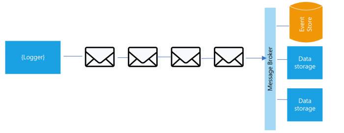

## 11. Journaux
> `Traiter les journaux comme des flux d'événements, ne pas gérer les fichiers journaux.`

La journalisation applicative ou les journaux d’évènements, permettant de stocker un historique des évènements attachés à un processus ou à un service externe qui tourne. Ces évènements sont horodatés et ordonnés en fonction du temps pour retracer le comportement d’une application. Dans une situation idéale, ces fichiers sont visibles par les développeurs dans leurs consoles locales et, en production, ils sont automatiquement capturés comme un flux d'événements et poussés dans un système consolidé en temps réel pour l'archivage à long terme et l'exploration de données. La meilleure solution serait de capter les erreurs puis de les envoyer à un service comme une notification d’erreur.

Traditionnellement, la responsabilité de collecter les journaux, de les filtrer selon le niveau souhaité (`ERROR` , `WARN`, `DEBUG`, etc.), de les contextualiser et enfin de les sauvegarder dans des fichiers est souvent déléguée à l’application. Cette approcher rend l’exploitation des logs pour des fins opérationnelles ou de monitoring, compliquée et fastidieuse.

Dans les microservices, l'observabilité est le citoyen de première classe, c’est pourquoi les applications 12 facteurs privilégient une vision plus dynamique où les logs seront considérés comme un flux d’évènements décrivant le comportement de l’application, sans pour autant se soucier du stockage du flux de sortie.

### Nous recommandons les pratiques spécifiques suivantes :

- Publier les journaux vers un agrégateur central de journaux.
- Écrire les journaux en sortie standard.
- Ne supprimez pas ou ne faites pas tourner les journaux. Conservez les données des journaux pour des analyses futures.

### Exemples de cas d’utilisation

L'observabilité peut être obtenue en utilisant des outils [APM](https://www.mezmo.com/learn-log-management/logging-vs-apm) (AWS Log Analysis, Newrelic, et d'autres outils) ou des outils d'agrégation de logs comme [Splunk](https://www.splunk.com/fr_fr).

Dans les déploiements de validation ou de production, les flux de chaque processus seront capturés par leur environnement d’exécution, assemblés avec les autres flux de l’application, et routés vers une ou plusieurs destinations pour un visionnage et un archivage de longue durée. Le lieu d’archivage n’est pas visible et ne peut être configuré par l’application : ils sont complètements gérés par l’environnement d’exécution. Des routeurs opensource de logs, (tel que [Logplex](https://devcenter.heroku.com/articles/logplex) et [Fluentd](https://www.fluentd.org/)) existent pour cela.

Le flux d’événements d’une application peut être routé dans un fichier, ou surveillé en temps réel (avec tail) dans un terminal. Plus pertinent, les flux peuvent être envoyés vers un outil d’indexation et d’archivage des logs tel que Splunk, ou bien dans un entrepôt de données générique comme [Hadoop/Hive](https://hadoop.apache.org/)

[Le facteur suivant](./12_processus_administration.md)

[Le tableau de la méthodologie de 12 Facteurs](../README.md)