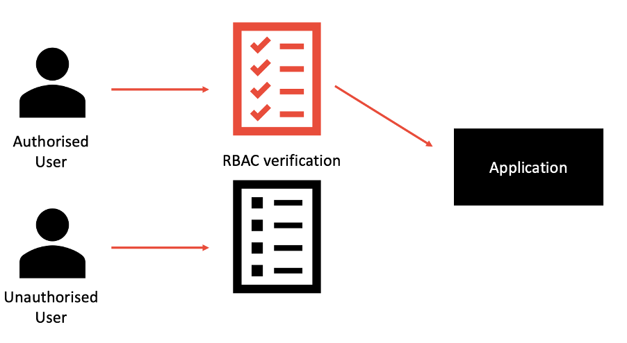

## 15 - Authentification/autorisation

L'ajout du facteur Authentification et autorisation met l'accent sur la sécurité des applications Cloud Native. Le déploiement d'applications dans un environnement en infonuagique signifie que les applications peuvent être transportées à travers de nombreux centres de données dans le monde entier, exécutées dans plusieurs conteneurs et accessibles à un nombre presque illimité de clients. Il est donc essentiel que la sécurité ne soit pas une réflexion après coup pour les applications natives en infonuagique et constitue un facteur très important à prendre en compte.
Les applications natives du cloud peuvent sécuriser leurs points d'extrémité grâce au contrôle d'accès basé sur les rôles (RBAC). Ces rôles déterminent si le client appelant dispose d'une autorisation suffisante pour que l'application honore la demande et permettent de suivre l'auteur de la demande à des fins d'audit.

MicroProfile [JWT](https://jwt.io/) (JSON Web Token), un mécanisme d'authentification par jeton pour authentifier, autoriser et vérifier les utilisateurs, peut être une API Java open source utile pour activer ce facteur. Un jeton Web JSON (JWT) est un jeton autonome conçu pour transmettre en toute sécurité des informations sous forme d'objet JSON. Les informations contenues dans cet objet JSON sont signées numériquement et peuvent être reconnues et vérifiées par le destinataire. 

Pour les microservices, un mécanisme d'authentification basé sur des jetons offre un moyen léger pour les contrôles de sécurité et les jetons de sécurité de propager les identités des utilisateurs à travers différents services. JWT est en train de devenir le format de jeton le plus courant car il suit des normes bien définies et connues. Les normes JWT de MicroProfile définissent le format requis de JWT pour l'authentification et l'autorisation.

### Nous recommandons les bonnes pratiques suivantes :

- Protection contre les DOS et DDOS
- L'API doit être sécurisée par A&A - jeton d'API, RBAC, OAuth.
- Le contenu Web doit être exposé en externe via HTTPS.
- Le réseau doit être protégé par un pare-feu.
- Les charges utiles des demandes/réponses de l'API doivent être cryptées.
- La sécurité du pare-feu et du routeur doit être en place.
- Protection de la base de données
- MFA (authentification multifactor)

[Le tableau de la méthodologie de 12 Facteurs](../README.md)