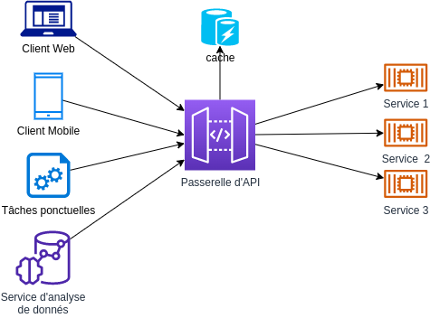

## 13 - API First

API first a été introduit comme un facteur permettant de mettre l'accent sur l'importance des API dans le développement d'applications natives en infonuagique. Les applications développées pour le cloud participent généralement à un écosystème de services distribués et si les API ne sont pas clairement définies, cela peut conduire à un cauchemar d'échecs d'intégration. D'où l'importance de ce facteur dans la conception d'applications qui prospèrent dans l'infonuagique.

Une approche API-first implique le développement d'API cohérentes et réutilisables, ce qui donne aux équipes la possibilité de travailler sur les contrats publics des uns et des autres sans interférer avec les processus de développement internes. En utilisant une approche API-first et en planifiant clairement les différentes API qui seront consommées par les applications et services clients, chaque API peut être très clairement conçue pour être aussi efficace que possible et peut être facilement modélisée. Cela permet une meilleure collaboration avec les parties prenantes et permet aux développeurs et aux architectes de tester ou de vérifier leur orientation/plan avant d'investir trop dans le support d'une API donnée. Un processus de conception clair pour chaque API permet également de créer une documentation plus efficace pour chacune d'entre elles. Il est essentiel de fournir une documentation bien conçue, complète et facile à suivre pour que les développeurs aient une bonne expérience de l'API.

Les langages de description d'API sont des langages spécifiques à un domaine, qui conviennent à la description des API. Ce sont des langages intuitifs qui peuvent être facilement écrits, lus et compris par les développeurs d'API, les concepteurs d'API et les architectes d'API. Par rapport aux langages de programmation ou aux langages de mise en œuvre d'API, les langages de description d'API utilisent un niveau d'abstraction plus élevé et un paradigme déclaratif, ce qui signifie qu'ils peuvent être utilisés pour aider à exprimer le quoi plutôt que le comment - ils peuvent aider à définir la structure de données des réponses possibles (le quoi), au lieu de décrire comment la réponse est calculée. Pendant les phases initiales de conception d'une API, cela peut être particulièrement utile pour simuler une API et recueillir les commentaires des parties prenantes. OpenAPI, Swagger et RAML sont des exemples de langages de description d'API.

Pour définir clairement une API dans le code source d'une application, on peut utiliser les modèles standard des spécifications d'API. Une spécification d'API peut fournir une compréhension générale du comportement d'une API et de la façon dont une API particulière est liée à d'autres API. Elle explique le fonctionnement de l'API et les résultats auxquels on peut s'attendre en l'utilisant.

[Le facteur suivant](./telemetrie.md)

[Le tableau de la méthodologie de Twelve-Factor](../README.md)