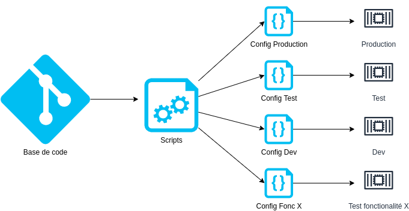

## 1. Codebase
"Une base de code suivie avec un système de contrôle de version, plusieurs déploiements"

Le premier principe de la méthodologie est lié à la base de code de votre application. Une base de code suivie avec un système de contrôle de version, elle est utilisée pour plusieurs déploiements de l’application : prod, pre-prod, dev.
Le point le plus important ici est de s'assurer que votre application est suivie et qu'elle se trouve dans un dépot central accessible à vos développeurs grâce à des outils tels que Git, Mercurial ou SVN.

Vous devez gérer le code de votre application dans un système de contrôle des versions tel que Git ou Mercurial. Pour travailler sur l'application, vous extrayez le code vers votre environnement de développement local. Le stockage du code dans un système de contrôle des versions permet aux membres de votre équipe de travailler ensemble. En effet, ce système fournit une trace d'audit des modifications apportées au code, et offre un moyen systématique de résoudre les conflits de fusion et d'effectuer un rollback du code vers une version précédente. Ce type de stockage fournit également un emplacement à partir duquel effectuer l'intégration continue (CI) et le déploiement continu (CD).

Bien que les développeurs puissent travailler sur différentes versions du code au sein de leurs environnements de développement, la véritable source est le code situé dans le système de contrôle des versions. Le code qui se trouve dans le dépôt correspond à ce qui est conçu, testé et déployé, et le nombre de dépôts est indépendant du nombre d'environnements. Le code du dépôt sert à générer une version unique, qui une fois associée à une configuration spécifique à un environnement, permet de produire une version immuable ne pouvant faire l'objet d'aucune modification, y compris de sa configuration. Cette version peut alors être déployée vers un environnement. (Toute modification requise pour la version doit entraîner la création d'une nouvelle version.)

Cloud Source Repositories vous permet de collaborer et de gérer votre code dans un dépôt Git privé, complet et évolutif. Cet outil est doté d'une fonctionnalité de recherche de code parmi tous les dépôts. Vous pouvez également connecter d'autres produits AWS Cloud, tels que Cloud Build, App Engine, Cloud Logging et Pub/Sub.

Dans une architecture de microservices, l'approche correcte est chaque service doit avoir sa propre base de code. Le fait d'avoir une base de code indépendante vous aide à faciliter le processus CI/CD pour vos applications.
De plus, nous recommandons fortement l'utilisation de Git comme référentiel, en raison de la richesse de ses fonctionnalités et de son énorme écosystème. GitHub est devenu la plateforme d'hébergement Git par défaut dans la communauté open source, mais il existe de nombreuses autres excellentes options d'hébergement Git, en fonction des besoins de votre organisation.

- Utilisez une base de code unique pour tous les environnements.
- Toutes les modifications du code de votre application peuvent être suivies dans une base de code unique.
- Utilisez une gestion des dépendances appropriée à votre langue pour les bibliothèques partagées entre les projets. Pour Java, Gradle ou Maven sont populaires : pom.xml
- Attachez vos dépendances à une version afin d'éviter que les choses ne changent sous vos pieds entre deux constructions.
avec les accès dont vous avez besoin. 
Exemple:

Github, Mercurial, SVN

[Le facteur suivant](./dependance.md)

[Le tableau de la méthodologie de Twelve-Factor](../README.md)