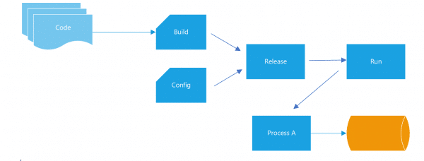

## 5. Build, release, run (CI/CD)

"Étapes de construction et d'exécution strictement séparées".

Il est important de séparer le processus de déploiement logiciel en trois phases: 
la phase de la compilation qui transforme le code en un paquet exécutable/un paquet de construction et installe les dépendances
la phase du release qui envoie le résultat de cette build sur l’environnement cible, et qui récupère le paquet de construction de l'étape de construction et le combine avec les configurations de l'environnement de déploiement et rend votre application prête à fonctionner.
la phase de l'exécution qui lance le ou les processus de l’application, ou plutot c'est comme si vous exécutiez votre application dans l'environnement d'exécution.

Chaque étape doit donner lieu à un artefact à identifiant unique. Chaque déploiement doit être associé à une release spécifique qui est le produit de la combinaison d'une configuration d'environnement et d'une version. Cela permet de réduire le temps d’indisponibilité de l’applicatif car la phase de build, est souvent une longue opération et peut se faire en parallèle de l’exécution de l’ancienne application sur l’environnement cible.

Nous recommandons l'utilisation d'un outil d'intégration continue/de livraison continue (CI/CD) pour automatiser les processus de constructions et de déploiement. Les images Docker permettent de séparer facilement et plus efficacement les étapes de construction et d'exécution. Idéalement, les images sont créées à chaque livraison et traitées comme des artefacts de déploiement.

- Build and publish a Docker image.
- Les builds sont déclenchés par un changement de code. Avec les microservices, cela doit être automatisé et cette automatisation vit dans le contrôle de source avec l'application.
- Les builds aboutissent à une version avec un identifiant de version unique qui peut être facilement référencé dans l'étape "Run".
- Vous pouvez mettre à l'échelle une version existante ou revenir à une version précédente sans avoir besoin d'une nouvelle construction ou d'une nouvelle version. Ceci peut être facilement géré avec un outil comme Kubernetes.

[Le facteur suivant](./processus.md)

[Le tableau de la méthodologie de Twelve-Factor](../README.md)