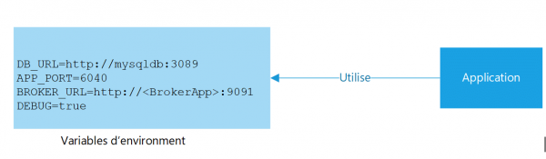

## 3. Configuration (Config)

> Séparation stricte entre la configuration et le code et Stocker la config dans l'environnement.


Toute application moderne requiert une configuration, d'une forme ou d'une autre. Les données de configuration vont plus porter sur des données sensibles telles que les mots de passe de la base de données ou les identifiants d’authentifications. Il est donc nécessaire de les protéger en les séparant du reste du code de l’application pour cela il existe généralement des configurations différentes en fonction des environnements cibles (développement, pre-prod et production, par exemple). Ces configurations incluent généralement des identifiants de compte de service et des descripteurs de ressources dans des services externes tels que des bases de données.




Dans un environnement de service microservice, vous pouvez gérer les configurations de vos applications à partir d'un contrôle de source comme git (spring-cloud-config) et utiliser les variables d'environnement pour ne pas maintenir les informations sensibles dans le contrôle de source.

### Nous recommandons les pratiques spécifiques suivantes :

- Utilisez des fichiers .env non contrôlés par version pour le développement local. Docker prend en charge le chargement de ces fichiers au moment de l'exécution.
- Conservez tous les fichiers .env dans un système de stockage sécurisé, tel que Vault, afin que les fichiers soient disponibles pour les équipes de développement, mais non commités dans Git.
- Utilisez une variable d'environnement pour tout ce qui peut changer au moment de l'exécution, et pour tout secret qui ne doit pas être commité dans le référentiel partagé.
- Une fois que vous avez déployé votre application sur une plate-forme de livraison, utilisez le mécanisme de gestion des variables d'environnement de cette plate-forme.
- N'utilisez pas la configuration interne de l’application, tel que config/routes.rb avec Rails
- N'utilisez pas des fichiers de configuration qui ne sont pas inclus dans le système de contrôle de version, par exemple config/database.yml de Rails.


L'avantage de séparer les paramètres de configuration de la logique applicative est que vous pouvez appliquer les paramètres de configuration en fonction du chemin de déploiement. Par exemple, vous pouvez avoir un ensemble de paramètres de configuration pour un déploiement destiné à un environnement de test et un ensemble différent pour un déploiement destiné à un environnement de production.

- Externaliser la configuration avec des variables d'environnement.
- Tous les paramètres de configuration sont transmis via des variables d'environnement et ne sont pas codés en dur.
- Vous ne construisez qu'une seule fois pour les déploiements dans tous vos environnements.
- Les services peuvent être reconfigurés dynamiquement sans recompilation (par exemple en changeant les paramètres)
- Les secrets sont transmis à l'aide de méthodes sécurisées telles que Docker Secrets, AWS secret Manager, Terraform secret ou Kubernetes Secrets et aucun secret n'est stocké dans le contrôle de version.

Le changement d’environnement est aussi simple que de modifier le fichier env lui-même. Vous pouvez stocker plusieurs fichiers sous les noms .env.dev, .env.prod, .env.uat, etc., et configurer votre code source pour qu’il accède à ces fichiers en fonction de l’environnement dans lequel il est exécuté.

### Exemples de cas d’utilisation

Maintenant que vous avez une idée claire du fonctionnement des variables d’environnement et de la manière dont vous devez les utiliser efficacement, voici quelques scénarios courants dans lesquels vous pouvez utiliser les variables d’environnement :

- Type d’environnement : Les variables d’environnement sont souvent utilisées pour stocker le nom de l’environnement dans lequel l’application est en cours d’exécution. La logique de l’application peut utiliser cette valeur pour accéder au bon ensemble de ressources ou activer/désactiver certaines fonctionnalités ou sections de l’application.
- Nom de domaine : Le nom de domaine d’une application peut varier en fonction de son environnement. L’isoler vous permet également de modifier facilement le nom de domaine de votre application sans avoir à rechercher ses occurrences dans l’ensemble de la base de code.
- URL d’API : Chaque environnement de votre application peut avoir des API déployées dans différents environnements également.
- Clés privées : Les clés des services et ressources payants doivent être isolées du code source de l’application afin qu’elles ne tombent pas accidentellement dans de mauvaises mains.
- Numéros de compte de service, etc : Vous pouvez varier d’autres informations spécifiques au système, telles que les numéros de compte de service, les keytabs, etc., en fonction de l’environnement de l’application pour la gestion et la surveillance des ressources.

Les fichiers .env stockent les secrets de votre application sous la forme de paires clé-valeur. Le format habituel pour stocker les variables d’environnement dans un fichier .env est le suivant :

```
Clé1=Valeur1
```

[Le facteur suivant](./stockage.md)

[Le tableau de la méthodologie de Twelve-Factor](../README.md)
