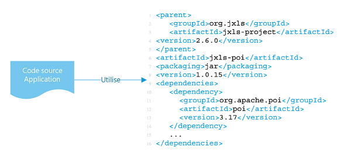

## 2. Dépendances

> Déclarer et isoler explicitement les dépendances.

Deux éléments sont à prendre en compte pour ce qui est des dépendances des applications douze facteurs : la déclaration et l'isolation des dépendances.

Les dépendances (librairies, outils, …) doivent être décrites explicitement, de manière exhaustive, et doivent être installées lors de l’étape de “build” de l’application. Cela vous permet de faire rapidement vos premiers pas avec le code de manière reproductible et de suivre facilement les modifications apportées aux dépendances.

Vous devez également isoler une application et ses dépendances en les rassemblant dans un conteneur. Les conteneurs vous permettent d'isoler une application et ses dépendances de son environnement, et de garantir le fonctionnement uniforme de l'application malgré les différences entre les environnements de développement et de préproduction.

### Nous recommandons les pratiques spécifiques suivantes :

- Toutes les dépendances sont déclarées explicitement à l'aide d'un manifeste de déclaration des dépendances, tel qu'un Dockerfile.
- Votre application s'exécute de manière isolée afin d'éviter que les dépendances du système ne soient utilisées accidentellement, comme dans un conteneur Docker.
- Les dépendances sont déclarées et isolées de la même manière pour les environnements de développement et de production.

### Exemples de cas d’utilisation

- Déclarez toutes les dépendances dans pom.xml ou build.gradle.
- Tous les paquets de l'application seront gérés par des gestionnaires de paquets comme sbt, maven.
- Dans les environnements non conteneurisés, utilisez un outil de gestion de la configuration (Chef, Puppet, Ansible) pour installer les dépendances du système.
- Dans un environnement conteneurisé, faites-le dans le Dockerfile.
- Bundler pour Ruby fournit le format de manifeste Gemfile pour la déclaration des dépendances, ainsi que la commande bundle exec pour l’isolation des dépendances. En python, il y a deux outils séparés pour ces étapes – Pip est utilisé pour la déclaration et Virtualenv pour l’isolation. Même le C dispose d’Autoconf pour les déclarations de dépendances, et la liaison statique peut fournir l’isolation des dépendances. Peu importe la chaîne d’outils, la déclaration et l’isolation des dépendances doivent toujours être utilisées ensemble – seulement l’un ou l’autre ne suffit pas à satisfaire les 12 facteurs.

[Le facteur suivant](./configurations.md)

[Le tableau de la méthodologie de Twelve-Factor](../README.md)