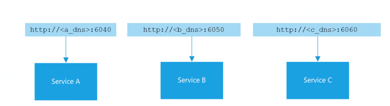

## 7. Association de ports

> Exportez les services via des associations de ports.

Dans les environnements non basés sur le cloud, les applications Web sont souvent conçues pour s'exécuter dans des conteneurs d'applications tels que Apache Tomcat et le serveur HTTP Apache. En revanche, les applications douze facteurs ne reposent pas sur des conteneurs d'applications externes. Au lieu de cela, elles intègrent la bibliothèque du serveur Web directement dans l'application.

Le principe du Port Binding affirme qu'un service ou une application est identifiable sur le réseau par un numéro de port, et non par un nom de domaine. 
Les noms de domaine et les adresses IP associées peuvent être attribués à la volée par des manipulations manuelles et des mécanismes automatisés de découverte de services. Leur utilisation comme point de référence n'est donc pas fiable. En revanche, l'exposition d'un service ou d'une application au réseau en fonction du numéro de port est plus fiable et plus facile à gérer. Au minimum, les problèmes potentiels dus à une collision entre l'attribution d'un numéro de port privé au réseau et l'utilisation publique de ce même numéro de port par un autre processus public peuvent être évités en utilisant la redirection de port.



Sur le plan architectural, il est recommandé que les services exposent un numéro de port, spécifié par la variable d'environnement PORT.

Les applications qui exportent l'association de ports peuvent consommer les informations relatives à cette association en externe (en tant que variables d'environnement) lors de l'utilisation du modèle Platform as a Service.

### Nous recommandons les pratiques spécifiques suivantes :

- Configurer le port avec la variable d'environnement server.port.
- Vous ne devez pas coder en dur les numéros de port dans votre code. Indiquez plutôt les numéros de port dans l'environnement, par exemple dans une variable d'environnement.

### Exemples de cas d’utilisation

Au lieu de coder en dur le port sur lequel le serveur Web écoute, la configuration utilise une variable d'environnement. L'extrait de code suivant, indique comment accepter une valeur de port transmise dans une variable d'environnement.

```js
const express = require('express')
const request = require('got')

const app = express()
app.enable('trust proxy')

const PORT = process.env.PORT || 8080
app.listen(PORT, () => {
  console.log('App listening on port ${PORT}')
  console.log('Press Ctrl+C to quit.')
})
```


[Le facteur suivant](./concurrence.md)

[Le tableau de la méthodologie de Twelve-Factor](../README.md)