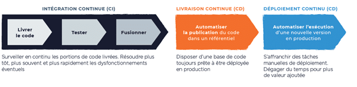

## 10. Parité des environnements developpemment/production

> Gardez le développement, la pre-prod et la production aussi proches que possible.

Des nombreuses organisations cherchent à faire évoluer et à renforcer l'innovation de leurs systèmes d'information de manière rapide et efficace. 

Les applications d'entreprise évoluent dans différents environnements au cours de leur cycle de développement. En règle générale, ces environnements sont les suivants : développement, test, préproduction et production. Il est recommandé de faire en sorte que ces environnements restent aussi semblables que possible.

Pour les microservices, il s'agit d'une caractéristique inhérente aux microservices qui sont exécutés à l'aide des techniques de conteneurisation. Donc nous recommandons, une fois encore, l'utilisation de conteneurs - un outil très puissant ici, car ils vous permettent d'exécuter exactement le même environnement d'exécution tout au long du développement local jusqu'à la production. N'oubliez pas, cependant, que des différences dans les données sous-jacentes peuvent toujours entraîner des différences au moment de l'exécution.

La parité des environnements (ou parité dev/prod) est une fonctionnalité que la plupart des développeurs considèrent comme acquise. Cependant, à mesure que les entreprises se développent et que leurs écosystèmes informatiques évoluent, la parité des environnements devient difficile à maintenir.
Ceci est important pour s'assurer que tous les bogues potentiels peuvent être identifiés lors du développement et des tests plutôt que lorsque l'application est mise en production. Cela permet d'éliminer la déclaration de développement stéréotypée : 

> Cela fonctionne sur mon ordinateur portable mais ... 

De nombreuses applications s'exécutant désormais dans l'infonuagique, interagissant avec de nombreux autres services dans un vaste écosystème de services, il est important que nous reproduisions cet environnement lorsque nous développons et testons nos applications.

### Nous recommandons les pratiques spécifiques suivantes :

- Créez des images de conteneurs et expédiez-les dans plusieurs environnements, puisque tous les environnements fonctionnent de la même manière lorsqu'ils sont configurés avec les mêmes paramètres.
- Utiliser Github avec les bonnes branches pour chaque environnement selon le bon [flux de travail de Git](https://github.com/CQEN-QDCE/ceai-cqen-documentation/blob/main/Guides/CICD/ceai_cicd_workflow.md) pour votre projet.
- Éliminez le délai de publication de votre code pour qu'il soit vos branches identiques.

### Exemples de cas d’utilisation

- L'utilisation de [Git Workflow](https://nvie.com/posts/a-successful-git-branching-model/) qui permet d'avoir plusieurs branches et environnements 

- Pour un application nodejs, nous utilisons NODE_ENV, NODE_CONFIG pour produire un comportement légèrement différent. Par exemple NODE_ENV=production a une signification particulière. npm install installera uniquement les dépendances répertoriées dans votre package.json et omettra toute devDependencies. Nous utilisons également NODE_ENV pour déterminer comment nous construisons nos ressources statiques. NODE_ENV=production inclut quelques optimisations supplémentaires.

NODE_CONFIG est utilisé avec parcimonie, et uniquement pour charger des fichiers de configuration spécifiques à l'environnement.

[Le facteur suivant](./journaux.md)

[Le tableau de la méthodologie de Twelve-Factor](../README.md)