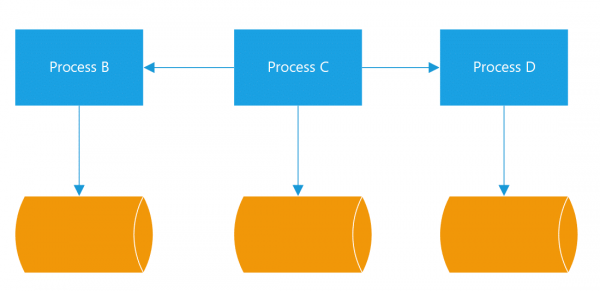

## 6. Processus

"Les processus sont sans état et ne partagent rien"

Les applications douze/quize facteurs sont exécutées dans l'environnement sous la forme d'un ou de plusieurs processus. Ces processus doivent être doivent être indépendants. Les applications peuvent ainsi évoluer grâce à la réplication de leurs processus. Ces processus qui peut être plus précisément appelé processus sans état. Cela signifie qu'aucun processus ne garde trace de l'état d'un autre processus et qu'aucun processus ne garde trace d'informations telles que l'état de la session ou du flux de travail. Un processus sans état facilite la mise à l'échelle. Lorsqu'un processus est sans état, des instances peuvent être ajoutées et supprimées pour gérer une charge particulière à un moment donné. Comme chaque processus fonctionne indépendamment, l'absence d'état empêche les effets secondaires involontaires.

Pour les microservices, le point important du facteur Processus est que votre application doit être sans état. Ainsi, il est facile de faire évoluer un service horizontalement sans aucun impact en ajoutant simplement plus d'instances de ce service. Si votre système nécessite toujours de maintenir l'état, utilisez les ressources attachées comme redis pour stocker l'état au lieu de le faire en mémoire.

- Créez des services sans état et stockez toutes les informations d'état en dehors de l'application, par exemple dans une base de données.
- Tous les processus doivent exposer des health check endpoint (/healthz)
- Ne doit pas dépendre d'un gestionnaire de processus (par exemple pm2)
- Doit sortir non nul en cas d'erreur fatale
- Les contrôles de santé ne doivent pas dépendre de la santé des services de soutien.
- Ne nécessite pas d'exécution privilégiée (par exemple, root).

[Le facteur suivant](./liaison_port.md)

[Le tableau de la méthodologie de Twelve-Factor](../README.md)