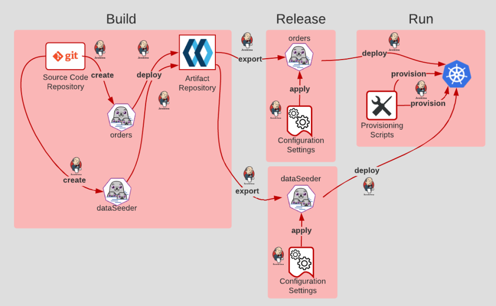

## 12. Processus d'administration

"Exécuter les tâches d'administration et de maintenance en tant que processus ponctuels"

Les processus d'administration sont généralement constitués de tâches ponctuelles ou récurrentes, telles que la création de rapports, l'exécution de scripts batch, le démarrage de sauvegardes de bases de données et la migration de schémas. Le facteur relatif aux processus d'administration du manifeste des douze facteurs a été rédigé en prenant en compte les tâches ponctuelles. Pour les applications cloud natives, ce facteur devient plus pertinent lors de la création de tâches récurrentes. Par ailleurs, les instructions de cette section sont orientées vers ce type de tâche.

Les conteneurs rendent cela très facile, car vous pouvez faire tourner un conteneur juste pour exécuter une tâche, puis l'arrêter.

Les processus d'administration doivent respecter les règles suivantes:

- Ces scripts doivent partager le même chemin de déploiement et d’exécution de l’application de base et ne doivent pas être séparés du cycle de vie du développement. Cela signifie que pour une même base de code, on associe une même séquence de Build, Release et Run.
- Afin d’éviter tout risque d’interférence avec les processus de production en cas de problème (fail ou potentiel impact de performances), les processus d’administration doivent être exécutés d’une manière séparée et isolés des autres processus de production. Il est préférable de démarrer de nouvelles instances d’exécution.
- Une parfaite parité entre les environnements de dev, tests et production permet de valider le bon fonctionnement de ces scripts avant de les appliquer en production.

De cette façon, vos microservices peuvent se concentrer sur la logique métier. Cela permet également de déboguer et d'administrer en toute sécurité les applications de production et qui permet également d'exécuter les processus ponctuels comme une tâche et de les arrêter automatiquement une fois la mise en œuvre terminée.

- Créez des processus ponctuels en tant que points de terminaison d'API.
- Exécuter des scripts ponctuels (comme la sauvegarde d'une base de données) dans le même environnement et la même configuration que l'application. Cela peut être fait avec Docker en utilisant les commandes docker exec ou kubectl exec.
-  Stockez les scripts d'administration dans le même contrôle de version que l'application pour éviter les problèmes de synchronisation.
- Le traitement doit être exécuté dans un conteneur séparé

[Le facteur suivant](./api_first.md)

[Le tableau de la méthodologie de Twelve-Factor](../README.md)