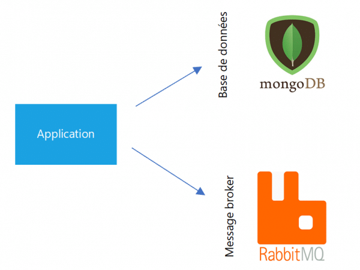

## 4. Services de stockage externes (Backing Services)

> Traitez les services externes comme des ressources attachées.

Chaque service utilisé par l'application dans le cadre de son fonctionnement normal, tel que les systèmes de fichiers, les bases de données, les systèmes de mise en cache, les files d'attente de messages et les serveurs de messagerie doit être accessible en tant que service et externalisé dans la configuration et qui peuvent être approvisionnés et maintenus par le personnel des systèmes comme des ressources attachées. Ce sont des abstractions pour la ressource sous-jacente. 

Par exemple, lorsque l'application écrit des données dans l'espace de stockage, traiter celui-ci comme un service externe vous permet de modifier facilement le type de stockage sous-jacent, car il est dissocié de l'application. Vous pouvez ensuite effectuer des changements, par exemple passer d'une base de données PostgreSQL locale à Cloud SQL pour PostgreSQL sans modifier le code de l'application.

Dans un écosystème de microservices, tout ce qui est externe au service est traité comme une ressource attachée. La ressource peut être échangée à tout moment sans que cela ait un impact sur le service.

### Nous recommandons les pratiques spécifiques suivantes :

- Créez des services pluggable en utilisant des abstractions comme JPA.
- Connexion aux ressources de sauvegarde via URL + secrets. 
- Externaliser les informations de connexion dans la configuration externe. Comme dans helm values.yaml
- Utiliser le stockage objet lorsque des fichiers sont nécessaires (pas de stockage local).
- Utiliser des bases de données externes (par exemple Postgres, MySQL, Redis, etc.) pour conserver l'état.
- Utiliser des variables d'environnement pour la configuration (par exemple, les délais d'attente, les points de terminaison, etc.)
- Utiliser des délais d'attente configurables pour les connexions et les réponses des backends.

### Exemples de cas d’utilisation

Un déploiement d’une application 12 facteurs doit pouvoir remplacer une base de données MySQL locale par une autre gérée par des tiers (Amazon RDS, par exemple) sans le moindre changement dans le code de l’application. De la même manière, un serveur SMTP local doit pouvoir être remplacé par un service tiers (Postmark, par exemple) sans changements dans le code. Dans les deux cas, seules les informations de configurations doivent changer.

[Le facteur suivant](./cicd.md)

[Le tableau de la méthodologie de Twelve-Factor](../README.md)