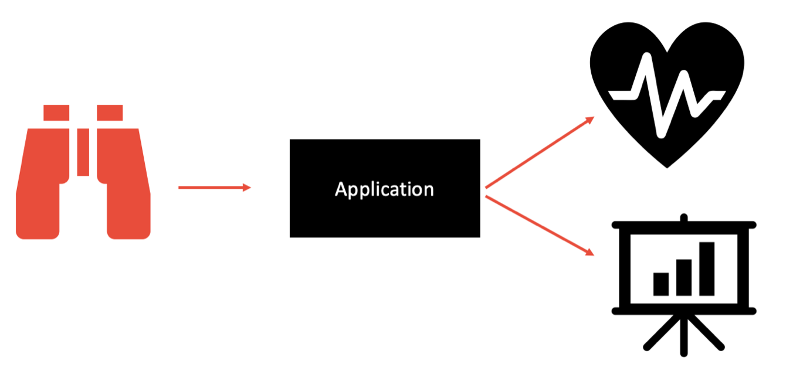

## 14 - Télémétrie

La télémétrie est un autre ajout important. Le facteur de journalisation, qui était déjà inclus dans la méthodologie originale des applications à douze facteurs est généralement orientée vers la structure interne de votre application, plutôt que de refléter l'utilisation réelle du client. La télémétrie, quant à elle, est axée sur la collecte de données une fois l'application lancée dans la nature. La télémétrie et la surveillance des applications en temps réel permettent aux développeurs de contrôler les performances, la santé et les principales mesures de leur application dans cet environnement compliqué et hautement distribué.

La télémétrie peut inclure des mesures spécifiques au domaine (celles qui sont nécessaires ou requises par votre organisation, votre département ou votre équipe), ainsi que des mesures de santé et de système pour votre application. Les mesures de santé et de système comprennent le démarrage, l'arrêt et la mise à l'échelle de l'application, le suivi des requêtes Web et les résultats des contrôles de santé périodiques. [MicroProfile Health](https://github.com/eclipse/microprofile-health) et [MicroProfile Metrics](https://github.com/eclipse/microprofile-metrics) sont de fantastiques outils `Java` ouverts et natifs d'infonuagique qui peuvent être utilisés pour collecter ce type de mesures.

[Le facteur suivant](./authentification.md)

[Le tableau de la méthodologie de Twelve-Factor](../README.md)