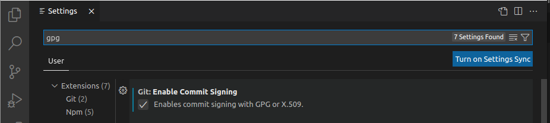
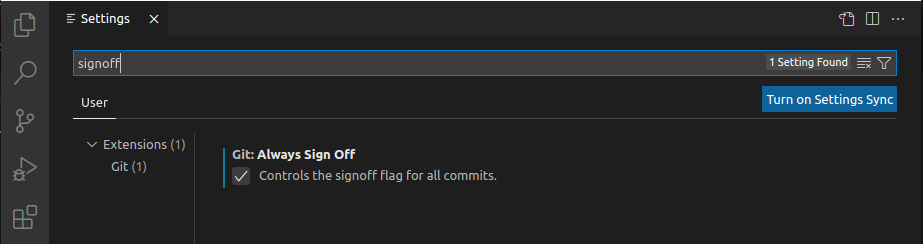

<!-- ENTETE -->
[](https://www.quebec.ca/gouv/politiques-orientations/vitrine-numeriqc/accompagnement-des-organismes-publics/demarche-conception-services-numeriques)
[](https://github.com/CQEN-QDCE/.github/blob/main/LICENCE.md)

---

<div>
    
</div>
<!-- FIN ENTETE -->

# Commandes Git de base pour tout développeur


## Installation des outils 

Avant d'entreprendre des travaux avec Git, il faut s'équiper des outils dont vous aurez besoin. Vous devez d'abord installer l’exécutable en ligne de commande Git, puis, selon vos préférences, vous pouvez installer des outils graphiques complémentaires tels que Github Desktop ou encore l'extension pour VSCode Gitlens.

### Installation de git 

Faites l'installation selon votre système d'exploitation. 

**Linux** 

Installez via la commande suivante: 

```sh 
$ sudo apt-get install git -y
```

**Mac** 

Pour l'installation la plus à jour, installez via l'installateur binaire disponible dans le site web de Git, à l'adresse [https://git-scm.com/download/mac](https://git-scm.com/download/mac). 

### Installation de Github Desktop

Si vous préférez travailler avec une interface graphique au lieu de la ligne de commande, vous aimerez probablement  `Github Desktop`. Cette application est une couche d'interface graphique qui utilise Git pour faire le contrôle de source dans la plateforme Github. 

Allez à la page [https://desktop.github.com/](https://desktop.github.com/) pour faire le téléchargement et l'installation selon votre système d'exploitation. 


## Configurez git 

Si vous n'avez jamais utilisé Git auparavant, vous aurez besoin de faire quelques configurations. 

Exécutez les commandes suivantes, pour que Git connaisse votre nom et votre adresse courriel. 

```sh
git config --global user.name "Votre nom "
git config --global user.email "vous@email.com"
```

Configurez les préférences de fin de ligne: 

```sh 
# Pour usagers de Mac/Unix
git config --global core.autocrlf input
git config --global core.safecrlf true

# Pour usagers de Windows
git config --global core.autocrlf true
git config --global core.safecrlf true
```

Finalement, crééz et configurez votre clé GPG pour signature de code dans Github. Référez vous à la page [Création et configuration d'une clé GPG][signature]


## Configurez VSCode pour signer et faire signoff

Une fois que vous avez déjà configuré vos informations personnelles et ajouté votre clé GPG dans Github, il faut configurer VSCode pour les utiliser lors d'un `commit`. 

Dans VSCode, sélectionnez l'option `Settings` ou `Configuration` et faites la recherche pour `gpg`. 



Marquez la boîte qui dit `Enables commit signing with GPG or X.509`. Ensuite, cherchez pour `signoff` 



Marquez la boîte qui dit `Controls the signoff flag for all commits`. 

Et voilà, vous avez configuré la clé GPG et vos informations personnelles pour créer le signoff et la signature obligatoires à tous les commits dans le Github du CQEN.  

## Git pull 

Récupère et intègre les objets et références d'un autre dépôt ou d'une branche locale. 

La commande `git pull` permet de récupérer tous les changements sur la branche distante. Elle prend en paramètre la branche source et la branche ciblé.

Exemple:
La commande  `git pull main preprod:master` nous permet de récupérer les changements de la branche `preprod` du remote `main` dans la branche `master` du remote `origin`.

## Git fetch

Récupère les dernières informations d'objets et références du serveur Git.  

```sh
$ git fetch <nom-du-remote>
```

`git fetch` permet de rechercher et afficher les changements sur un remote passé en argument, qui ne sont pas présent en local, sans aucun transfert de fichiers.

Exemple: 
La commande  `git fetch main`  permet de chercher les nouveaux changements sur le remote `main` qui ne sont pas présents en `local`.

## Git rebase

Réapplique les commits au-dessus d'une autre base.

`git rebase` permet de transférer les changements d’une branche à une autre, elle prend en argument la branche avec laquelle nous voulons rebaser.

Exemple:
La commande  `git rebase -i cqen/preprod`  permet de rebaser les commits de notre branche courante avec la branche `preprod` de remote `cqen`.

## Git checkout 

Change de branche ou restaure les fichiers de la branche de travail.

```bash 
$ git checkout <nom de la branche> 
```

`git checkout` permet de se déplacer d’une branche à une autre et aussi de supprimer les modifications qui ne sont pas ajoutées. Elle prend en argument la branche cible. 

Exemples:
```sh
$ git checkout branch-A         # Déplace vers la branche branch-A si elle existe.
$ git checkout -b branch-B      # Crée et déplace vers la branche branch-B si elle n’existe pas déjà.
$ git checkout path/file.php    # Supprime tous les changements non ajoutés (unstaged) sur le fichier path/file.php.
$ git checkout .                # Supprime tous les changements non ajoutés (unstaged) sur tous les fichiers.

## Git add 


`git add` permet d’ajouter les changements que nous avons fait sur la branche courante dans le prochain commit.

Exemples:
```sh
 git add nom_fichier.go     # Ajoute les changements fait au fichier nom_fichier.go au prochain commit
 git add -u    # Ajoute les modifications sur les fichiers déjà connus par git (les nouveaux fichiers ne seront pas ajoutés)

## Git commit 

`git commit` permet commiter les modifications que nous avons en local sur la branche courante.

Exemples:
```sh
$ git commit -m “[tag] Message de commit” -s -S   # permet de commiter les changements sur la branche courante, avec un message “Message de commit” (et fait la signature et le signoff).
$ git commit –amend                         # permet de commiter les nouveaux changements sur la branche courante dans la dernière commit que nous avons créé sur la branche
```

## Git reset 

`git reset` permet de supprimer tous les changements que nous avons faits sur la branche courante.

Exemples:
```sh 
$ git reset –hard HEAD    # permet de retourner vers la version que nous avons sur la branche master.
$ git commit –amend       # permet de commiter les nouveaux changements sur la branche courante dans la dernière commit que nous avons créé sur la branche.
```

## Git push 

`git push` permet d’envoyer les modifications sur un remote.

Exemples:
```sh
$ git push origin branch-A    # permet d’envoyer les modifications que nous avons faites sur la branche branch-A vers notre repos origin.
```

## Git status 

Affiche l'état du repertoire de travail.

```sh
$ git status    # permet d’afficher toutes les modifications non commités sur la branche courante.
```

## Git merge 
Joignez deux ou plusieurs historiques de développement ensemble.

## Git history 

Afficher l'arbre des modifications 

```sh
$ git hist 
``` 


## Git branch 
Information sur les branches locales 

```bash 
$ git branch
```

Information sur les branches de tous les remotes 

```bash
$ git branch -r
```

Création d'une nouvelle branche 

```bash 
$ git branch <nom de la nouvelle branche>
```

Renommer une branche 

```bash 
$ git branch -m <nom actuel> <nouveau nom de la branche>
```

# Workflows 

## Identifiez-vous à git

Lors de vos commits, il est obligatoire de faire la soumission signée par vous avec votre clé GPG (`signature`) et d'ajouter votre nom et courriel à la fin du message de `commit` (`signoff`), aux fins de validation auprès de la plateforme. 

Utilisez la flag `-s` ou `--signoff` pour rajouter vos informations d'identification au commit, et utilisez le flag -S pour signer le code avec votre clé GPG (détails sur le document [Création et configuration d'une clé GPG](./CreationConfigCleGPG.md)). 

``` 
$ git commit -m "[tag] votre message" --signoff -S
```

Référez-vous au [répo de la Base de connaissances][securisation] pour plus d'information sur la sécurisation de Github.  

## Création d'un dépôt Github 

- Créez un répertoire pour le projet 
- Allez dans le nouveau répertoire 
- Saisissez `git init` 
- Écrivez du code 
- Saisissez `git add` pour ajouter du code au projet 
- Saisissez `git commit` pour faire un commit à votre dépôt local. 
- Saisissez `git branch -M master` pour créer la branche principale. 
- Allez sur Github
- Cliquez sur `new repository`, et ensuite `Create repository`


Pour pousser votre code sur le serveur Github, saisissez les commandes suivantes: 

```bash
# $ git remote add origin git@github.com:username/new_repo
$ git remote add origin https://github.com/username/new_repo 
$ git push -u origin master
```

## Corriger une branche qui est derrière la branche master 

Admettons que vous êtes sur votre branche `maBranche`. 

Faites les commandes suivantes: 

```
$ git status
```
Si les changements ne sont pas commités, faites-le d'abord: 

```
$ git add .
$ git commit -m "[func] commit changes" -s -S
```

Ensuite, faites un `pull` du contenu du `master`:

```
$ git pull origin master
```

Vérifiez s'il y a des conflits qui résultent de ce `pull`, corrigez-les et commitez-les: 

```
$ git add .
$ git commit -m"resolved conflicts message"
```

Ensuite, poussez les changements: 

```
$ git push origin maBranche
```

## Références 

- [Page man de git](https://git.github.io/htmldocs/git.html)

- [Git guide Start a new git repository ](https://kbroman.org/github_tutorial/pages/init.html)


<!-- Définitions -->
[signature]: ./CreationConfigCleGPG.md

[securisation]: https://github.com/CQEN-QDCE/BaseConnaissances/tree/main/github