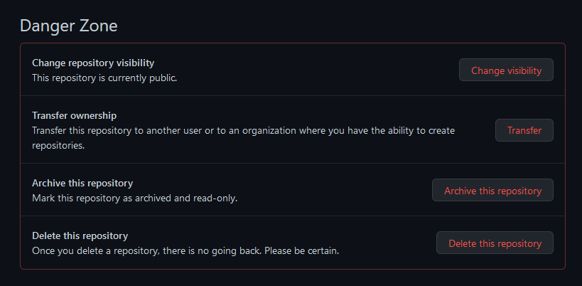
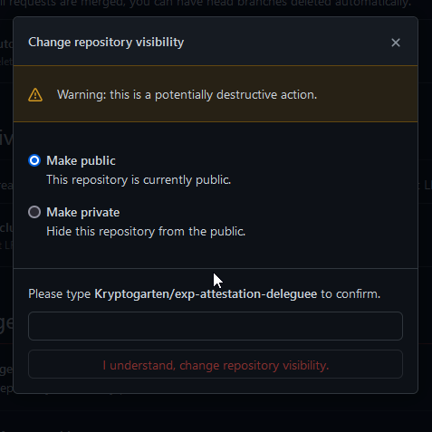

<!-- ENTETE -->

---

    

<!-- FIN ENTETE -->

# Procédure pour correction de commit

Si vous vous retrouvez sur cette page, il est probable que vous ayez reçu une alerte de notre service de surveillance des dépôts Github. Ne vous inquiétez pas, les fuites se produisent parfois... même pour les meilleurs d'entre nous... Cette section fournit un guide étape par étape sur la façon de remédier à une fuite qui s'est produite sur un dépôt Github public.

## **Guide étape par étape pour remédier à la fuite**

Étape 1 : Révoquez le secret exposé  
Étape 2 : Nettoyez l'historique de git  
Étape 3 : Inspectez les logs  

## **Étape 1 : Révoquez le secret exposé**

La révocation du secret est le seul moyen de s'assurer qu'aucun attaquant n'accède au service concerné.

Comment le faire: 

- Après avoir été alerté, vous devez accéder au code source correspondant; consultez la documentation du fournisseur concerné, vous pouvez généralement révoquer vos informations d'identification dans la même section que vous les avez émises. 
- Enfin, si vous avez divulgué des informations d'identification d'entreprise ou des informations d'identification que vous ne pouvez pas révoquer par-vous-même, nous vous recommandons vivement de contacter votre équipe de sécurité. C'est normal de faire des erreurs, par contre les cacher ne fera qu'empirer les problèmes. 

Que vous ayez réussi à révoquer les informations d'identification ou non, passez à l'étape 2 pour atténuer la fuite et en supprimer les preuves.

## **Étape 2 : Nettoyez l'historique de git**

Si, pour une raison quelconque, vous ne pouviez pas révoquer les informations d'identification divulguées, l'action la plus rapide pour supprimer les informations d'identification de la vue de la plupart des attaquants consiste à rendre le répo privé. Bien que vos informations d'identification soient probablement reproduites à un autre endroit sur Internet, c'est déjà un bon moyen de gagner du temps.

Comment le faire:  

- allez dans la section des paramètres de votre projet GitHub et choisissez le bouton de changement de visibilité  `"Change visibility"` en bas. 

Ensuite choisissez l'option faire privé `"Make a repository private"`. 

Pour une question d'image de marque, vous pouvez également vouloir nettoyer l'historique de git pour supprimer toute trace de la fuite. Gardez à l'esprit que cette action n'est pas suffisante car le secret peut toujours être visible pour les attaquants, soit dans les forks du répo concerné, soit sur la version miroir de GitHub.

De plus, ce n'est pas une action triviale à mener, sachez que la réécriture de l'historique de git peut interrompre le flux de travail des développeurs contributeurs. Maintenant que les informations d'identification ont été révoquées et que les attaquants ne peuvent plus les utiliser, prenez le temps de faire les choses correctement.

Comment le faire: 

- Nous vous recommandons d'utiliser la procédure de Github pour la suppression de contenu problématique du dépôt [Removing sensitive data from a repository (en)](https://docs.github.com/en/authentication/keeping-your-account-and-data-secure/removing-sensitive-data-from-a-repository)
- Une fois que vous avez corrigé votre historique Git, poussez-le vers le serveur distant. Sachez qu'il peut arriver qu'il reste un commit orphelin contenant encore les données problématiques sur Github. Vous pouvez contacter le support Github pour supprimer définitivement ces données.

## **Étape 3 : Inspectez les logs**

L'inspection de vos logs vous donnera une idée rapide de savoir si les informations d'identification compromises ont été utilisées par un attaquant ou non, et ce qui s'est exactement passé là-bas.

Comment le faire: 

- Si le fournisseur concerné est géré par le moteur de détection, vous pouvez consulter la section Vérifier les activités suspectes de la documentation du détecteur concerné. Sinon, le fournisseur d'API donne généralement des informations sur la date à laquelle les informations d'identification ont été utilisées pour la dernière fois dans la page des paramètres. Si les informations d'identification compromises sont des informations d'identification de base de données ou des clés privées, vous pouvez consulter les logs de serveur pertinents.

## Ce qu'on ne doit pas faire

- Faire un commit sur la version actuelle du code n'est pas la solution. Github conserve tout l'historique du dépôt, alors le secret continue visible dans les commits antérieurs. 
- Seulement rendre le dépôt affecté privé n'est pas la solution non plus. 

## **Finalement**

Félicitations, vous devriez maintenant être couvert.

Restez vigilant et surveillez votre code et votre historique pour vérifier que vous n'avez pas d'autres secrets enfouis dans votre code.

En plus, dans le pipeline de CI/CD du CQEN dans Github, il y a quelques outils qui sont utilisés pour veiller sur la fuite de données sensibles dans vos dépôts. Ces outils surveillent plusieurs paramètres de sécurité et de qualité du code soumis dans les dépôts du CQEN. Ces outils sont [Snyk](https://snyk.io), [GitGuardian](https://www.gitguardian.com/) et [SonarQube](https://www.sonarqube.org/). Référez-vous à la page [Outils CI/CD](./OutilsCICD.md) pour des informations sur leur configuration. 

## Références

https://docs.github.com/en/authentication/keeping-your-account-and-data-secure/removing-sensitive-data-from-a-repository
