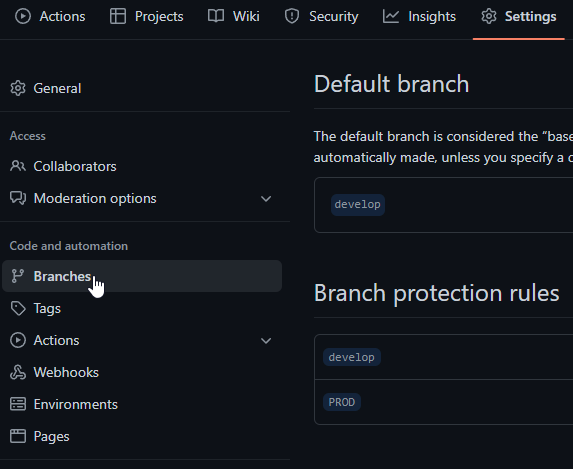
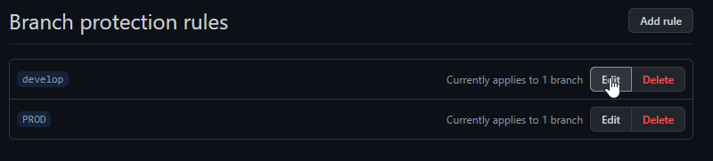
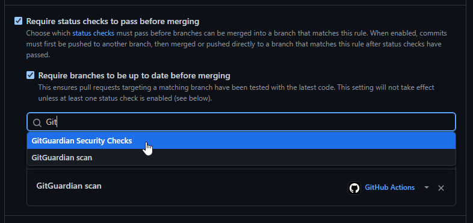
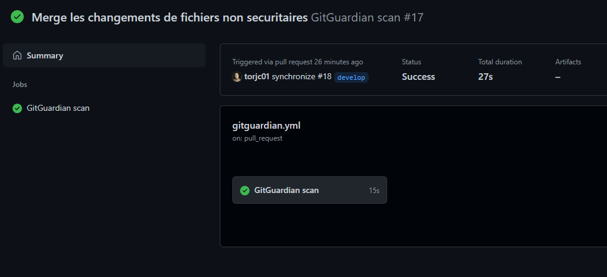
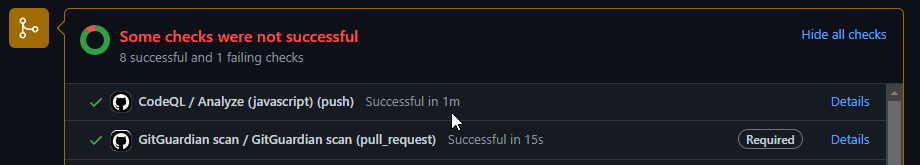

<!-- ENTETE -->
[](https://www.quebec.ca/gouv/politiques-orientations/vitrine-numeriqc/accompagnement-des-organismes-publics/demarche-conception-services-numeriques)
[](https://github.com/CQEN-QDCE/.github/blob/main/LICENCE.md)

---

<div>
    
</div>
<!-- FIN ENTETE -->

# GitGuardian 

<div align="center">
    
</div>

## Prérequis 

- Avoir un compte GitHub configuré avec double facteur d'authentification; 

- Avoir un compte GitGuardian, qui est lié à votre compte GitHub; 

- Créer un token d'accès personnel d'API de GitGuardian et l'enregistrer comme variable d'environnement dans GitHub. 


## Création du token d'accès personnel 

Créez un token d'accès personnel dans la section d'API de votre tableau de bord de GitGuardian.

 <br/>

Ajoutez les autorisations dont vous avez besoin. On recommande tout choisir pour laisser le plus de possibilités d'action à GitGuardian. 

En plus, c'est une bonne pratique de déterminer une date d'expiration pour toute clé d'API que vous générez: vous pouvez le faire en modifiant le champ `Expires`.

 <br/>

Voilà, votre token d'accès personnel est créé. Prenez en note ce token, parce qu'il n'y a pas moyen de le visualiser ultérieurement. 

 <br/>


## Création de la variable d'environnement dans GitHub

Vous avez un token d'accès créé et actif dans GitGuardian. Maintenant il faudrait le faire connaître à GitHub pour les autorisations d'accès lors de l'exécution des jobs `"Actions"`. On le fait par la création d'une variable d'environnement au niveau de votre projet. 

Accédez à votre projet et dans la section de configurations, allez à la page des `Secrets`. 

 <br/>

Pour créer le secret, cliquez le bouton `New repository secret`. 

 <br/>

Ajoutez le token généré à la variable d'environnement `GITGUARDIAN_API_KEY` dans le champ `"Name"`; collez le texte du token que vous avez copié dans le champ `"Value"`. 

 <br/>

Votre secret est désormais créé et actif dans votre compte GitHub et peut être utilisé dans les flux de travail des `"Actions"`. 

 <br/>

## Configuration de l'action 

Cette intégration de GitGuardian avec le CI/CD dans Github est faite par moyen d'une application CLI appelée [ggshield](https://docs.gitguardian.com/internal-repositories-monitoring/ggshield/getting_started), qui est un `wrapper` pour l'API de détection de secrets de GitGuardian. Le token qui est généré et configuré dans les `secrets` et il sert à faire l'authentification de `ggshield` dans le flux de travail de GitHub.

Suivez les étapes ci-dessous pour préparer l'action `GitGuardian scan` à protéger votre projet. 
### Création du fichier du flux de travail

Ajoutez un nouveau fichier appelé `git-guardian.yml` au répertoire `.github/workflows` de votre projet, qui va utiliser l'action `GitGuardian/ggshield-action`. 

Utilisez le code ci-dessous comme base de votre `workflow`:

```yaml
name: GitGuardian scan

on: [push, pull_request]

jobs:
  scanning:
    name: GitGuardian scan
    runs-on: ubuntu-latest
    steps:
      - name: Checkout
        uses: actions/checkout@v2
        with:
          fetch-depth: 0 # récupère tout l'historique pour que plusieurs commits puissent être vérifiés par le scan.
      - name: GitGuardian scan
        uses: GitGuardian/ggshield-action@master
        env:
          GITHUB_PUSH_BEFORE_SHA: ${{ github.event.before }}
          GITHUB_PUSH_BASE_SHA: ${{ github.event.base }}
          GITHUB_PULL_BASE_SHA: ${{ github.event.pull_request.base.sha }}
          GITHUB_DEFAULT_BRANCH: ${{ github.event.repository.default_branch }}
          GITGUARDIAN_API_KEY: ${{ secrets.GITGUARDIAN_API_KEY }}
```

Configurez la balise `on:` pour ajouter les événements qui déclencheront l'exécution de l'action selon votre convenance. Le code d'exemple est déclenché lorsqu'on fait un `push` dans une branche ou lorsqu'un `pull-request` est créé ou qu'il a des modifications. 

### Configuration des branches 

Vous devez ensuite configurer les branches pour ajouter `GitGuardian scan` à vos `status checks` requis pour empêcher que les `pull-requests` qui présentaient des enjeux de sécurité soient fusionnés. 

D'abord, allez sur les configurations (`"Settings"`) de votre projet, et cliquez sur `Branches`. 

 <br/>

Par la suite, on va éditer la branche qui sera protégée par l'action `GitGuardian scan`, en cliquant sur le bouton `Edit`. 

 <br/>

Dans la page `Branch protection rule`, sélectionnez les boîtes `Require status checks to pass before merging` et `Require branches to be up to date before merging`; puis dans la recherche, assurez-vous de choisir `GitGuardian scan` et `GitGuardian Security Checks`. 

 <br/> 

## Exécution de l'action 

Lorsqu'un des événements de la balise `on:` se passe, GitHub exécute l'action et vérifie le dépôt de votre projet. S'il y a des secrets qui sont exposés dans votre commit, votre flux de travail sera signalisé comme en échec, et les étapes suivantes du flux ne seront pas exécutées.  

Vous pouvez vérifier le résultat de l'exécution soit dans les checks de votre `pull-request`, soit dans l'option `Actions` dans le menu de votre projet. 

 <br/> 

 <br/> 

## Références

[GitHub Actions Integration (en)](https://docs.gitguardian.com/internal-repositories-monitoring/integrations/ci_cd_integrations/github_actions)