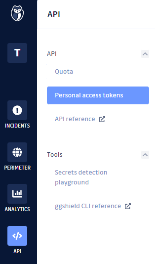
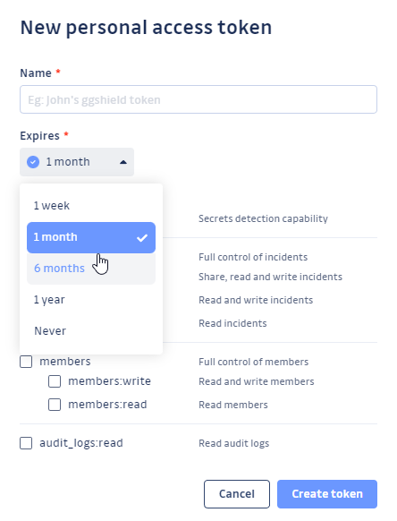
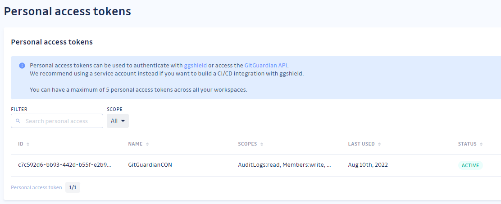
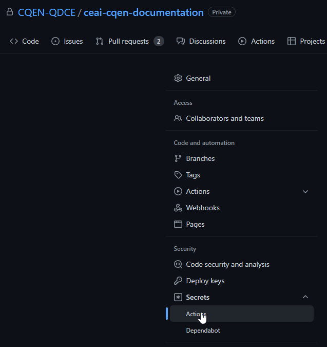
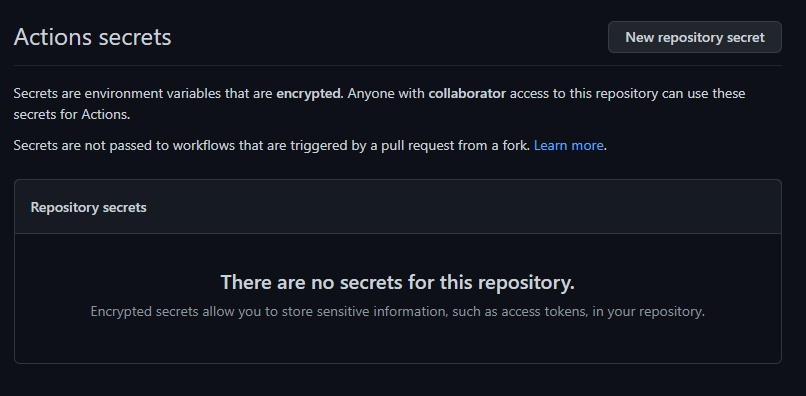
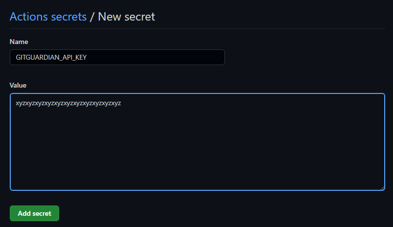
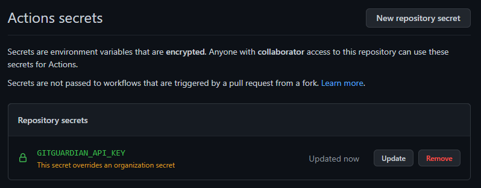

<!-- ENTETE -->
[](https://www.quebec.ca/gouv/politiques-orientations/vitrine-numeriqc/accompagnement-des-organismes-publics/demarche-conception-services-numeriques)
[](https://github.com/CQEN-QDCE/.github/blob/main/LICENCE.md)

---

<div>
    
</div>
<!-- FIN ENTETE -->

# GitGuardian 

## Prérequis 

- Avoir un compte GitHub configuré avec double facteur d'authentification; 

- Avoir un compte GitGuardian, qui est lié à votre compte GitHub; 

- Créer un token d'accès personnel d'API de GitGuardian et l'enregistrer comme variable d'environnement dans GitHub. 


## Création du token d'accès personnel 

Créez un token d'accès personnel dans la section d'API de votre tableau de bord de GitGuardian.

 <br/>

Ajoutez les autorisations dont vous avez besoin. On recommande tout choisir pour laisser le plus de possibilités d'action à GitGuardian. 

En plus, c'est une bonne pratique de déterminer une date d'expiration pour toute clé d'API que vous générez: vous pouvez le faire en modifiant le champ `Expires`.

 <br/>

Voilà, votre token d'accès personnel est créé. Prenez-note de ce token, parce qu'il n'y a pas moyen de le visualiser ultérieurement. 

 <br/>


## Création de la variable d'environnement dans GitHub

Vous avez un token d'accès créé et actif dans GitGuardian. Maintenant il faudrait le faire connu à GitHub pour les autorisations d'accès lors de l'exécution des jobs des `"Actions"`. On le fait par la création d'une variable d'environnement au niveau de votre projet. 

Accédez à votre projet et dans la section de configurations, allez à la page des `Secrets`. 

 <br/>

Pour créer le secret, cliquez le bouton `New repository secret`. 

 <br/>

Ajoutez le token généré à la variable d'environnement `GITGUARDIAN_API_KEY` dans le champ `"Name"`; collez le texte du token que vous avez copié dans le champ `"Value"`. 

 <br/>

Votre secret est desormais crée et actif dans votre compte GitHub et peut être utilisé dans les flux de travail des `"Actions"`. 

 <br/>

## Exécution de l'action 

Ajoutez un nouveau job au répertoire `.github/workflows` de votre projet, en utilisant l'action `GitGuardian/ggshield-action`. Utilisez le code ci-dessous comme base de votre `workflow`:

```yaml
name: GitGuardian scan

on: [push, pull_request]

jobs:
  scanning:
    name: GitGuardian scan
    runs-on: ubuntu-latest
    steps:
      - name: Checkout
        uses: actions/checkout@v2
        with:
          fetch-depth: 0 # récupère tout l'historique pour que plusieurs commits puissent être vérifiés par le scan.
      - name: GitGuardian scan
        uses: GitGuardian/ggshield-action@master
        env:
          GITHUB_PUSH_BEFORE_SHA: ${{ github.event.before }}
          GITHUB_PUSH_BASE_SHA: ${{ github.event.base }}
          GITHUB_PULL_BASE_SHA: ${{ github.event.pull_request.base.sha }}
          GITHUB_DEFAULT_BRANCH: ${{ github.event.repository.default_branch }}
          GITGUARDIAN_API_KEY: ${{ secrets.GITGUARDIAN_API_KEY }}
```

Configurez la balise `on:` pour ajouter les événements qui déclencheront l'exécution de l'action selon votre convenance. Le code d'exemple est déclenché lorsqu'on fait un `push` dans une branche ou lorsqu'un `pull-request` est créé ou qu'il a des modifications. 

Vous devez ensuite configurer les branches pour ajouter `GitGuardian scan` à vos `status checks` requis pour empêcher que `pull-requests` qui aient problèmes de sécurité soient fusionnés. D'abord, allez sur les configurations (`"Settings"`) de votre projet, et cliques sur `Branches`. 

 <br/>

Par la suite, editez la branche qui sera protégée par l'action `GitGuardian scan`, cliquez sur le bouton `Edit`. 

 <br/>

Dans la page `Branch protection rule`, selectionnes les boîtes `Require status checks to pass before merging` et `Require branches to be up to date before merging`; puis dans la recherche, assurez-vous de choisir `GitGuardian scan` et `GitGuardian Security Checks`. 

 <br/> 

Cette intégration de GitGuardian avec le CI/CD dans Github est faite par moyen d'une apllication CLI appellée [ggshield](https://docs.gitguardian.com/internal-repositories-monitoring/ggshield/getting_started), qui est un `wrapper` pour l'API de détection de secrets de GitGuardian. Le token qui est généré et configuré dans les `secrets` set à faire l'authentification dans `ggshield`.

Lorsqu'un des événements de la balise `on:` se passe, GitHub exécute l'action 
## Références

[GitHub Actions Integration (en)](https://docs.gitguardian.com/internal-repositories-monitoring/integrations/ci_cd_integrations/github_actions)