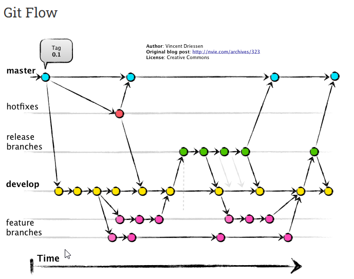
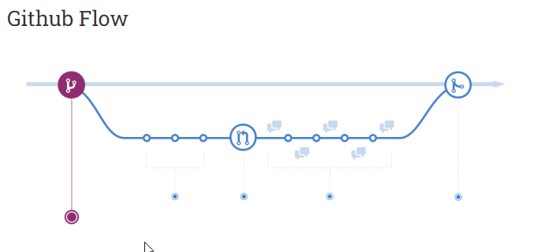

<!-- ENTETE -->
[](https://www.quebec.ca/gouv/politiques-orientations/vitrine-numeriqc/accompagnement-des-organismes-publics/demarche-conception-services-numeriques)
[](LICENSE_FR)

---

<div>
    
</div>
<!-- FIN ENTETE -->

# Meilleures pratiques de Github

1. **Faites des commits propres qui ne concernent qu'une seule chose**.    
Très souvent, on fait plusieurs changements de natures différentes dans une session de travail. Il ne faut pas les regrouper en un seul commit, mais plutôt repartir en plusieurs
commits distincts. On saura ainsi plus facilement ce qui a été fait, puisque la description associée à chaque commit sera simple (et ne concernera qu'une chose), et si l'on a besoin
de revenir en arrière, on pourra choisir de défaire le commit qui concerne le problème spécifique, plutôt que de tout défaire ce qu'on a fait dans la session de travail.
Cela vous aidera sur plusieurs points. Ceux-ci seront plus compréhensibles, ils contiendront peu de modifications, ce qui vous aidera à revenir sur un point ou changer quelques fichiers, différemment si l'on a un gros commit. Cela aidera aussi lors des merges et des pull requests - vous aurez moins de code à réviser et donc moins de conflits potentiels à gérer. 

1. **Faites des commits très fréquemment**  
Git est un excellent système de gestion des versions, profitez-en! N'attendez pas d'avoir écrit beaucoup de code avant de faire un commit. Dès que vous avez quelque chose qui fonctionne raisonnablement (mais pas nécessairement complètement), faites un commit. 
Décomposez votre session de travail en très petites étapes significatives et faites un commit après chacune. Par exemple, chaque fois qu'on avance un peu dans le développement d'une fonctionnalité, on s'assure qu'un nouveau test passe et l’on fait un commit.

1. **Ne faites pas de commit de fichiers binaires**.
Fichiers du type document (Writer, Word, Pages, WordPerfect), chiffrier (Calc, Excel, Numbers, Lotus123), présentation (Impress, PowerPoint, Keynote) etc., n'a aucun bénéfice à être enregistrés dans un système de contrôle de code source. Pour ce type de fichier, utilisez un gestionnaire de documents, comme par exemple SharePoint ou Content Manager. De même pour les fichiers de type exécutable, il est impossible de contrôler leurs versions dans Github; trouvez un autre endroit à les déposer.

1. **Ne faites pas de commit d'un fichier qui est généré automatiquement**.  
Nous disposons aujourd'hui de beaucoup d'espace mémoire, mais il ne faut pas exagérer!
On veut conserver ce qui demande beaucoup d'effort à produire (le code tout particulièrement). Il n'y a absolument aucun intérêt à stocker un fichier qui est généré automatiquement par l'exécution d'un programme. Cela occupe inutilement de l'espace (surtout que ces fichiers sont parfois très gros).

1. **Ne divulguez jamais de secrets ou fichiers de configuration dans le contrôle de code source**  
Tout ce que peut donner accès ou entraîner une authentification ou autorisation y est compris: mots de passe, clés secrètes, les clés d'API, les jetons privés, les clés SSH, les fichiers d'environnement comme `.env` ou `.envprod`, les fichiers de configuration, etc. Ces fichiers contiennent des secrets, des préférences personnelles, historiques ou des informations générales concernant votre environnement local qui ne doivent pas être divulguées. Il est recommandé d'utiliser un magasin externe sécurisé pour l'injection sécuritaire de secrets, tel que AWS Secrets Manager, Openshift Secrets, Github Secrets ou Hashicorp Vault. Si vous commitez par erreur, il est nécessaire de l'enlever du dépôt le plus tôt possible. Référez-vous à la page [Correction de commit](./CorrectionCommit.md) pour mesures de remédiation et la page [Removing sensitive data from a repository (en)](https://docs.github.com/en/authentication/keeping-your-account-and-data-secure/removing-sensitive-data-from-a-repository) (en anglais) pour enlever tout trace de ces fichiers du dépôt. 

1. **Créez un fichier `.gitignore` et y incluez les fichiers qui ne doivent pas être commités**.  
Le fichier `.gitignore` répertorie tous les fichiers qui ne seront jamais commités dans le dépôt git; ils seront ignorés par l'outil. Il est essentiel que vous ayez un dans tous vos dépôts, que vous y mettiez les fichiers de secrets et de configuration, mais aussi les binaires, les exécutables et les fichiers générés automatiquement, par exemple, les dépendances, fichiers objets intermédiaires résultants du processus de compilation, fichiers du système d'exploitation, etc. Github a une [collection de gabarits de .gitignore](https://github.com/github/gitignore), organisés principalement par langage de programmation ou framework, que vous pouvez utiliser directement ou pour vous inspirer dans la création du `.gitignore` le plus adapté à la réalité de votre projet. 

1. **Ne modifiez pas l'historique des commits qui ont été publiés**.  
Ce principe vous évitera de gros maux de tête. Si vous changez l'historique des commits qui sont visibles par tous, vous risquez de causer des problèmes lorsqu'un développeur voudra faire une fusion avec son entrepôt local. Donc, pensez-y bien avant d'utiliser une commande qui change l'historique des commits (comme rebase), et si vous le faites, faites-le seulement sur une branche locale.

1. **Ne pas commiter le code en tant qu'auteur non reconnu**.  
Les dépôts du Lab exigent la conformité avec le [Developer Certificate of Origin](https://github.com/apps/dco) qui est un moyen léger pour les contributeurs de certifier qu'ils ont écrit ou qu'ils ont le droit de soumettre le code qu'ils contribuent au projet. À tous les commits, il est obligatoire qu'ils aient le `signoff` du développeur, bien que la signature avec sa clé GPG. On fait cela en ajoutant les flags `-s` et `-S` à la commande de commit, par exemple: `git commit -m "[tag] texte du message" -s -S`. 

1. Tous les fichiers de code source doivent être encodés en utf-8. 

1. Corriger un fichier ou un bout de code qui ne respecte pas les conventions n'est jamais une perte de temps.

1. Si vous déplacez ou renommez un fichier, assurez-vous de faire un commit avant de recommencer à modifier ce fichier. 

1. Soyez très prudent avec la commande reset, qui peut détruire des fichiers de manière définitive. 

1. Ne poussez pas directement vers la branche master:[Protect branches](https://docs.github.com/en/repositories/configuring-branches-and-merges-in-your-repository/defining-the-mergeability-of-pull-requests/about-protected-branches), [Mergeability](https://docs.github.com/en/repositories/configuring-branches-and-merges-in-your-repository/defining-the-mergeability-of-pull-requests)

1. Définissez les propriétaires de code pour des révisions de code plus rapides: [CodeOwners](https://docs.github.com/en/repositories/managing-your-repositorys-settings-and-features/customizing-your-repository/about-code-owners)


# Règles d'or pour message de commit réussi

1. Séparez le sujet du texte du message avec une ligne à blanc 
2. Limitez le sujet à 50 caractères 
3. Mettez en majuscule la ligne de sujet 
4. Ne terminez pas la ligne de sujet avec point 
5. Utilisez le mode impératif dans la ligne du sujet 
6. Gardez le corps du message à 72 caractères
7. Utilisez le corps pour expliquer quoi et pourquoi au lieu de comment
8. Pour chaque commit, écrivez une description concise qui décrit exactement les changements apportés


Un bon message de commit est très important et souvent négligé par le développeur trop pressé ou insouciant. Comment pensez-vous qu'on peut se retrouver en cas de problème si la description du commit est quelque chose comme "du ménage pour corriger les conneries de Paul"? Décrivez la fonctionnalité que vous avez créée, le bogue que vous avez corrigé, etc. À proscrire les descriptions génériques (correction de bogue, grande mise à jour de code), ou des commentaires qui n'ont pas rapport avec les changements apportés.  

Il est suggéré d'écrire une description de la forme suivante: 

```
    [type] description du changement apporté
```

  On pourrait adopter un système de types au début du message pour signifier immédiatement le type de changement le fichier a subi. Par exemple:  
  - `[func]` Ajout d'une nouvelle fonctionnalité;  
  - `[edit]` Modification d'une fonctionnalité existante;  
  - `[del]` Suppression d'une fonctionnalité ou d'un fichier;  
  - `[fix]` Correction d'un bogue;  
  - `[refac]` Refactoring d'un code, amélioration du code sans changement de fonctionnalité;   
  - `[doc]` Ajout de documentation (commentaires y compris);  
  - `[style]` Modifications cosmétiques au code;  
  - `[misc]` lorsque la tâche ne correspond pas aux types précédents.   

Voici un exemple de message de commit bien réussi: 

```
    [doc] Résumez les modifications en 50 caractères environ ou moins

    Texte explicatif plus détaillé, si nécessaire. Limitez-le à environ 
    72 caractères. Dans certains contextes, la première ligne est traitée
    comme le sujet du commit et le reste du texte comme corps. La
    ligne blanche séparant le résumé du corps est essentielle (sauf si
    vous omettez entièrement le corps); divers outils comme `log`, `shortlog`
    et `rebase` peuvent être confondus si vous écrivez les deux ensemble.

    Expliquez le problème que ce commit résout. Concentrez-vous sur pourquoi 
    vous faites ce changement par opposition à comment (le code explique 
    cela). Y a-t-il des effets secondaires ou d'autres conséquences non 
    intuitives de ce changement? Voici l'endroit pour les expliquer.

    Les autres paragraphes viennent après les lignes vides.

    - Les point de forme sont correctes aussi

    - Généralement, un trait d'union ou un astérisque est utilisé pour
      le point de forme, précédé par un seul espace, avec des lignes 
      vides entre les deux, mais des conventions peuvent varier ici

    Si vous utilisez un outil de suivi des problèmes, mettez-y des références 
    en bas, comme ça:

    Résout: #123
    Voyez aussi: #456, #789
```
## Workflow de base


# Modèles de branches

## Git Flow

`Git Flow` est une stratégie de branchement qui vise a simplifier la gestion des livrables. Elle a été créée par le développeur de logiciel Vincent Driessen en 2010. Fondamentalement, `Git Flow` s'agit d'isoler le travail en cours dans de différents types de branches. `Git Flow` bénéficie le développement en parallèle et la collaboration entre les membres de l'équipe, en isolant dans les branches de travail les codes de différentes équipes. Toutes les différentes branches à la fin de leur développement sont mergés à la branche `develop`, qui sert de zone de préparation de versions. Ainsi, lorsque la prochaine version sera branchée de la branche `develop`, elle contiendra automatiquement toutes les nouveautés qui ont été terminées. 

Par contre, comme dit le créateur de la stratégie dans une note sur le site de `Git Flow`, elle n'est pas parfaitement adaptée à tout type de développement logiciel. Cette stratégie a été conçue en 2010 et elle visait les logiciels qui sont explicitement versionnés et qui ont besoin à donner du support aux différentes versions du logiciel. Le paradigme actuel, de livraison continue des applications sur web n'est pas, selon M Driessen, adapté à la stratégie du `Git Flow`. On préconise choisir et utiliser une autre stratégie, notamment `Github Flow`. 




## Github Flow

La façon dont l'équipe chez Github fait la gestion de leur flow interne est l'utilisation de `Github Flow`. 

En fait, ils travaillent avec un environnement de déploiement en continu où il n'y a pas le concept de `« release »` car chaque fois qu'ils finissent de préparer une nouvelle fonctionnalité, ils poussent en direct immédiatement (après toute la chaîne d'automatisation créée dans l'environnement). C'est le moyen le plus complet et le plus direct de gérer le flux d'applications Web ou de projets qui ne traitent pas exactement avec le concept de versions.

Les applications Web sont généralement livrées en continu, et vous n'avez pas à prendre en charge plusieurs versions du logiciel déployé. 

Les concepts principaux de Github Flow sont: 

- Tout ce qui se trouve dans la branche `master` est déployable 
- Pour travailler sur quelque chose de nouveau, créez une branche nommée de manière descriptive hors de `master` (par exemple: `new-oauth2-scopes`) 
- Commitez(`commit`) dans cette branche localement et poussez (`push`) régulièrement votre travail vers la même branche nommée sur le serveur 
- Lorsque vous avez besoin de commentaires ou d'aide, ou que vous pensez que la branche est prête pour la fusion (`merge`), ouvrez un `pull request`
- Une fois que quelqu'un d'autre a examiné et approuvé la fonctionnalité, vous pouvez la fusionner (`merge`) dans `master` 
- Une fois qu'il est fusionné (`merge`) et poussé(`push`) à `master`, vous pouvez et devez déployer immédiatement.

Ceci est le flux complet. 




# Références

 [Guide de Bonnes Pratiques Git de la Poly de Montréal](https://cours.polymtl.ca/inf1900/logiciel/qualiteCode/guides/BonnesPratiquesGit.pdf)

[Git, les bonnes pratiques](https://medium.com/@pilloud.anthony/git-les-bonnes-pratiques-b0f19c3eef47), par Anthony Pilloud. 

[How to Write a Git Commit Message (en)](https://cbea.ms/git-commit/), par CBEAMS, en anglais. 

[A successful Git branching model (en)](https://nvie.com/posts/a-successful-git-branching-model/) Article seminal sur git-flow, par Vicent Driessen, en anglais. 

[HubFlow: GitFlow For GitHub (en)](https://datasift.github.io/gitflow/index.html) git-flow usage case, en anglais.   

[Github Flow Page (en)](https://githubflow.github.io/) La page principale de Github Flow, en anglais. 

[Github Flow Quickstart (en)](https://docs.github.com/en/get-started/quickstart/github-flow) La page de démarrage rapide pour utilisation de Github Flow, en anglais. 
