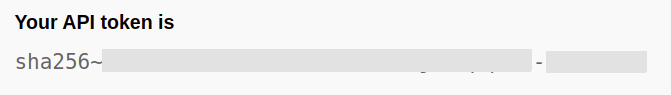

# CLI développeur (odo)

L'outil en ligne de commandes de développement de Red Hat Openshift (odo - Red Hat Openshift Developer CLI), est un outil simplifiant la création d'applications dans la plateforme conteneurisée d'Openshift et Kubernetes.
Avec odo, vous pouvez développer, tester, déboguer et déployer des applications basées en microservices dans un cluster Openshift sans avoir une connaissance approfondie de la plateforme.

## Installation de l'outil client odo

### Linux

1. Étape 1: Téléchargez l'exécutable approprié à votre système d'exploitation.
    
    Dans ce cas-ci, la version pour linux:
    ```bash
    curl -L https://developers.redhat.com/content-gateway/rest/mirror/pub/openshift-v4/clients/odo/latest/odo-linux-amd64 -o odo
    ```
2. Étape 2: Changez la permission du fichier binaire
    ```bash
    chmod +x <filename>
    ```
3. Placez le fichier binaire dans un répertoire référencé dans votre variable d'environnement $PATH.
    
    Pour vérifier la valeur de votre variable "PATH", utilisez la commande `echo $PATH`
    ```bash
    echo $PATH
    ```
    Pour déplacer le fichier utiliser la commande `cp <src> <dest>` (copier) ou `mv <src> <dest>` (déplacer). Par exemple pour copier:
    ```bash
    cp odo /usr/local/bin/
    ```
    Pour déplacer le fichier utiliser la commande `cp <src> <dest>` (copier) ou `mv <src> <dest>` (déplacer). Par exemple pour copier:
    ```bash
    cp odo /usr/local/bin/
    ```
4. Vérifiez que odo est maintenant disponible dans votre système:
    ```bash
    odo version
    ```
    Exemple de résultat:
    ```bash
    odo v2.5.1 (ae0c55309)

    Server: https://api.exp.openshift.cqen.ca:6443
    Kubernetes: v1.23.5+3afdacb
    ```
## Se connecter au cluster d'Openshift
Pour ouvrir une session au cluster, obtenir le jeton avec un [appel HTTP](https://oauth-openshift.apps.exp.openshift.cqen.ca/oauth/token/request
)
La réponse à la requête dans le navigateur web contiendra la valeur du token de conexion:


Avec le jeton, utilisez la commande `odo login`:
```bash
odo login https://api.exp.openshift.cqen.ca:6443 --token=<token-dans-la-response>
```
Un message va s'afficher pour montrer qu'on a bien ouvert une session avec succès dans le cluster

## Variables de configuration
- Pour établir une variable de configuration dans le fichier devfile, utilisez la commande `odo config`, par exemple:
  ```bash
  odo config set Name testapp
  odo config set Ports 8080/TCP,8443/TCP
  odo config set Memory 500M  
  ```
- Pour effacer une variable de configuration dans le fichier devfile, utilisez la commande `odo config unset`, par exemple:
  ```bash
  odo config unset Name
  odo config unset Ports
  odo config unset Memory  
  ```
### Variables d'environnement
- Pour ajouter des variables d'environnement au fichier devfile.yaml généré par odo, utilisez la commande `odo config set --env NOM_VAR=VALEUR_VAR`, par exemple:
  ```bash
  odo config set --env COMPONENT_BACKEND_HOST=backend-app
  ```
- Pour effacer une variable d'environnement dans le fichier devfile, utilisez la commande `odo config unset` avec l'option `--env`. Par exemple:
  ```bash
  odo config unset --env KAFKA_HOST --env KAFKA_PORT  
  ```
## Autres commandes
- Suggestions (aide)
  La commande `odo -h` ou `odo --help` nous montre les différentes options d'utilisations avec odo:
  ```bash
  odo -h
  ```
  Exemple de résultat:
  ```bash
  odo is a CLI tool for running OpenShift applications in a fast and automated manner.
    Reducing the complexity of deployment, odo adds iterative development without the worry of deploying your source code.

    Find more information at https://github.com/redhat-developer/odo

    Usage:
    odo [flags]
    odo [command]

    Examples:
    # Creating and deploying a Node.js project
    git clone https://github.com/openshift/nodejs-ex && cd nodejs-ex
    odo create nodejs
    odo push
    
    # Accessing your Node.js component
    odo url create

    Commands:
    app          Perform application operations (delete, describe, list)
    catalog      Catalog related operations (describe, list, search)
    component    Manage components (create, delete, describe, exec, link, list, log, push, status, test, unlink, watch)
    config       Change or view configuration (set, unset, view)
    debug        Debug commands (info, port-forward)
    env          Change or view environment configuration (set, unset, view)
    preference   Modifies preference settings (set, unset, view)
    project      Perform project operations (create, delete, get, list, set)
    registry     Configure devfile registry (add, delete, list, update)
    service      Perform service related operations (create, delete, describe, list)
    storage      Perform storage operations (create, delete, list)
    test         Run the test command defined in the devfile
    url          Expose component to the outside world (create, delete, list)

    Utility Commands:
    build-images Build images
    deploy       Deploy components
    login        Login to cluster
    logout       Log out of the current OpenShift session
    utils        Utilities for terminal commands and modifying odo configurations (terminal)
    version      Print the client version information

    Component Shortcuts:
    create       Create a new component 
    delete       Delete component 
    describe     Describe component 
    exec         Executes a command inside the component 
    link         Link component to a service or component 
    list         List all components in the current application 
    log          Retrieve the log for the given component 
    push         Push source code to a component 
    status       Watches the given component and outputs machine-readable JSON events representing component status changes 
    unlink       Unlink component to a service or component 
    watch        Watch for changes, update component on change. Watch doesn't support git components. 

    Flags:
        --complete             Install completion for odo command
        --kubeconfig string    Paths to a kubeconfig. Only required if out-of-cluster.
        --uncomplete           Uninstall completion for odo command
    -v, --v Level              Number for the log level verbosity. Level varies from 0 to 9 (default 0).
        --vmodule moduleSpec   Comma-separated list of pattern=N settings for file-filtered logging
    -y, --y                    Don't prompt user for typing 'yes'

    Use "odo [command] --help" for more information about a command.
  ```
  La commande `odo [command] --help` suggérée comme l'indique le résultat précédent nous montre les options disponibles pour une commande en particulière, par exemple pour un projet:
  ```bash
  odo project -h
  ```
  Résultat obtenu:
  ```bash
  Perform project operations

    Usage:
    odo project [options] [flags]
    odo project [command]

    Examples:
    # Set the active project
    odo project set myproject

    # Create a new project
    odo project create myproject

    # List all the projects
    odo project list

    # Delete a project
    odo project delete myproject

    # Get the active project
    odo project get

    Available Commands:
    create      Create a new project
    delete      Delete a project
    get         Get the active project
    list        List all the projects
    set         Set the current active project

    Flags:
    -h, --help   Help for project

    Additional Flags:
        --kubeconfig string    Paths to a kubeconfig. Only required if out-of-cluster.
    -v, --v Level              Number for the log level verbosity. Level varies from 0 to 9 (default 0).
        --vmodule moduleSpec   Comma-separated list of pattern=N settings for file-filtered logging

    Use "odo project [command] --help" for more information about a command.
  ```

## Nettoyage (effacer les ressources créées)

### Effacer un composant
Pour effacer un composant devfile, executez la commande `odo delete`
```bash
odo delete
```
Si le composant a été poussé dans le cluster, le composant et ses ressources relationnées (URL, secrets, et d'autres), sont effacés du cluster.

### Annuler le déploiement des composants devfile kubernetes
Pour annuler un déploiement qui a été fait avec l'outil client odo, utilisez la commande `odo delete` avec l'option `--deploy`:
```bash
odo delete --deploy
```
### Effacer tout
Pour effacer tous les artefacts deployés avec odo, utilisez la commande `odo delete` avec l'option `--all`
```bash
odo delete --all
```

## Se déconnecter du cluster Openshift CLI
```bash
odo logout
```

## Références
- [Understanding odo](https://docs.openshift.com/container-platform/4.10/cli_reference/developer_cli_odo/understanding-odo.html)