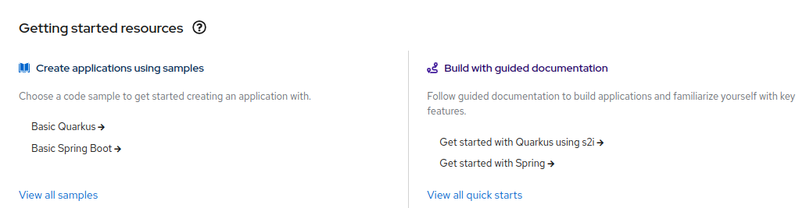
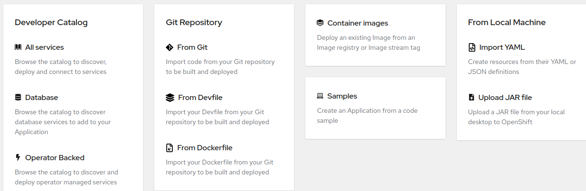
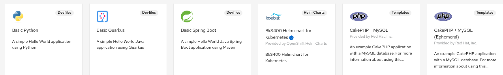
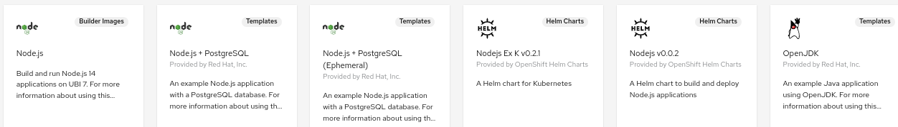

### Questions - Réponses

#### Avant de commencer mes travaux d'expérimentation

**Q: Par où commencer mon expérience sur Openshift?**

R: Il y a deux manières de travailler sur Openshift:
- La console web : l’interface graphique d’Openshift facilite l’accès et la gestion des ressources d’une manière intuitive. Le portail vous offre la possibilité de commencer dès zéro avec une application exemple, ou de déployer une ou plusieurs applications à partir d'une source comme un répertoire github, un fichier Dockerfile, un registre d'images, etc. Vous trouvez l'option d'accès au portail Openshift dans notre [Coffre à outils](https://ceai.cqen.ca/coffre-a-outils/index.html).
Pour accéder au portail:
    - Cliquez sur l'option "Portail Openshift" 
    - Sélectionnez l'option de "Log in with" CEAI
    - Completez vos identifiants pour vous connecter au portail.

- La ligne de commandes avec le Client d'Openshift (oc cli): Si vous êtes familiarisé à travailler avec bash, alors cette option pourrait vous permettre de gérer les ressources vous-même. Pour l'utilisation de oc cli, vous devez l'installer localement. [Voir instructions](Readme-HandsOn.md#installation-de-oc-cli)

**Q: Comment je prépare mon application pour la déployer sur Openshift?**

R: Idéalement, toute application comme service (SAAS: Software as a Service) qui sera déployée dans un contexte infonuagique devrait suivre la méthodologie des [12 facteurs](https://12factor.net/)

<i>Minimalement</i>, l'application doit:

- Exister dans un répertoire de code (github)
  
<i>Fortement recommandé</i>, mais non obligatoire:
- Être conteneurisé (avoir un Dockerfile)

#### Déploiement des composants sur Openshift

**Q: Je n'ai pas une application pour déployer, est-ce que c'est possible de trouver des applications exemple?**

R: Oui, Openshift offre plusieurs exemples d'applications dans les différents langages de programmation (nodejs, python, java, .net, etc.), que vous pouvez choisir au moment de la création des applications, composants ou services.

Dans la console web, perspective de développeur, vous choisissez l'option "+Add" pour commencer avec des ressources existantes ("Getting started resources"). Vous trouvez deux options:
- Créer des applications à partir des exemples ("Create applications using samples -> View all samples")
- Documentation pour vous guider, étape par étape, à construire des applications et vous familiariser avec les caractéristiques principales. ("Build with guided documentation -> View all quick starts")

**Q: Comment déployer une application existante?**

R: On peut déployer une application à partir d'une source comme:
- un répertoire github
- un fichier Dockerfile dans un répertoire github
- une image docker dans un registre d'images
- autres.

Allez [ici](README.md#exemples-de-déploiement) pour voir des exemples de déploiement.

**Q: Comment déployer une solution intégrée sur Openshift? (plusieurs composants)**

R: L'application intégrée doit avoir un fichier de configuration pour le déploiement, comme un ficher [yaml](https://yaml.org/). 

Le développeur a l'option de déployer les composants manuellement ou en utilisant le catalogue du développeur de la console web, qui facilite la sélection de gabarits des solutions intégrées comme:
- CakePHP + MySQL
- Node.js + PostgreSQL
- Autres.

**Q: Est-il possible de déployer une solution intégrée avec un fichier docker-compose?**

Non. On ne peut pas déployer directement une solution intégrée avec un fichier docker-compose dans Openshift.
Mais, il existe des outils comme *kompose* qui permettent de "traduire" un fichier docker-compose dans plusieurs fichiers yaml de déploiement pour chacun des composants.

Voir [ici](../kompose/README.md#openshift) un exemple d'utilisation de kompose pour convertir un fichier docker-compose aux fichiers yaml de création des ressources sur *Openshift*.