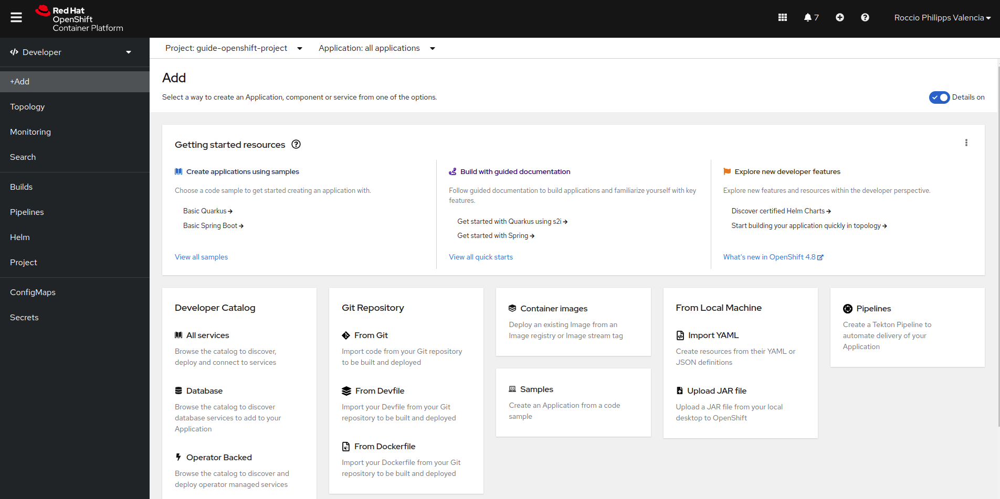
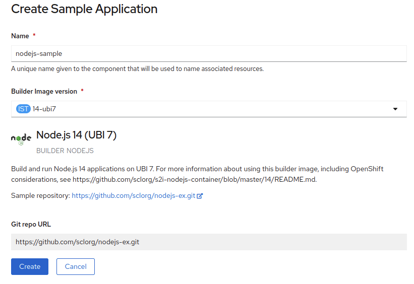
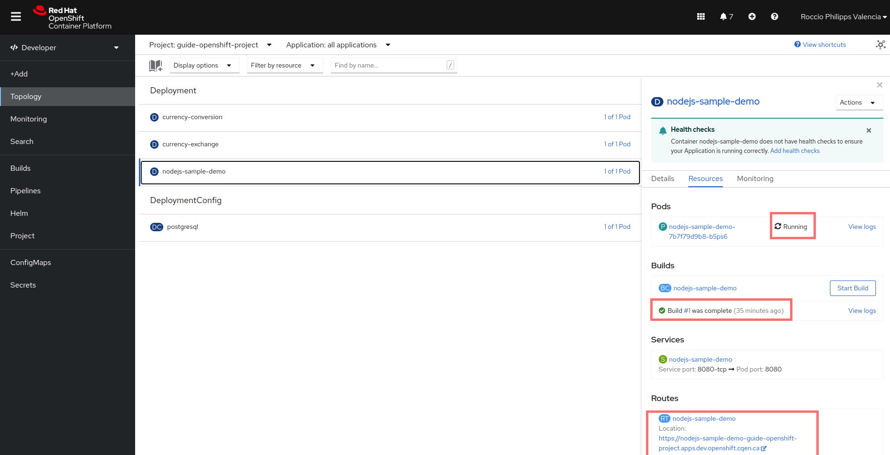
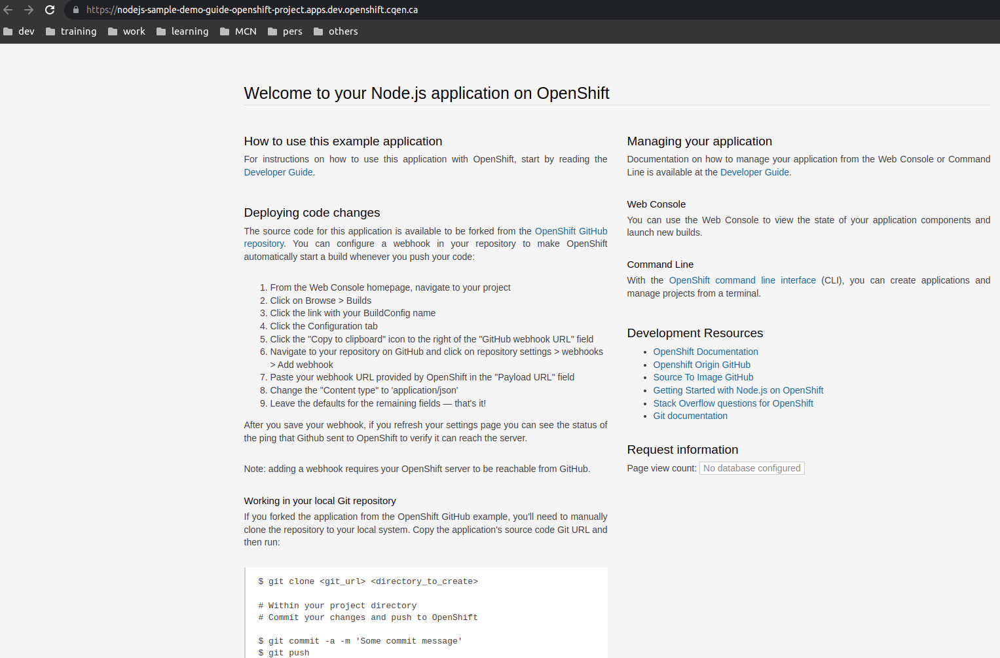
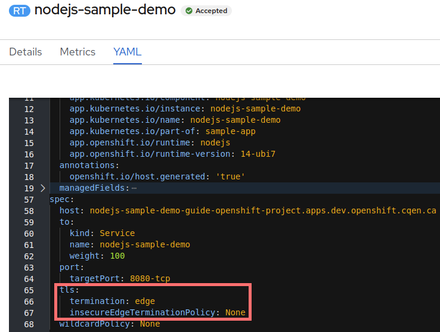
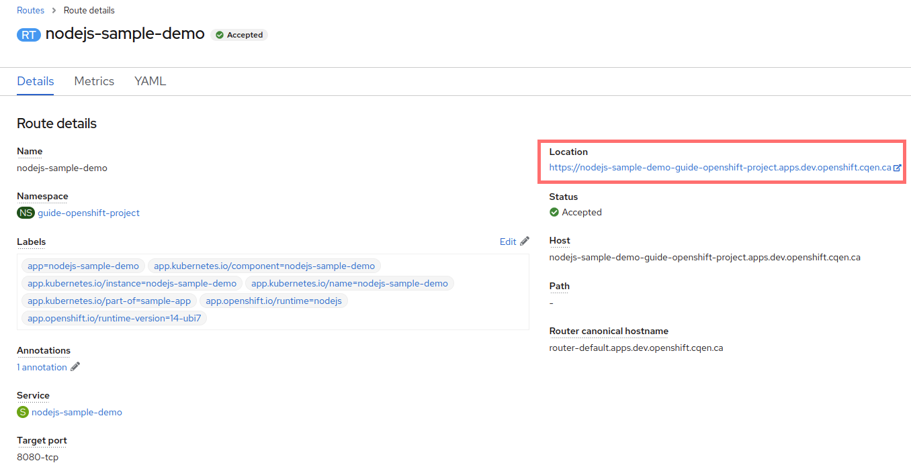

# Redhat Openshift

## Expérimentation avec la Console Web d'Openshift
(Documentation Openshift [ici](https://docs.openshift.com/container-platform/4.10/web_console/odc-about-developer-perspective.html))
### Créer un projet
Le site du laboratoire, [CEAI](https://ceai.cqen.ca/), vous offre l'option  "Coffre à outils" avec des outils que vous servira pour travailler comme le "Portail Openshift". 

Pour accéder à la console web, vous devez vous authentifier avec votre identifiant du CEAI.

À partir de la page d'accueil d'Openshift, vous trouverez la liste des projets auxquels vous avez accès. Cliquez sur l'un d'eux pour commencer avec la création des ressources comme des applications.

### Créer une application
Sélectionnez un projet.
Dans le menu à gauche, vous verrez l'option "+Add". Cliquez sur ce bouton pour créer une application.
Vous verrez que Openshift vous offre une diversité d'options de création des applications, telles que: 
- Exemples suggérés, 
- Création à partir des sources dans un dépôt Git, 
- Création à partir d'une image dans un registre des conteneurs, 
- Création à partir d'un fichier dans la machine locale, 
- Autre.



Pour démontrer un exemple de création d'une application, choisir `Node.js` dans la liste des exemples suggérés: "Getting started resources" -> "View all samples" -> "Node.js"



Cette application vient d'un dépôt git [nodejs-ex](https://github.com/sclorg/nodejs-ex) qui a les scripts nécessaires pour la création des ressources comme le service, le pod, la route (url), entre autres.

Une fois le déploiement terminé, l'application sera déployée et accessible via un lien web:



Vous pouvez constater que le pod et le service ont été créés, que le "build" s'est bien complété, que le service a été exposé avec le port 8080 et qu'il y a une route pour accéder à l'application (section "Routes -> Location" dans l'image).

* Pour ajouter la couche de sécurité (TLS) à la route, il faut éditer la route créée originalement. Pour le faire, suivez les instructions [ici](#prise-en-charge-https-des-routes-dans-openshift)

Vous pouvez cliquer sur le lien de la route pour ouvrir l'application sur le web:



Et voilà!, félicitations! vous avez déployé une application web sur Openshift.

## Expérimentation avec l'Interface de Commande en Ligne d'Openshift (OC CLI) 

(Documentation Openshift [ici](https://docs.openshift.com/container-platform/4.10/cli_reference/openshift_cli/getting-started-cli.html))
### [Installation de oc cli](Outils/OC/README.md#installation-de-openshift-cli-oc)
### [Se connecter au cluster d'Openshift](Outils/OC/README.md#se-connecter-au-cluster-dopenshift)
### [Accéder à votre projet de travail](Outils/OC/README.md#accéder-à-votre-projet-de-travail)

### Créer une application
La commande "oc new-app" va créer une nouvelle application:
```bash
oc new-app https://github.com/sclorg/cakephp-ex
```
Vous verrez un résultat similaire:
```bash
--> Found image 6f4aedf (13 months old) in image stream "openshift/php" under tag "7.4-ubi8" for "php"
...
--> Creating resources ...
    imagestream.image.openshift.io "cakephp-ex" created
    buildconfig.build.openshift.io "cakephp-ex" created
    deployment.apps "cakephp-ex" created
    service "cakephp-ex" created
--> Success
    Build scheduled, use 'oc logs -f buildconfig/cakephp-ex' to track its progress.
    Application is not exposed. You can expose services to the outside world by executing one or more of the commands below:
     'oc expose service/cakephp-ex' 
    Run 'oc status' to view your app.
```
#### [Autres commandes](Outils/OC/README.md#autres-commandes)

#### Se déconnecter du cluster Openshift CLI
```bash
oc logout
```

#### Prise en charge HTTPS des routes dans Openshift

Pour rendre l'application plus sécuritaire, on ajoute à la route, le protocole TLS (Transport Layer Security) qui offre une sécurité de bout en bout aux données envoyées sur internet. Pour le configurer, dans la console web, il faut éditer la route pour ajouter ce qui correspond au protocole TLS.
* Cliquez sur la route (dans Routes -> nodejs-sample-demo)
* Ouvrez l'onglet YAML et vous allez voir la définition de la route.
* Trouvez la section qui correspond aux spécifications ("spec" -> "port"), et ensuite après le port, ajouter:
    ```yaml
    tls:
        termination: edge
        insecureEdgeTerminationPolicy: None
    ```
    
* Sauvegardez les changements.
* Retournez aux détails de la route (cliquez sur le bouton "cancel").
* Vérifiez que le lien pour accéder à l'application a changé pour "https:..." au lieu de "http:..."

    
