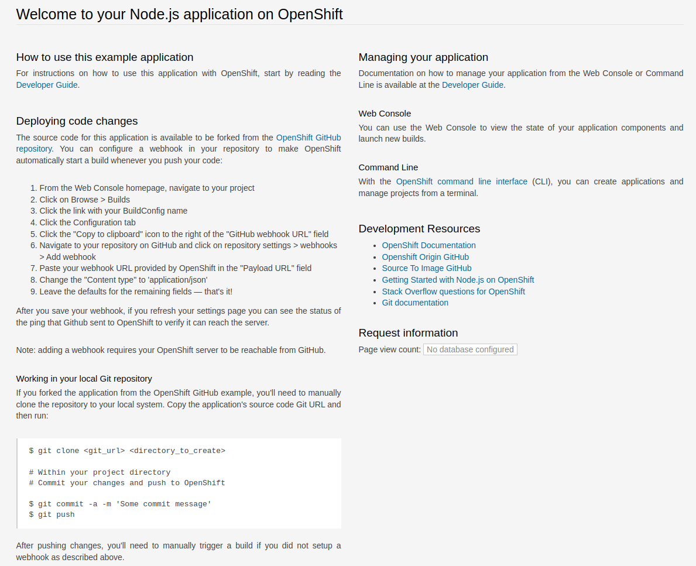

# Ajouter la couche de sécurité (SSL - Secure Sockets Layer) à votre application
Dans cet exercice, vous allez configurer votre application pour crypter le trafic avec le certificat joker d'Openshift (Openshift Wildcard certificate).

Dans les étapes précédentes, vous avez:
- crée et déployé votre application nodejs
- ajouté une route à votre application

## TLS Termination Edge
Openshift a un certificat joker SSL qui peut être utilisé pour toute application. On peut utiliser ce certificat SSL pour servir SSL dès notre application sans devoir générer un certificat nous mêmes.

Il faut éditer la route créée pour ajouter l'option TLS.

Allez dans la console web d'Openshift et cliquez sur la route de l'application (menu à gauche -> Topology ou menu à gauche -> Project -> Route).

Pour continuer, suivez les instructions [ici](../../Readme-HandsOn.md#ajout-dune-couche-de-sécurité-pour-laccès-à-nos-applications-sur-le-web)

## Vérification
Cliquez sur le nouveau lien créé "https://..."

Vous devez voir un résultat similaire:

Félicitations! Dans cet exercice, vous avez appris sur le service SSL à partir de votre application.

[Table de matières](README.md)