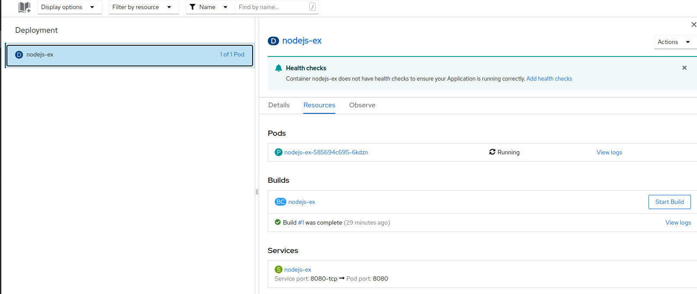
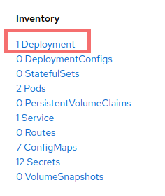
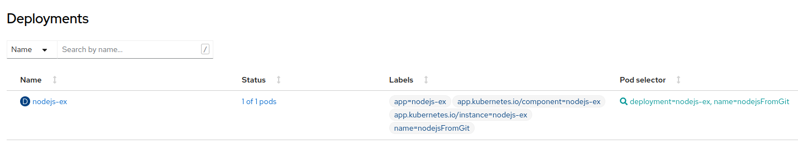

# Création et déploiement d'une application simple Nodejs

Cet exemple va vous montrer une simple page de bienvenue générée à partir d'un gabarit Nodejs offert pour Openshift.

On s'inspire des instructions détaillées dans [le répertoire de l'exemple](https://github.com/sclorg/nodejs-ex)

## Étape 1: Se connecter au projet de travail
Pour se connecter au projet du travail, on va utiliser la commande oc dans un terminal (ligne de commandes).
```bash
oc login --token=<jeton> --server=https://api.exp.openshift.cqen.ca:6443
```

Pour obtenir le jeton de connection, voir les instructions [ici](../../Readme-HandsOn.md#se-connecter-au-cluster-dopenshift)

## Étape 2: Créer l'application avec l'outil client OC

### Créer l'application à partir du code source (github)
On va créer l'application à partir du code source dans github:

```bash
oc new-app https://github.com/sclorg/nodejs-ex -l name=nodejs-from-source
```

L'outil va inspecter le code source, va trouver l'image appropriée dans DockerHub, créer un ImageStream pour l'image, et créer la bonne configuration de construction (build), la configuration de déploiement et la définition du service.

Vous aurez un résultat similaire:
```bash
--> Found image 3655497 (2 weeks old) in image stream "openshift/nodejs" under tag "16-ubi8" for "nodejs"

    Node.js 16 
    ---------- 
    Node.js 16 available as container is a base platform for building and running various Node.js 16 applications and frameworks. Node.js is a platform built on Chrome's JavaScript runtime for easily building fast, scalable network applications. Node.js uses an event-driven, non-blocking I/O model that makes it lightweight and efficient, perfect for data-intensive real-time applications that run across distributed devices.

    Tags: builder, nodejs, nodejs16

    * The source repository appears to match: nodejs
    * A source build using source code from https://github.com/sclorg/nodejs-ex will be created
      * The resulting image will be pushed to image stream tag "nodejs-ex:latest"
      * Use 'oc start-build' to trigger a new build

--> Creating resources with label name=nodejsFromGit ...
    imagestream.image.openshift.io "nodejs-ex" created
    buildconfig.build.openshift.io "nodejs-ex" created
    deployment.apps "nodejs-ex" created
    service "nodejs-ex" created
--> Success
    Build scheduled, use 'oc logs -f buildconfig/nodejs-ex' to track its progress.
    Application is not exposed. You can expose services to the outside world by executing one or more of the commands below:
     'oc expose service/nodejs-ex' 
    Run 'oc status' to view your app.
```

### "Build" de l'application

La commande "oc new-app" va déclencher un "build" une fois que toutes les dependencies nécessaires ont été confirmées.

Vérifier le statut de votre nouvelle application avec la commande "oc status"
```bash
oc status
```

Vous allez voir un résultat similaire:
```bash
In project ws1-nodejs on server https://api.exp.openshift.cqen.ca:6443

svc/nodejs-ex - 172.30.204.90:8080
  deployment/nodejs-ex deploys istag/nodejs-ex:latest <-
    bc/nodejs-ex source builds https://github.com/sclorg/nodejs-ex on openshift/nodejs:16-ubi8 
    deployment #2 running for 24 hours - 1 pod
    deployment #1 deployed 24 hours ago


1 info identified, use 'oc status --suggest' to see details.
```

### Déploiement de l'application
Le déploiement arrive automatiquement quand l'image de la nouvelle  application est disponible.

Les commandes "oc get pods" ou "oc get svc" peuvent nous aider à monitorer le status du déploiement:

```bash
oc get pods
```
résultat obtenu:
```bash
NAME                         READY   STATUS      RESTARTS   AGE
nodejs-ex-1-build            0/1     Completed   0          24h
nodejs-ex-585694c695-6kdzn   1/1     Running     0          24h
```
On observe un première pod pour le build de l'application et un deuxième pod pour l'application qui roule.

```bash
oc get svc
```
résultat obtenu:
```bash
NAME        TYPE        CLUSTER-IP      EXTERNAL-IP   PORT(S)    AGE
nodejs-ex   ClusterIP   172.30.204.90   <none>        8080/TCP   24h
```
On observe une adresse IP pour le service qui roule et le port par défaut pour le déploiement: 8080

#### Console Web
Vous pouvez aussi vérifier le déploiement de l'application dans la console web d'Openshift:



On peut observer que des ressources associés à l'application ont été crées:
- la définition du service
- la configuration de construction (build)

Dans les options du menu à gauche, vous pouvez clicker sur "Project" pour voir l'aperçu du projet. La section inventaire vous montre la liste de ressources qui ont été créés, dont le fichier de configuration de déploiement.



Cliquez sur "1 Deployment" pour voir les détails du déploiement:



### Configurer le routage
La commande "oc expose" va nous permettre d'exposer le service avec un URL pour accéder à l'application dans le web:

```bash
oc expose svc/nodejs-ex
```
résultat:
```bash
route.route.openshift.io/nodejs-ex exposed
```

[Table de matières](README.md)