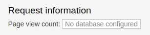

# Ajouter le service de base de données - mongodb

Dans les étapes précédentes, vous avez créé l'application web et testé l'accès à sa page web.
Si vous observez la page web, vous allez voir la section "Request information" avec un champ "Page view count" que pour le moment affiche le message: "No database configured" (il n'y a pas de base de données configurée). 



On va régler cela en ajoutant un service de base de données - MongoDB. On va créer le service avec la commande "oc new-app" et à partir de l'image dans DockerHub:

```bash
oc new-app centos/mongodb-26-centos7
```
Pour vérifier le déploiement de la base de données, utilisez la commande "oc status".
```bash
oc status      
```
Vous allez voir un résultat similaire:

```bash
In project ws1-nodejs on server https://api.exp.openshift.cqen.ca:6443

svc/mongodb-26-centos7 - 172.30.245.220:27017
  deployment/mongodb-26-centos7 deploys istag/mongodb-26-centos7:latest 
    deployment #2 running for 3 minutes - 1 pod
    deployment #1 deployed 3 minutes ago

https://nodejs-ex-ws1-nodejs.apps.exp.openshift.cqen.ca to pod port 8080-tcp (svc/nodejs-ex)
  deployment/nodejs-ex deploys istag/nodejs-ex:latest <-
    bc/nodejs-ex source builds https://github.com/sclorg/nodejs-ex on openshift/nodejs:16-ubi8 
    deployment #2 running for 2 days - 1 pod
    deployment #1 deployed 2 days ago
```

[Table de matières](README.md)