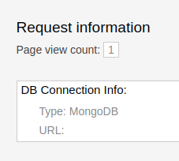
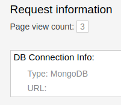

# Tester l'ensemble (frontend connecté à la base de données)

Dans les étapes précédentes, vous avez déployé l'application web nodejs et le service de base de données mongoDB.
Maintenant, on va vérifier que l'application est liée à la base de données avec le compteur de visites de la page.

Quand vous accédez à la page web de l'application dans le navigateur (le lien dans la route de l'application), vous voyez la section de "Request Information" dans la partie inférieure à droit de la page:

Rafraîchissez la page web par exemple deux fois, et vous allez vérifier que le compteur de visites a été incrémenté:

[Table de matières](README.md)